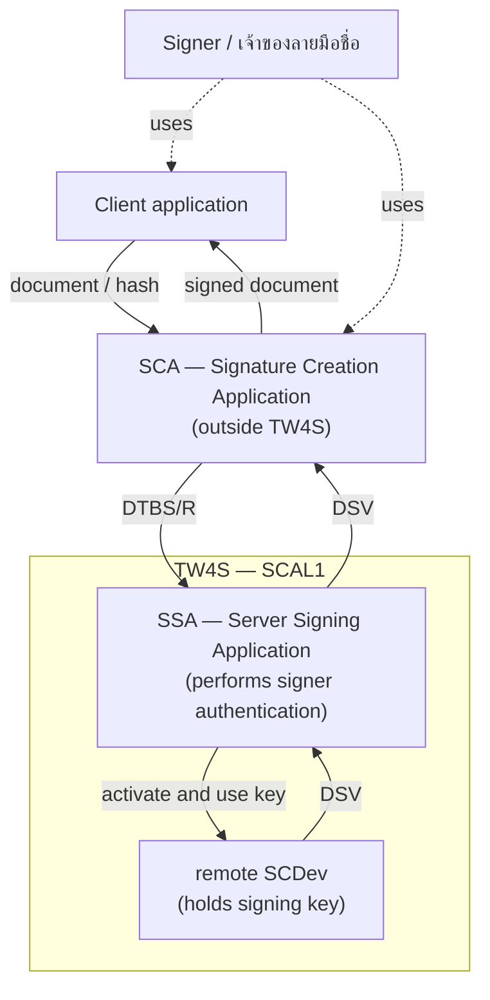
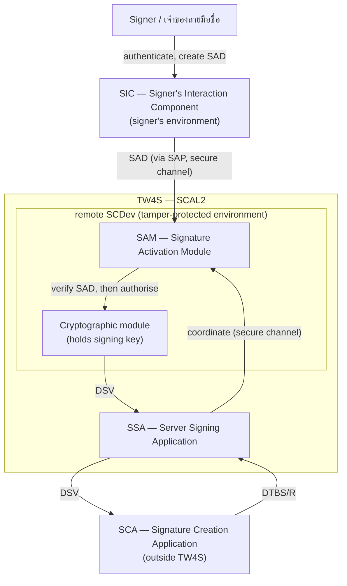
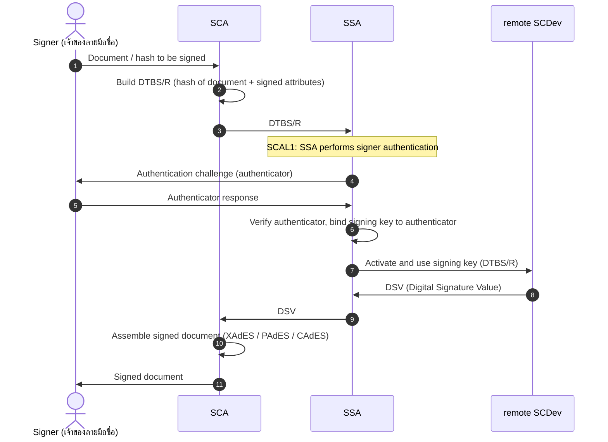
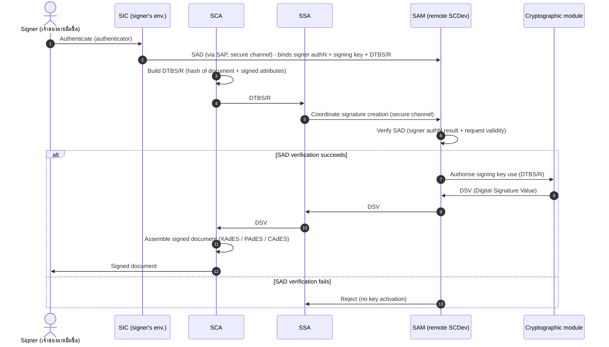

# ETDA Recommendation ขมธอ. 36-2566 — Remote Signing Service (v1.0)

> **Converted for AI context use** from the official ETDA PDF. Bilingual (Thai original + English translation). Technical sections only, plus a condensed "About" from the announcement/foreword; committee/working-group name lists omitted. Thai text is authoritative; English is a faithful translation. See [Appendix B — Conversion Notes](#appendix-b--conversion-notes) for fidelity boundaries.

**Issuer:** สำนักงานพัฒนาธุรกรรมทางอิเล็กทรอนิกส์ (ETDA), กระทรวงดิจิทัลเพื่อเศรษฐกิจและสังคม
**Issued:** 30 มิถุนายน พ.ศ. 2566 / 2023-06-30 · **ICS:** 35.030 · **Version:** 1.0

---

## About this standard

This standard (ETDA Recommendation ขมธอ. 36-2566) is issued by the Electronic Transactions Development Agency (ETDA), Ministry of Digital Economy and Society, under the authority of §5 of the ETDA Act B.E. 2562 (พระราชบัญญัติสำนักงานพัฒนาธุรกรรมทางอิเล็กทรอนิกส์ พ.ศ. ๒๕๖๒ มาตรา ๕). It was announced on 30 June 2023 and carries the ICS classification 35.030.

The standard describes the components and operating principles of remote signing — the creation of digital signatures using trustworthy systems supporting server signing (TW4S). Its central concern is guaranteeing that the signing key remains under the sole control of the signer, and it sets out the security requirements that TW4S must meet so that organisations across Thailand can use or provide remote signing services reliably and to a common standard.

The motivation, set out in the foreword (คำนำ), is practical: the safekeeping of private keys, and the convenient management of those keys for signing, remain the chief obstacle to wider adoption of digital signatures — they are not tasks that ordinary users can easily perform on their own. Remote signing is presented as an accepted alternative, already recognised in several countries such as the members of the European Union, because it lets signers store and retrieve their private keys over a computer network securely and conveniently, provided it is done through trustworthy and secure means.

On that basis ETDA developed this recommendation, incorporating public consultation and the comments of experts and relevant agencies, and drawing on the requirements set out in the standards of the European Union. Committee and working-group membership lists from the source PDF are omitted from this conversion.

---

## Table of Contents

- [Glossary](#glossary)
- [1. Scope / ขอบข่าย](#1-scope--ขอบข่าย)
- [2. Terms and Definitions / บทนิยาม](#2-terms-and-definitions--บทนิยาม)
- [3. Abbreviations / อักษรย่อ](#3-abbreviations--อักษรย่อ)
- [4. Overview of TW4S / ภาพรวมของระบบ TW4S](#4-overview-of-tw4s--ภาพรวมของระบบ-tw4s)
  - [4.1 Conceptual architecture](#41-conceptual-architecture)
  - [4.2 SCAL (Sole Control Assurance Level)](#42-scal-sole-control-assurance-level)
  - [4.3 Signer authentication](#43-signer-authentication)
  - [4.4 Signing key & cryptographic module](#44-signing-key--cryptographic-module)
  - [4.5 SAD](#45-sad)
  - [4.6 SAP](#46-sap)
  - [4.7 SIC](#47-sic)
  - [4.8 SAM](#48-sam)
  - [4.9 Environment scopes](#49-environment-scopes)
- [5. Security Requirements / ข้อกำหนดด้านความมั่นคงปลอดภัย](#5-security-requirements--ข้อกำหนดด้านความมั่นคงปลอดภัย)
  - [5.1 SRG — General Security Requirements](#51-srg--general-security-requirements)
  - [5.2 SRC — Core Component Security Requirements](#52-src--core-component-security-requirements)
  - [5.3 SRA — Additional Security Requirements (SCAL2)](#53-sra--additional-security-requirements-scal2)
  - [5.4 Product security standards](#54-product-security-standards)
- [Bibliography / บรรณานุกรม](#bibliography--บรรณานุกรม)
- [Appendix A — Codebase cross-reference](#appendix-a--codebase-cross-reference)
- [Appendix B — Conversion notes](#appendix-b--conversion-notes)

---

## Glossary

Compact bilingual index of the terms and abbreviations defined in §2 (บทนิยาม) and §3 (อักษรย่อ). Thai is authoritative; English is faithful. Full definitions live in [§2 Terms and Definitions](#2-terms-and-definitions--บทนิยาม); full abbreviation listings live in [§3 Abbreviations](#3-abbreviations--อักษรย่อ).

| Thai term | English | Abbreviation | Meaning |
|-----------|---------|--------------|---------|
| การลงลายมือชื่อดิจิทัลที่ใช้การควบคุมจากระยะไกล | Remote signing | — | Creating a digital signature where the signing key is used over a network from a remote system |
| ระบบสนับสนุนการลงลายมือชื่อดิจิทัลด้วยเครื่องบริการที่เชื่อถือได้ | Trustworthy systems supporting server signing | TW4S | A client-server system that uses the signing key under the signer's control to create digital signatures |
| บริการลงลายมือชื่อดิจิทัลที่ใช้การควบคุมจากระยะไกล | Remote signing service | — | A signature creation service built on a TW4S so the signer keeps sole control of the signing key |
| บริการลงลายมือชื่อดิจิทัลด้วยเครื่องบริการ | Server signing service | — | Alternate name for the remote signing service |
| แอปพลิเคชันสร้างลายมือชื่อดิจิทัล | Signature Creation Application | SCA | The application that signs electronic documents using signatures produced by an SCDev |
| แอปพลิเคชันลงลายมือชื่อดิจิทัลด้วยเครื่องบริการ | Server Signing Application | SSA | The server-side application that uses a remote SCDev to produce a digital signature value on behalf of the signer |
| ระดับความเข้มงวดในการควบคุมของเจ้าของลายมือชื่อโดยไม่มีการควบคุมของบุคคลอื่น | Sole Control Assurance Level | SCAL | The assurance level at which the signer alone controls the signing key |
| — (ระดับย่อยของ SCAL) | SCAL level 1 | SCAL1 | Basic sole-control assurance level (see §4.2) |
| — (ระดับย่อยของ SCAL) | SCAL level 2 | SCAL2 | Advanced sole-control assurance level requiring additional controls such as a SAM (see §4.2, §5.3) |
| กุญแจสำหรับใช้สร้างลายมือชื่อดิจิทัล | Signing key | — | The private key in an asymmetric cryptosystem used to create a digital signature |
| โมดูลเข้ารหัสลับ | Cryptographic module | — | The hardware or software module, inside an SCDev, that performs the cryptographic operations on the signing key |
| ข้อมูลสั่งให้สร้างลายมือชื่อดิจิทัล | Signature Activation Data | SAD | The data collected by SAP to give high confidence that a signature operation is under the signer's sole control |
| โพรโทคอลเพื่อสั่งให้สร้างลายมือชื่อดิจิทัล | Signature Activation Protocol | SAP | The protocol that gathers SAD to control a signature operation over the DTBS/R using the signer's signing key |
| โพรโทคอลสั่งให้สร้างลายมือชื่อดิจิทัล | Signature Activation Protocol | SAP | Short Thai form used in §2.12 and §3; identical to the row above |
| ส่วนติดต่อของเจ้าของลายมือชื่อ | Signer's Interaction Component | SIC | The software and/or hardware component the signer uses to interact with SAP |
| โมดูลสั่งให้สร้างลายมือชื่อดิจิทัล | Signature Activation Module | SAM | Software that uses SAD to give high confidence that use of the signing key stays under the signer's sole control (SCAL2) |
| การควบคุมของเจ้าของลายมือชื่อโดยไม่มีการควบคุมของบุคคลอื่น | Sole control | — | Control of the signing key exercised by the signer alone, with no other party able to control it |
| เจ้าของลายมือชื่อ | Signer | — | The person who holds the signing key and creates a digital signature in their own name or on behalf of another |
| ผู้ให้บริการ | Service provider | — | The organisation that offers a TW4S-based remote/server signing service |
| ลายมือชื่อดิจิทัล | Digital signature | — | An electronic signature produced by cryptographic means, enabling signer authentication, integrity and non-repudiation |
| สิ่งที่ใช้ยืนยันตัวตน | Authenticator | — | Something a person possesses and controls, such as a password or biometric, used to verify identity |
| การยืนยันตัวตน | Authentication | — | The process of verifying a person's identity by checking that person's authenticator |
| แบบแสดงข้อมูลเพื่อลงลายมือชื่อ | Data to Be Signed Representation | DTBS/R | The formatted data that is processed to produce a digital signature value |
| ใบรับรอง | Certificate | — | Electronic data that binds a signer to the data used to verify their electronic signature |
| ค่าลายมือชื่อดิจิทัล | Digital Signature Value | DSV | The bit string resulting from applying the signing key to the DTBS/R |
| อุปกรณ์/ระบบสร้างลายมือชื่อดิจิทัล | Signature Creation Device | SCDev | Software or hardware designed to use the signing key, via a cryptographic module, to create a digital signature value |
| อุปกรณ์/ระบบสร้างลายมือชื่อดิจิทัลที่ใช้การควบคุมจากระยะไกล | Remote Signature Creation Device | remote SCDev | An SCDev that the signer can control remotely while retaining sole control of the signing key |
| ระดับความน่าเชื่อถือของการยืนยันตัวตน | Authentication Assurance Level | AAL | The assurance level of the authentication process (see §3) |
| ผู้ให้บริการออกใบรับรอง | Certificate Authority | CA | The entity that issues certificates |
| เกณฑ์ประเมินทั่วไปด้านความมั่นคงปลอดภัยทางเทคโนโลยีสารสนเทศ | Common Criteria | CC | The general criteria for IT security evaluation (ISO/IEC 15408) |
| คณะกรรมการด้านมาตรฐานของสหภาพยุโรป | European Committee for Standardization | CEN | The European standardisation committee |
| ระดับความเข้มงวดในการประเมินตามเกณฑ์ประเมินทั่วไปด้านความมั่นคงปลอดภัยทางเทคโนโลยีสารสนเทศ | Evaluation Assurance Level | EAL | The assurance level of an evaluation under the Common Criteria |
| องค์กรด้านมาตรฐานโทรคมนาคมของสหภาพยุโรป | European Telecommunications Standards Institute | ETSI | The European telecommunications standards body |
| ระดับความน่าเชื่อถือของการพิสูจน์ตัวตน | Identity Assurance Level | IAL | The assurance level of the identity proofing process |
| ผู้พิสูจน์และยืนยันตัวตน | Identity Provider | IdP | The entity that proves and asserts a subject's identity |
| องค์การระหว่างประเทศว่าด้วยการมาตรฐาน/คณะกรรมาธิการระหว่างประเทศว่าด้วยมาตรฐานสาขาอิเล็กทรอนิกส์ | International Organization for Standardization / International Electrotechnical Commission | ISO/IEC | The joint international standards bodies for the referenced standards |
| ผู้ให้บริการรับลงทะเบียนใบรับรอง | Registration Authority | RA | The entity that registers certificate applicants |
| ผู้ให้บริการประทับเวลา | Time-stamping Authority | TSA | The entity that issues trusted time stamps |

---

## 1. Scope / ขอบข่าย

> **Key points (AI):**
> - Describes the components and operating principles of **remote signing** using **trustworthy systems supporting server signing (TW4S)**.
> - Central guarantee: the **signing key** stays under the signer's **sole control**, with security requirements set for TW4S so Thai organisations can use or provide remote signing reliably and to a common standard.
> - **In scope:** bulk/batch signing after successful signer authentication; electronic signatures of natural persons and electronic seals of legal persons (the term "signer" covers the legal person that owns an electronic seal).
> - **Out of scope:** the detailed IT architecture of TW4S (e.g. number of servers); components outside TW4S such as the Signature Creation Application (SCA) or client application; and supporting services such as certification, time-stamping or identity proofing.
> - Verbs follow ISO-style convention: "ต้อง" = requirement, "ควร" = recommendation, "อาจ" = permission. The standard references the requirements set out in the standards of the European Union [1].

**[TH]**

ข้อเสนอแนะมาตรฐานฉบับนี้อธิบายส่วนประกอบและหลักการทำงานที่เกี่ยวข้องกับการลงลายมือชื่อดิจิทัลที่ใช้การควบคุมจากระยะไกล (remote signing) โดยอาศัยระบบสนับสนุนการลงลายมือชื่อดิจิทัลด้วยเครื่องบริการที่เชื่อถือได้ (trustworthy systems supporting server signing: TW4S) ในการสร้างลายมือชื่อดิจิทัล เพื่อรับประกันว่ากุญแจสำหรับใช้สร้างลายมือชื่อดิจิทัล (signing key) อยู่ภายใต้การควบคุมของเจ้าของลายมือชื่อโดยไม่มีการควบคุมของบุคคลอื่น (sole control) รวมทั้งระบุข้อกำหนดด้านความมั่นคงปลอดภัยของ TW4S เพื่อให้หน่วยงานต่าง ๆ ในประเทศไทยสามารถใช้บริการหรือให้บริการลงลายมือชื่อดิจิทัลที่ใช้การควบคุมจากระยะไกลได้โดยมีความน่าเชื่อถือและเป็นมาตรฐานเดียวกัน

ข้อเสนอแนะมาตรฐานฉบับนี้สามารถใช้ได้ในกรณีดังนี้

– การสร้างลายมือชื่อดิจิทัลครั้งละหลายรายการ (bulk/batch signing) ซึ่งเป็นการสร้างลายมือชื่อดิจิทัลภายในช่วงระยะเวลาที่กำหนดไว้ช่วงหนึ่ง หรือการสร้างลายมือชื่อดิจิทัลที่กำหนดไว้จำนวนหนึ่ง ในนามของเจ้าของลายมือชื่อหลังการยืนยันตัวตนเจ้าของลายมือชื่อเป็นผลสำเร็จ อย่างไรก็ตาม การพิจารณาใช้รูปแบบการสร้างลายมือชื่อดิจิทัลครั้งละหลายรายการควรคำนึงถึงข้อกำหนดทางกฎหมายที่เกี่ยวข้องด้วยว่าอนุญาตให้เจ้าของลายมือชื่อดำเนินการได้หรือไม่

– การลงลายมือชื่ออิเล็กทรอนิกส์ (electronic signature) ของบุคคล หรือการประทับตราอิเล็กทรอนิกส์ (electronic seal) ของนิติบุคคล ดังนั้น คำนิยามที่กำหนดไว้เกี่ยวกับเจ้าของลายมือชื่อจะมีความหมายครอบคลุมถึงนิติบุคคลที่เป็นเจ้าของตราอิเล็กทรอนิกส์ด้วย

ทั้งนี้ ข้อเสนอแนะมาตรฐานฉบับนี้จะไม่ครอบคลุมถึง

– รายละเอียดของสถาปัตยกรรมระบบสารสนเทศสำหรับระบบสนับสนุนการลงลายมือชื่อดิจิทัลด้วยเครื่องบริการที่เชื่อถือได้ (TW4S) เช่น จำนวนเครื่องบริการที่จำเป็นต้องใช้

– รายละเอียดของส่วนประกอบที่เกี่ยวข้องกับการสร้างลายมือชื่อดิจิทัล ซึ่งอยู่นอกขอบเขตของระบบสนับสนุนการลงลายมือชื่อดิจิทัลด้วยเครื่องบริการที่เชื่อถือได้ (TW4S) เช่น แอปพลิเคชันสร้างลายมือชื่อดิจิทัล (signature creation application: SCA) หรือแอปพลิเคชันของผู้ใช้งาน (client application)

– รายละเอียดของบริการสนับสนุนอื่น ๆ ที่ใช้ประกอบกับบริการลงลายมือชื่อดิจิทัลที่ใช้การควบคุมจากระยะไกล เช่น บริการออกใบรับรอง บริการประทับเวลาอิเล็กทรอนิกส์ หรือบริการพิสูจน์และยืนยันตัวตน

ข้อเสนอแนะมาตรฐานฉบับนี้อ้างอิงข้อกำหนดจากมาตรฐานของสหภาพยุโรป [1]

ข้อเสนอแนะมาตรฐานฉบับนี้มีรูปแบบของคำที่ใช้แสดงออกถึงคุณลักษณะของเนื้อหาเชิงบรรทัดฐาน (normative) และเนื้อหาเชิงให้ข้อมูล (informative) ดังต่อไปนี้

– "ต้อง" ใช้ระบุสิ่งที่เป็นข้อกำหนด (requirement) ซึ่งต้องปฏิบัติตาม
– "ควร" ใช้ระบุสิ่งที่เป็นข้อแนะนำ (recommendation)
– "อาจ" ใช้ระบุสิ่งที่ยินยอมหรืออนุญาตให้ทำได้ (permission)

**[EN]**

This standard recommendation describes the components and operating principles related to remote signing, relying on trustworthy systems supporting server signing (TW4S) to create digital signatures. Its purpose is to guarantee that the signing key remains under the sole control of the signer, and to set out the security requirements of TW4S so that organisations across Thailand can use or provide remote signing services reliably and to a common standard.

This standard recommendation applies to the following cases:

- Bulk/batch signing — the creation of digital signatures within a defined time window, or the creation of a defined number of digital signatures, in the name of the signer after successful authentication of the signer. Whether to adopt bulk/batch signing should also take account of the relevant legal requirements as to whether the signer is permitted to do so.
- The electronic signature of a natural person, or the electronic seal of a legal person. Accordingly, the definitions concerning the "signer" also extend to the legal person that owns an electronic seal.

This standard recommendation does not cover:

- The detailed IT architecture of TW4S, such as the number of servers required.
- Details of components involved in creating a digital signature that lie outside TW4S, such as the Signature Creation Application (SCA) or the client application.
- Details of supporting services used together with the remote signing service, such as certificate issuance, electronic time-stamping, or identity proofing and authentication services.

This standard recommendation references the requirements set out in the standards of the European Union [1].

This standard recommendation uses the following wording to distinguish normative from informative content:

- "ต้อง" (must) denotes a requirement that shall be complied with.
- "ควร" (should) denotes a recommendation.
- "อาจ" (may) denotes a permission.

---

## 2. Terms and Definitions / บทนิยาม

> **Key points (AI):**
> - Defines **18 terms (2.1–2.18)** that anchor the rest of the standard; Thai spellings are kept identical to the [Glossary](#glossary).
> - Recurring concept: a piece of data, a protocol, or a module (SAD / SAP / SAM) exists to give **high confidence** that each signature operation stays under the **signer's sole control (SCAL)**.
> - Architecture roles: **SCDev** (and its remote variant) is the device/system that holds the signing key; **SCA** is the client application; **SSA** is the server-side application that drives a remote SCDev.
> - English renderings are drawn verbatim from the project term bank; Thai definitions are quoted verbatim from the source PDF.

**[TH]**

ความหมายของคำที่ใช้ในข้อเสนอแนะมาตรฐานฉบับนี้ มีดังต่อไปนี้

**[EN]**

The meanings of the terms used in this standard recommendation are as follows.

| # | Thai term | English / abbr. | Thai definition (verbatim) | English translation |
|---|-----------|-----------------|----------------------------|---------------------|
| 2.1 | ลายมือชื่อดิจิทัล | Digital signature | ลายมือชื่ออิเล็กทรอนิกส์ที่ได้จากกระบวนการเข้ารหัสลับข้อมูลอิเล็กทรอนิกส์ ซึ่งช่วยให้สามารถยืนยันตัวเจ้าของลายมือชื่อและตรวจพบการเปลี่ยนแปลงของข้อความและลายมือชื่ออิเล็กทรอนิกส์ได้ รวมถึงการทำให้เจ้าของลายมือชื่อไม่สามารถปฏิเสธความรับผิดจากข้อความที่ตนเองลงลายมือชื่อได้ [2] | An electronic signature produced by a cryptographic process on electronic data, which makes it possible to authenticate the signer and to detect any change in the message or the electronic signature, and which prevents the signer from disclaiming responsibility for a message they have signed [2]. |
| 2.2 | กุญแจสำหรับใช้สร้างลายมือชื่อดิจิทัล | Signing key | กุญแจส่วนตัว (private key) ในระบบการเข้ารหัสลับแบบอสมมาตร (asymmetric cryptography) สำหรับใช้สร้างลายมือชื่อดิจิทัล | The private key in an asymmetric cryptography system used to create a digital signature. |
| 2.3 | เจ้าของลายมือชื่อ | Signer | ผู้ซึ่งถือกุญแจสำหรับใช้สร้างลายมือชื่อดิจิทัล (signing key) และสร้างลายมือชื่อดิจิทัลนั้นในนามตนเองหรือแทนบุคคลอื่น | The person who holds the signing key and creates a digital signature in their own name or on behalf of another person. |
| 2.4 | ระบบสนับสนุนการลงลายมือชื่อดิจิทัลด้วยเครื่องบริการที่เชื่อถือได้ | Trustworthy systems supporting server signing (TW4S) | ระบบที่มีสถาปัตยกรรมในรูปแบบเครื่องขอใช้บริการและเครื่องบริการ (client-server system) ที่ใช้กุญแจสำหรับใช้สร้างลายมือชื่อดิจิทัล (signing key) ภายใต้การควบคุมของเจ้าของลายมือชื่อ เพื่อสร้างลายมือชื่อดิจิทัล | A system with a client-server architecture that uses the signing key under the signer's control to create digital signatures. |
| 2.5 | บริการลงลายมือชื่อดิจิทัลที่ใช้การควบคุมจากระยะไกล (หรือ บริการลงลายมือชื่อดิจิทัลด้วยเครื่องบริการ) | Remote signing service (Server signing service) | บริการสร้างลายมือชื่อดิจิทัลที่มีระบบสนับสนุนการลงลายมือชื่อดิจิทัลด้วยเครื่องบริการที่เชื่อถือได้ (TW4S) เพื่อให้เจ้าของลายมือชื่อสามารถควบคุมกุญแจสำหรับใช้สร้างลายมือชื่อดิจิทัล (signing key) และรับประกันว่ากุญแจสำหรับใช้สร้างลายมือชื่อดิจิทัลนั้นอยู่ภายใต้การควบคุมของเจ้าของลายมือชื่อโดยไม่มีการควบคุมของบุคคลอื่น (sole control) | A signature creation service built on a TW4S that lets the signer control the signing key and guarantees that the signing key remains under the signer's sole control. |
| 2.6 | ผู้ให้บริการ | Service provider | หน่วยงานที่ให้บริการระบบสนับสนุนการลงลายมือชื่อดิจิทัลด้วยเครื่องบริการที่เชื่อถือได้ (TW4S) | The organisation that offers a service based on TW4S. |
| 2.7 | สิ่งที่ใช้ยืนยันตัวตน | Authenticator | สิ่งที่ใช้เชื่อมโยงอัตลักษณ์กับบุคคล ซึ่งบุคคลนั้นครอบครองและควบคุมเพื่อใช้ในการยืนยันตัวตน เช่น รหัสผ่าน ข้อมูลชีวภาพ [3] | Something that links an identity to a person, which the person possesses and controls in order to authenticate, such as a password or biometric data [3]. |
| 2.8 | การยืนยันตัวตน | Authentication | กระบวนการยืนยันอัตลักษณ์ของบุคคลด้วยการตรวจสอบสิ่งที่ใช้ยืนยันตัวตนของบุคคลนั้น [3] | The process of verifying a person's identity by checking that person's authenticator [3]. |
| 2.9 | แบบแสดงข้อมูลเพื่อลงลายมือชื่อ | Data to Be Signed Representation (DTBS/R) | ข้อมูลที่ถูกจัดรูปแบบเพื่อนำมาคำนวณในการสร้างค่าลายมือชื่อดิจิทัล (digital signature value) | The data that has been formatted to be processed in creating the digital signature value. |
| 2.10 | ใบรับรอง | Certificate | ข้อมูลอิเล็กทรอนิกส์หรือการบันทึกอื่นใด ซึ่งยืนยันความเชื่อมโยงระหว่างเจ้าของลายมือชื่อกับข้อมูลสำหรับใช้สร้างลายมือชื่ออิเล็กทรอนิกส์ [4] | Electronic data, or any other record, that confirms the binding between a signer and the data used to create their electronic signature [4]. |
| 2.11 | ข้อมูลสั่งให้สร้างลายมือชื่อดิจิทัล | Signature Activation Data (SAD) | ชุดข้อมูลที่รวบรวมโดยโพรโทคอลสั่งให้สร้างลายมือชื่อดิจิทัล (SAP) เพื่อใช้ในการควบคุมด้วยความเชื่อมั่นในระดับสูงว่าการดำเนินการสร้างลายมือชื่อดิจิทัล (signature operation) อยู่ภายใต้การควบคุมของเจ้าของลายมือชื่อโดยไม่มีการควบคุมของบุคคลอื่น | The set of data collected by the Signature Activation Protocol (SAP) used to control, with high confidence, that a signature operation is under the signer's sole control. |
| 2.12 | โพรโทคอลสั่งให้สร้างลายมือชื่อดิจิทัล | Signature Activation Protocol (SAP) | โพรโทคอลที่รวบรวมข้อมูลสั่งให้สร้างลายมือชื่อดิจิทัล (SAD) เพื่อใช้ในการควบคุมการดำเนินการสร้างลายมือชื่อดิจิทัล (signature operation) ต่อแบบแสดงข้อมูลเพื่อลงลายมือชื่อ (DTBS/R) โดยอาศัยกุญแจสำหรับใช้สร้างลายมือชื่อดิจิทัล (signing key) ของเจ้าของลายมือชื่อ | The protocol that gathers the Signature Activation Data (SAD) to control a signature operation over the DTBS/R using the signer's signing key. |
| 2.13 | อุปกรณ์/ระบบสร้างลายมือชื่อดิจิทัล | Signature Creation Device (SCDev) | ซอฟต์แวร์หรือฮาร์ดแวร์ที่ออกแบบให้ใช้กุญแจสำหรับใช้สร้างลายมือชื่อดิจิทัล (signing key) ในการสร้างค่าลายมือชื่อดิจิทัล (digital signature value) ด้วยโมดูลเข้ารหัสลับ (cryptographic module) | Software or hardware designed to use the signing key, via a cryptographic module, to create the digital signature value. |
| 2.14 | อุปกรณ์/ระบบสร้างลายมือชื่อดิจิทัลที่ใช้การควบคุมจากระยะไกล | Remote Signature Creation Device (remote SCDev) | อุปกรณ์/ระบบสร้างลายมือชื่อดิจิทัล (SCDev) ที่เจ้าของลายมือชื่อสามารถควบคุมการดำเนินการสร้างลายมือชื่อดิจิทัล (signature operation) จากระยะไกล และรับประกันด้วยความเชื่อมั่นในระดับสูงว่ากุญแจสำหรับใช้สร้างลายมือชื่อดิจิทัล (signing key) อยู่ภายใต้การควบคุมของเจ้าของลายมือชื่อโดยไม่มีการควบคุมของบุคคลอื่น | An SCDev that the signer can control remotely during a signature operation, and which gives high confidence that the signing key remains under the signer's sole control. |
| 2.15 | โมดูลสั่งให้สร้างลายมือชื่อดิจิทัล | Signature Activation Module (SAM) | ซอฟต์แวร์ที่ออกแบบให้ใช้ข้อมูลสั่งให้สร้างลายมือชื่อดิจิทัล (SAD) เพื่อรับประกันด้วยความเชื่อมั่นในระดับสูงว่าการใช้กุญแจสำหรับใช้สร้างลายมือชื่อดิจิทัล (signing key) อยู่ภายใต้การควบคุมของเจ้าของลายมือชื่อโดยไม่มีการควบคุมของบุคคลอื่น | Software designed to use the Signature Activation Data (SAD) to give high confidence that use of the signing key remains under the signer's sole control. |
| 2.16 | แอปพลิเคชันสร้างลายมือชื่อดิจิทัล | Signature Creation Application (SCA) | แอปพลิเคชันที่ใช้ลงลายมือชื่อในเอกสารอิเล็กทรอนิกส์ด้วยลายมือชื่อดิจิทัลที่สร้างจากอุปกรณ์/ระบบสร้างลายมือชื่อดิจิทัล (SCDev) | The application used to sign electronic documents with digital signatures produced by an SCDev. |
| 2.17 | แอปพลิเคชันลงลายมือชื่อดิจิทัลด้วยเครื่องบริการ | Server Signing Application (SSA) | แอปพลิเคชันที่ใช้อุปกรณ์/ระบบสร้างลายมือชื่อดิจิทัลที่ใช้การควบคุมจากระยะไกล (remote SCDev) ในการสร้างค่าลายมือชื่อดิจิทัล (digital signature value) ในนามของเจ้าของลายมือชื่อ | The application that uses a remote SCDev to produce a digital signature value on behalf of the signer. |
| 2.18 | ส่วนติดต่อของเจ้าของลายมือชื่อ | Signer's Interaction Component (SIC) | ส่วนประกอบในรูปแบบซอฟต์แวร์และ/หรือฮาร์ดแวร์ ที่เจ้าของลายมือชื่อใช้ในการทำงานร่วมกับโพรโทคอลสั่งให้สร้างลายมือชื่อดิจิทัล (SAP) | A software and/or hardware component that the signer uses to interact with the Signature Activation Protocol (SAP). |

---

## 3. Abbreviations / อักษรย่อ

> **Key points (AI):**
> - Lists the **22 abbreviations** used throughout ขมธอ. 36-2566, with their full English form and the Thai rendering (which is authoritative).
> - Two families dominate: **assurance levels** (AAL, EAL, IAL, SCAL) and **CSC/TW4S component roles** (SAD, SAM, SAP, SCA, SCDev, SIC, SSA, DSV, DTBS/R, TW4S).
> - The remaining abbreviations name **standards bodies / schemes** (CEN, ETSI, ISO/IEC, CC) and **PKI actors** (CA, RA, TSA, IdP).
> - English forms are taken verbatim from the project term bank.

**[TH]**

อักษรย่อที่ใช้ในข้อเสนอแนะมาตรฐานฉบับนี้ มีดังต่อไปนี้

**[EN]**

The abbreviations used in this standard recommendation are as follows.

| Abbreviation | English | Thai |
|--------------|---------|------|
| AAL | Authentication Assurance Level | ระดับความน่าเชื่อถือของการยืนยันตัวตน |
| CA | Certificate Authority | ผู้ให้บริการออกใบรับรอง |
| CC | Common Criteria | เกณฑ์ประเมินทั่วไปด้านความมั่นคงปลอดภัยทางเทคโนโลยีสารสนเทศ [5] [6] [7] |
| CEN | European Committee for Standardization | คณะกรรมการด้านมาตรฐานของสหภาพยุโรป |
| DTBS/R | Data to Be Signed Representation | แบบแสดงข้อมูลเพื่อลงลายมือชื่อ |
| DSV | Digital Signature Value | ค่าลายมือชื่อดิจิทัล |
| EAL | Evaluation Assurance Level | ระดับความเข้มงวดในการประเมินตามเกณฑ์ประเมินทั่วไปด้านความมั่นคงปลอดภัยทางเทคโนโลยีสารสนเทศ |
| ETSI | European Telecommunications Standards Institute | องค์กรด้านมาตรฐานโทรคมนาคมของสหภาพยุโรป |
| IAL | Identity Assurance Level | ระดับความน่าเชื่อถือของการพิสูจน์ตัวตน |
| IdP | Identity Provider | ผู้พิสูจน์และยืนยันตัวตน |
| ISO/IEC | International Organization for Standardization / International Electrotechnical Commission | องค์การระหว่างประเทศว่าด้วยการมาตรฐาน/คณะกรรมาธิการระหว่างประเทศว่าด้วยมาตรฐานสาขาอิเล็กทรอนิกส์ |
| RA | Registration Authority | ผู้ให้บริการรับลงทะเบียนใบรับรอง |
| SAD | Signature Activation Data | ข้อมูลสั่งให้สร้างลายมือชื่อดิจิทัล |
| SAM | Signature Activation Module | โมดูลสั่งให้สร้างลายมือชื่อดิจิทัล |
| SAP | Signature Activation Protocol | โพรโทคอลสั่งให้สร้างลายมือชื่อดิจิทัล |
| SCA | Signature Creation Application | แอปพลิเคชันสร้างลายมือชื่อดิจิทัล |
| SCAL | Sole Control Assurance Level | ระดับความเข้มงวดในการควบคุมของเจ้าของลายมือชื่อโดยไม่มีการควบคุมของบุคคลอื่น |
| SCDev | Signature Creation Device | อุปกรณ์/ระบบสร้างลายมือชื่อดิจิทัล |
| SIC | Signer's Interaction Component | ส่วนติดต่อของเจ้าของลายมือชื่อ |
| SSA | Server Signing Application | แอปพลิเคชันลงลายมือชื่อดิจิทัลด้วยเครื่องบริการ |
| TSA | Time-stamping Authority | ผู้ให้บริการประทับเวลา |
| TW4S | Trustworthy System Supporting Server Signing | ระบบสนับสนุนการลงลายมือชื่อดิจิทัลด้วยเครื่องบริการที่เชื่อถือได้ |

---

## 4. Overview of TW4S / ภาพรวมของระบบ TW4S

> **Key points (AI):**
> - §4 introduces the **conceptual architecture** of remote signing and breaks the system into its two principal components — the **Signature Creation Application (SCA)**, which lives outside TW4S, and the **Server Signing Application (SSA)** plus the **remote Signature Creation Device (remote SCDev)**, which live inside TW4S.
> - **Sole Control Assurance Level (SCAL)** is defined in two grades — **SCAL1** (basic, SSA authenticates the signer and activates the key) and **SCAL2** (advanced, a **Signature Activation Module (SAM)** verifies **Signature Activation Data (SAD)** before the key can be used). Figures 1 and 2 contrast the two architectures; Figures 3 and 4 contrast the two signer-authentication and key-activation flows.
> - Sub-sections §4.3–§4.8 unpack the supporting concepts: signer **identity proofing (IAL)** and **authentication (AAL)**, optional use of an external **Identity Provider (IdP)**, the signing key and cryptographic module, **SAD**, the **Signature Activation Protocol (SAP)**, the **Signer's Interaction Component (SIC)**, and the **SAM**.
> - §4.9 defines the three **environment scopes** that bound the system: the *tamper-protected environment*, the *service-provider protected environment*, and the *signer's environment*.
> - The four Mermaid figures below are **reconstructed** from the §4 body text (Thai is authoritative); where the source figure was ambiguous, a `> **Figure note:**` line records the uncertainty.

### 4.1 Conceptual architecture

> **Key points (AI):**
> - Remote signing is built on the cooperation of two applications: **SCA** (creates the signature and formats the signed document) and **SSA** (drives a remote SCDev to produce the Digital Signature Value, DSV).
> - **SCA's main input** is the document (or its hash) from the client application; its **main output** is the signed document.
> - **SSA's main input** is the Data to Be Signed Representation (**DTBS/R**) received from SCA; its **main output** is the **DSV** returned to SCA.
> - Supporting services (certification, time-stamping, identity proofing) and the SCA itself are **out of scope** of this standard.
> - SCAL1 (Figure 1) and SCAL2 (Figure 2) are the two assurance levels at which the conceptual architecture can be drawn.

**Figure 1 — SCAL1 conceptual architecture (รูปที่ 1):**

> **Figure note:** The source figure (รูปที่ 1) is a schematic whose individual box captions and arrow labels are not fully legible in the rendered PDF. The Mermaid above is reconstructed from the §4.1 body text, which establishes the SCA↔SSA↔remote-SCDev data path (DTBS/R in, DSV out) and the SCAL1 rule that the SSA performs signer authentication. Dashed lines denote the signer's indirect use of the client application / SCA; solid lines denote data flow.

**[TH]**

สถาปัตยกรรมแนวคิด (conceptual architecture) ของการลงลายมือชื่อดิจิทัลที่ใช้การควบคุมจากระยะไกล (remote signing) อาศัยการทำงานร่วมกันระหว่างแอปพลิเคชันสร้างลายมือชื่อดิจิทัล (signature creation application: SCA) และแอปพลิเคชันลงลายมือชื่อดิจิทัลด้วยเครื่องบริการ (server signing application: SSA) ที่ใช้อุปกรณ์/ระบบสร้างลายมือชื่อดิจิทัลที่ใช้การควบคุมจากระยะไกล (remote signature creation device: remote SCDev) รวมถึงองค์ประกอบหรือบริการสนับสนุนอื่น ๆ ที่เกี่ยวข้อง โดยคำนึงถึงความมั่นใจของการควบคุมกุญแจสำหรับใช้สร้างลายมือชื่อดิจิทัล

หมายเหตุ: บริการสนับสนุนอื่น ๆ ที่ใช้ประกอบกับบริการลงลายมือชื่อดิจิทัลที่ใช้การควบคุมจากระยะไกล เช่น บริการออกใบรับรอง บริการประทับเวลาอิเล็กทรอนิกส์ หรือบริการพิสูจน์และยืนยันตัวตน จะไม่อยู่ในขอบข่ายของข้อเสนอแนะมาตรฐานฉบับนี้

องค์ประกอบหลักสององค์ประกอบของสถาปัตยกรรมแนวคิด ข้างต้น ซึ่งได้แก่ แอปพลิเคชันสร้างลายมือชื่อดิจิทัล (SCA) และแอปพลิเคชันลงลายมือชื่อดิจิทัลด้วยเครื่องบริการ (SSA) มีหลักการทำงาน ดังนี้

– แอปพลิเคชันสร้างลายมือชื่อดิจิทัล (SCA) ทำหน้าที่สร้างลายมือชื่อดิจิทัลให้กับเอกสารที่จะลงลายมือชื่อและจัดรูปแบบเป็นเอกสารที่ลงลายมือชื่อแล้ว โดยมีข้อมูลเข้าหลัก (main input) ที่รับมาจากแอปพลิเคชันของผู้ใช้งาน (client application) คือ เอกสารหรือค่าแฮชของเอกสารที่จะลงลายมือชื่อ (และพารามิเตอร์อื่น ๆ) และมีข้อมูลออกหลัก (main output) ที่ส่งกลับไปยังแอปพลิเคชันของผู้ใช้งาน (client application) คือ เอกสารที่ลงลายมือชื่อแล้ว

– แอปพลิเคชันลงลายมือชื่อดิจิทัลด้วยเครื่องบริการ (SSA) ทำหน้าที่ใช้อุปกรณ์/ระบบสร้างลายมือชื่อดิจิทัลที่ใช้การควบคุมจากระยะไกล (remote SCDev) ในการสร้างค่าลายมือชื่อดิจิทัล (digital signature value: DSV) โดยมีข้อมูลเข้าหลัก (main input) ที่รับมาจากแอปพลิเคชันสร้างลายมือชื่อดิจิทัล (SCA) คือ แบบแสดงข้อมูลเพื่อลงลายมือชื่อ (data to be signed representation: DTBS/R) (และพารามิเตอร์อื่น ๆ) และมีข้อมูลออกหลัก (main output) ที่ส่งกลับไปยังแอปพลิเคชันสร้างลายมือชื่อดิจิทัล (SCA) คือ ค่าลายมือชื่อดิจิทัล (DSV)

ข้อเสนอแนะมาตรฐานฉบับนี้กำหนดความมั่นใจของการควบคุมกุญแจสำหรับใช้สร้างลายมือชื่อดิจิทัลเป็นระดับที่เรียกว่า "ระดับความเข้มงวดในการควบคุมของเจ้าของลายมือชื่อโดยไม่มีการควบคุมของบุคคลอื่น (sole control assurance level: SCAL)" ทั้งนี้ สถาปัตยกรรมแนวคิดของการลงลายมือชื่อดิจิทัลที่ใช้การควบคุมจากระยะไกล ที่ระดับความเข้มงวดฯ พื้นฐาน SCAL1 และระดับความเข้มงวดฯ ขั้นสูง SCAL2 สามารถแสดงเป็นแผนภาพตามรูปที่ 1 และรูปที่ 2 ตามลำดับ

ระบบสนับสนุนการลงลายมือชื่อดิจิทัลด้วยเครื่องบริการที่เชื่อถือได้ (trustworthy system supporting server signing: TW4S) เป็นระบบที่มีสถาปัตยกรรมในรูปแบบเครื่องขอใช้บริการและเครื่องบริการ (client-server system) ที่ออกแบบเพื่อให้เจ้าของลายมือชื่อสามารถควบคุมกุญแจสำหรับใช้สร้างลายมือชื่อดิจิทัล (signing key) และรับประกันว่ากุญแจสำหรับใช้สร้างลายมือชื่อดิจิทัลนั้นอยู่ภายใต้การควบคุมของเจ้าของลายมือชื่อโดยไม่มีการควบคุมของบุคคลอื่น

โดยทั่วไป ระบบสนับสนุนการลงลายมือชื่อดิจิทัลด้วยเครื่องบริการที่เชื่อถือได้ (TW4S) จะถูกใช้งานโดยเจ้าของลายมือชื่อหลายคน และเจ้าของลายมือชื่อแต่ละคนอาจจะเป็นเจ้าของหรือผู้ควบคุมกุญแจสำหรับใช้สร้างลายมือชื่อดิจิทัลหนึ่งกุญแจหรือหลายกุญแจก็ได้ ทั้งนี้ TW4S จะประกอบด้วยแอปพลิเคชันลงลายมือชื่อดิจิทัลด้วยเครื่องบริการ (SSA) และอุปกรณ์/ระบบสร้างลายมือชื่อดิจิทัลที่ใช้การควบคุมจากระยะไกล (remote SCDev) ซึ่งทำให้เจ้าของลายมือชื่อสามารถควบคุมกุญแจจากระยะไกล (remote control) ได้

หมายเหตุ: รายละเอียดของแอปพลิเคชันสร้างลายมือชื่อดิจิทัล (SCA) จะไม่อยู่ในขอบข่ายของข้อเสนอแนะมาตรฐานฉบับนี้ เนื่องจากแอปพลิเคชันสร้างลายมือชื่อดิจิทัล (SCA) ไม่ถือเป็นส่วนประกอบที่อยู่ใน TW4S

ในกรณีที่เป็นระดับ SCAL2 อุปกรณ์/ระบบสร้างลายมือชื่อดิจิทัลที่ใช้การควบคุมจากระยะไกล (remote SCDev) จะมีโมดูลสั่งให้สร้างลายมือชื่อดิจิทัล (signature activation module: SAM) ที่ติดตั้งภายในขอบเขตที่มีการป้องกันการเปลี่ยนแปลงข้อมูล มาทำหน้าที่สนับสนุนการควบคุมกุญแจจากระยะไกล (remote control) นอกจากนี้ ในขอบเขตของเจ้าของลายมือชื่อ ส่วนติดต่อของเจ้าของลายมือชื่อ (signer's interaction component: SIC) จะทำหน้าที่ยืนยันตัวตนเจ้าของลายมือชื่อ สร้างข้อมูลสั่งให้สร้างลายมือชื่อดิจิทัล (signature activation data: SAD) และส่งไปยังโมดูลสั่งให้สร้างลายมือชื่อดิจิทัล (SAM)

**[EN]**

The conceptual architecture of remote signing relies on the cooperation between the Signature Creation Application (SCA) and the Server Signing Application (SSA), the latter of which uses a remote Signature Creation Device (remote SCDev), together with other related components or supporting services, while taking into account the assurance of control over the signing key.

Note: Supporting services used together with the remote signing service — such as certificate issuance, electronic time-stamping, or identity proofing and authentication services — are not within the scope of this standard recommendation.

The two principal components of the conceptual architecture above — the Signature Creation Application (SCA) and the Server Signing Application (SSA) — operate as follows:

- The Signature Creation Application (SCA) creates a digital signature over the document to be signed and formats it as a signed document. Its main input, received from the client application, is the document or the hash of the document to be signed (along with other parameters), and its main output, returned to the client application, is the signed document.

- The Server Signing Application (SSA) uses a remote Signature Creation Device (remote SCDev) to produce the Digital Signature Value (DSV). Its main input, received from the SCA, is the Data to Be Signed Representation (DTBS/R) (along with other parameters), and its main output, returned to the SCA, is the DSV.

This standard recommendation defines the assurance of control over the signing key as a level called the "Sole Control Assurance Level (SCAL)". The conceptual architecture of remote signing at the basic assurance level SCAL1 and the advanced assurance level SCAL2 can be depicted as in Figure 1 and Figure 2, respectively.

A trustworthy system supporting server signing (TW4S) is a client-server system designed so that the signer can control the signing key, and which guarantees that the signing key remains under the signer's sole control.

In general, a TW4S is used by multiple signers, and each signer may own or control one or more signing keys. A TW4S is composed of a Server Signing Application (SSA) and a remote Signature Creation Device (remote SCDev) that together enable the signer to control the key remotely.

Note: The details of the Signature Creation Application (SCA) are not within the scope of this standard recommendation, because the SCA is not considered a component of TW4S.

In the case of SCAL2, the remote Signature Creation Device (remote SCDev) contains a Signature Activation Module (SAM), installed within the tamper-protected environment, which supports remote control of the signing key. In addition, within the signer's environment, the Signer's Interaction Component (SIC) authenticates the signer, generates Signature Activation Data (SAD), and sends it to the SAM.

#### 4.1.1 SCA

> **Key points (AI):**
> - SCA creates a digital signature in three steps: (1) accept the document/hash (compute the hash if a document is supplied); (2) compose the DTBS/R from the document hash plus the hashes of all signed attributes (e.g. certificate serial) and send it to the SSA; (3) combine the returned DSV with the other parameters into a signed document in the requested format.
> - Supported output formats include **XAdES** (XML), **PAdES** (PDF), and **CAdES** (CMS/enveloping).

**[TH]**

กระบวนการและข้อมูลที่สำคัญของแอปพลิเคชันสร้างลายมือชื่อดิจิทัล (SCA) มีรายละเอียด ดังนี้

กระบวนการสร้างลายมือชื่อดิจิทัลด้วยแอปพลิเคชันสร้างลายมือชื่อดิจิทัล (SCA) ประกอบด้วยขั้นตอนที่สำคัญ ดังนี้

(1) แอปพลิเคชันสร้างลายมือชื่อดิจิทัล (SCA) รับเอกสารหรือค่าแฮชของเอกสารที่จะลงลายมือชื่อ ในกรณีที่ผู้ใช้งานนำเข้าข้อมูลเป็นเอกสาร แอปพลิเคชันสร้างลายมือชื่อดิจิทัล (SCA) จะคำนวณค่าแฮชของเอกสารนั้น

(2) แอปพลิเคชันสร้างลายมือชื่อดิจิทัล (SCA) นำค่าแฮชของเอกสารที่จะลงลายมือชื่อ และค่าแฮชของรายการข้อมูลที่จะลงลายมือชื่อ (signed attributes) ทั้งหมด (เช่น หมายเลขใบรับรอง) มาจัดองค์ประกอบ จัดรูปแบบ และคำนวณค่าแฮชออกมาเป็นแบบแสดงข้อมูลเพื่อลงลายมือชื่อ (DTBS/R) จากนั้น แอปพลิเคชันสร้างลายมือชื่อดิจิทัล (SCA) จะส่งแบบแสดงข้อมูลเพื่อลงลายมือชื่อ (DTBS/R) ไปยังแอปพลิเคชันลงลายมือชื่อดิจิทัลด้วยเครื่องบริการ (SSA) ของ TW4S เพื่อสร้างค่าลายมือชื่อดิจิทัล (DSV) (รายละเอียดตามหัวข้อ 4.1.2)

(3) แอปพลิเคชันสร้างลายมือชื่อดิจิทัล (SCA) จะรับค่าลายมือชื่อดิจิทัล (DSV) ที่สร้างจากแอปพลิเคชันลงลายมือชื่อดิจิทัลด้วยเครื่องบริการ (SSA) ของ TW4S มารวมกับพารามิเตอร์อื่น ๆ และจัดรูปแบบเป็นเอกสารที่ลงลายมือชื่อแล้วตามรูปแบบที่ผู้ใช้งานร้องขอ เช่น เอกสาร XML ที่ลงลายมือชื่อดิจิทัลแบบ XAdES (XML Advanced Electronic Signature) เอกสาร PDF ที่ลงลายมือชื่อดิจิทัลแบบ PAdES (PDF Advanced Electronic Signature) หรือเอกสารที่บรรจุเอกสารต้นฉบับพร้อมลายมือชื่อดิจิทัลแบบ CAdES (CMS Advanced Electronic Signature)

**[EN]**

The key process and data of the Signature Creation Application (SCA) are detailed below.

The process of creating a digital signature with the SCA comprises the following key steps:

1. The SCA receives the document or the hash of the document to be signed. If the user supplies a document, the SCA computes the hash of that document.

2. The SCA takes the hash of the document to be signed together with the hashes of all signed attributes (e.g. the certificate serial number), composes and formats them, and computes the hash to produce the Data to Be Signed Representation (DTBS/R). The SCA then sends the DTBS/R to the SSA of the TW4S to produce the DSV (see §4.1.2).

3. The SCA receives the DSV produced by the SSA of the TW4S, combines it with the other parameters, and formats the result as a signed document in the format requested by the user — for example an XML document signed as XAdES (XML Advanced Electronic Signature), a PDF document signed as PAdES (PDF Advanced Electronic Signature), or a document that envelopes the original together with a CAdES (CMS Advanced Electronic Signature) signature.

#### 4.1.2 SSA

> **Key points (AI):**
> - SSA activation and DSV creation happen in two steps: (1) the SSA uses the remote SCDev to create, store and use the signing key under the control of an authorised signer, at the applicable SCAL — **SCAL1** (SSA authenticates the signer) or **SCAL2** (SAM verifies SAD); (2) the remote SCDev uses the signing key to produce the DSV over the DTBS/R *after* signer authentication succeeds (SCAL1) or *after* SAD verification succeeds (SCAL2).
> - Successful signer authentication is what gives assurance that the signing key remains under the signer's sole control.

**[TH]**

กระบวนการเรียกใช้กุญแจสำหรับใช้สร้างลายมือชื่อดิจิทัล (signing key activation) และการสร้างค่าลายมือชื่อดิจิทัล (DSV creation) ด้วยแอปพลิเคชันลงลายมือชื่อดิจิทัลด้วยเครื่องบริการ (SSA) ประกอบด้วยขั้นตอนที่สำคัญ ดังนี้

(1) แอปพลิเคชันลงลายมือชื่อดิจิทัลด้วยเครื่องบริการ (SSA) ใช้อุปกรณ์/ระบบสร้างลายมือชื่อดิจิทัลที่ใช้การควบคุมจากระยะไกล (remote SCDev) เพื่อสร้าง เก็บรักษา และใช้กุญแจสำหรับใช้สร้างลายมือชื่อดิจิทัลภายใต้การควบคุมของเจ้าของลายมือชื่อที่ได้รับอนุญาต ทั้งนี้ เจ้าของลายมือชื่อที่ได้รับอนุญาตสามารถควบคุมกุญแจสำหรับใช้สร้างลายมือชื่อดิจิทัลได้จากระยะไกลด้วยระดับความเข้มงวดในการควบคุมของเจ้าของลายมือชื่อโดยไม่มีการควบคุมของบุคคลอื่น (SCAL) ซึ่งแบ่งออกเป็น 2 ระดับ ดังนี้ (รายละเอียดตามหัวข้อ 4.2)

– ระดับความเข้มงวดฯ พื้นฐาน SCAL1

ที่ระดับ SCAL1 การใช้กุญแจสำหรับใช้สร้างลายมือชื่อดิจิทัลจะถูกควบคุมโดยแอปพลิเคชันลงลายมือชื่อดิจิทัลด้วยเครื่องบริการ (SSA) ซึ่งจะทำหน้าที่ยืนยันตัวตนเจ้าของลายมือชื่อ

– ระดับความเข้มงวดฯ ขั้นสูง SCAL2

ที่ระดับ SCAL2 การใช้กุญแจสำหรับใช้สร้างลายมือชื่อดิจิทัลจะถูกควบคุมโดยโมดูลสั่งให้สร้างลายมือชื่อดิจิทัล (SAM) ซึ่งจะทำหน้าที่ตรวจสอบความถูกต้องของข้อมูลสั่งให้สร้างลายมือชื่อดิจิทัล (SAD) ที่มาจากการยืนยันตัวตนเจ้าของลายมือชื่อ

ทั้งนี้ การยืนยันตัวตนเจ้าของลายมือชื่อจะช่วยทำให้มีความมั่นใจว่ากุญแจสำหรับใช้สร้างลายมือชื่อดิจิทัลอยู่ภายใต้การควบคุมของเจ้าของลายมือชื่อโดยไม่มีการควบคุมของบุคคลอื่น

(2) อุปกรณ์/ระบบสร้างลายมือชื่อดิจิทัลที่ใช้การควบคุมจากระยะไกล (remote SCDev) ใช้กุญแจสำหรับใช้สร้างลายมือชื่อดิจิทัลเพื่อสร้างค่าลายมือชื่อดิจิทัล (DSV) กับแบบแสดงข้อมูลเพื่อลงลายมือชื่อ (DTBS/R) ภายหลังจากแอปพลิเคชันลงลายมือชื่อดิจิทัลด้วยเครื่องบริการ (SSA) ยืนยันตัวตนเจ้าของลายมือชื่อ (signer authentication) จนเป็นผลสำเร็จ (ในกรณีของระดับ SCAL1) หรือภายหลังจากโมดูลสั่งให้สร้างลายมือชื่อดิจิทัล (SAM) ตรวจสอบความถูกต้องของข้อมูลสั่งให้สร้างลายมือชื่อดิจิทัล (SAD verification) จนเป็นผลสำเร็จ (ในกรณีของระดับ SCAL2)

**[EN]**

The signing key activation and DSV creation processes performed by the Server Signing Application (SSA) comprise the following key steps:

1. The SSA uses a remote Signature Creation Device (remote SCDev) to create, store and use the signing key under the control of an authorised signer. The authorised signer can control the signing key remotely at a Sole Control Assurance Level (SCAL), which is divided into two levels (see §4.2):

   – **Basic assurance level SCAL1.** At SCAL1, use of the signing key is controlled by the SSA, which authenticates the signer.

   – **Advanced assurance level SCAL2.** At SCAL2, use of the signing key is controlled by the Signature Activation Module (SAM), which verifies the Signature Activation Data (SAD) resulting from the signer's authentication.

   Signer authentication helps give assurance that the signing key remains under the signer's sole control.

2. The remote SCDev uses the signing key to produce the DSV over the DTBS/R after the SSA has successfully authenticated the signer (in the SCAL1 case), or after the SAM has successfully verified the SAD (in the SCAL2 case).

### 4.2 SCAL (Sole Control Assurance Level)

> **Key points (AI):**
> - SCAL is divided into two levels: **SCAL1** (basic) and **SCAL2** (advanced). The choice of level may be matched to the value or importance of the transaction, or as required by law.
> - Figure 2 shows the SCAL2 architecture: a **SAM** inside the remote SCDev (within the tamper-protected environment) gates the signing key, and a **SIC** in the signer's environment authenticates the signer, generates **SAD**, and forwards it to the SAM.

**Figure 2 — SCAL2 conceptual architecture (รูปที่ 2):**

> **Figure note:** The source figure (รูปที่ 2) is a schematic; individual box captions and arrow labels are not fully legible in the rendered PDF. The Mermaid above is reconstructed from the §4.1/§4.2.2 body text, which establishes: the SAM lives inside the remote SCDev within the tamper-protected environment; the SIC lives in the signer's environment and sends SAD to the SAM over a secure channel; the SSA coordinates with the SAM; and the cryptographic module produces the DSV only after the SAM verifies the SAD. The nesting of subgraphs (TW4S ⊃ remote SCDev ⊃ SAM + cryptographic module) reflects the §4.9 environment-scope hierarchy.

**[TH]**

ระดับความเข้มงวดในการควบคุมของเจ้าของลายมือชื่อโดยไม่มีการควบคุมของบุคคลอื่น (sole control assurance level: SCAL) ของ TW4S แบ่งออกเป็น 2 ระดับ ดังนี้

ทั้งนี้ การเลือกระดับ SCAL สามารถพิจารณาใช้งานให้เหมาะสมกับลักษณะ ประเภท หรือขนาดของธุรกรรมที่ทำ หรือเป็นไปตามที่กฎหมายกำหนด

**[EN]**

The Sole Control Assurance Level (SCAL) of a TW4S is divided into two levels, as follows.

The choice of SCAL level may be matched to the nature, type, or size of the transaction being performed, or as required by law.

#### 4.2.1 SCAL1

> **Key points (AI):**
> - SCAL1 gives **basic** confidence that the signing key is under the signer's sole control — suitable for lower-value or less critical transactions.
> - The confidentiality and integrity of the signing key are protected by the remote SCDev, which can be activated by the SSA.
> - The SSA authenticates the signer successfully *before* it activates the signing key to create a signature on the signer's behalf.
> - Figure 3 shows the SCAL1 signer-authentication and key-activation flow.

**Figure 3 — SCAL1 signer authentication & signing key activation (รูปที่ 3):**

> **Figure note:** The source figure (รูปที่ 3) is a swimlane/sequence diagram whose step labels are not fully legible. The Mermaid above is reconstructed from the SCAL1 properties in §4.2.1 and the SCA/SSA process descriptions in §4.1.1–§4.1.2: the SSA authenticates the signer, binds the signing key to the signer's authenticator, and only then activates the remote SCDev to produce the DSV. The exact ordering of the authentication exchange relative to the DTBS/R submission (shown here as DTBS/R first, then authentication) is not unambiguous in the source; the body text only requires that authentication succeeds *before* the key is activated.

**[TH]**

ระดับ SCAL1 มีคุณสมบัติ ดังนี้ (ตามรูปที่ 3)

(1) ระดับ SCAL1 รับประกันความเชื่อมั่นในระดับพื้นฐานว่าการใช้กุญแจสำหรับใช้สร้างลายมือชื่อดิจิทัล (signing key) อยู่ภายใต้การควบคุมของเจ้าของลายมือชื่อโดยไม่มีการควบคุมของบุคคลอื่น จึงอาจใช้กับธุรกรรมที่ไม่ได้มีมูลค่าสูงหรือไม่ได้มีความสำคัญ

(2) การรักษาความลับและความครบถ้วนสมบูรณ์ของกุญแจสำหรับใช้สร้างลายมือชื่อดิจิทัล ได้รับการดูแลโดยอุปกรณ์/ระบบสร้างลายมือชื่อดิจิทัลที่ใช้การควบคุมจากระยะไกล (remote SCDev) ซึ่งสามารถเปิดใช้งานได้โดยแอปพลิเคชันลงลายมือชื่อดิจิทัลด้วยเครื่องบริการ (SSA)

(3) แอปพลิเคชันลงลายมือชื่อดิจิทัลด้วยเครื่องบริการ (SSA) จะทำหน้าที่ยืนยันตัวตนเจ้าของลายมือชื่อจนเป็นผลสำเร็จก่อน จึงจะเรียกใช้กุญแจสำหรับใช้สร้างลายมือชื่อดิจิทัลเพื่อดำเนินการสร้างลายมือชื่อดิจิทัลในนามของเจ้าของลายมือชื่อ

**[EN]**

SCAL1 has the following properties (see Figure 3):

1. SCAL1 gives basic confidence that use of the signing key is under the signer's sole control, and so may be used for transactions that are not high-value or not critical.

2. The confidentiality and integrity of the signing key are protected by the remote Signature Creation Device (remote SCDev), which can be activated by the Server Signing Application (SSA).

3. The SSA authenticates the signer successfully before it activates the signing key to create a digital signature on the signer's behalf.

#### 4.2.2 SCAL2

> **Key points (AI):**
> - SCAL2 gives **high** confidence that the signing key is under the signer's sole control — suitable for high-value or critical transactions.
> - The signing key is again protected by the remote SCDev, under the control of the SSA.
> - The SSA coordinates with the **SAM** (software inside the remote SCDev) over a secure channel.
> - The **SAM** verifies the **SAD** originating from the signer's authentication *before* the signing key is activated.
> - The **SIC** authenticates the signer and produces **SAD** that binds the authentication to the signing key and the DTBS/R; the SAD must travel over a secure channel from the SIC to the SAM.
> - Figure 4 shows the SCAL2 signer-authentication and key-activation flow.

**Figure 4 — SCAL2 signer authentication & signing key activation (รูปที่ 4):**

> **Figure note:** The source figure (รูปที่ 4) is a swimlane/sequence diagram whose step labels are not fully legible. The Mermaid above is reconstructed from the SCAL2 properties in §4.2.2 and the SAD/SAP/SAM/SIC descriptions in §4.3.3.2, §4.5–§4.8. Key facts grounded in the body text: (a) the SIC authenticates the signer and generates SAD that binds the authentication to the signing key and the DTBS/R; (b) SAD travels over a secure channel from SIC to SAM; (c) the SAM verifies the SAD before authorising the cryptographic module to use the signing key; (d) per §4.3.3.2(1) the SAD is produced or results from a secure cooperation between the SAM and the SIC *through* the SSA. The exact ordering of SIC-authenticate/SAD-produce relative to SCA-build-DTBS/R (shown here in parallel) is not unambiguous in the source; the body text only requires that SAD verification succeeds *before* the key is activated. The explicit failure branch ("Reject") is an editorial addition for clarity and is not drawn as a separate branch in the source figure.

**[TH]**

ระดับ SCAL2 มีคุณสมบัติ ดังนี้ (ตามรูปที่ 4)

(1) ระดับ SCAL2 รับประกันความเชื่อมั่นในระดับสูงว่าการใช้กุญแจสำหรับใช้สร้างลายมือชื่อดิจิทัล (signing key) อยู่ภายใต้การควบคุมของเจ้าของลายมือชื่อโดยไม่มีการควบคุมของบุคคลอื่น จึงอาจใช้กับธุรกรรมที่มีมูลค่าสูงหรือมีความสำคัญ

(2) การรักษาความลับและความครบถ้วนสมบูรณ์ของกุญแจสำหรับใช้สร้างลายมือชื่อดิจิทัล ได้รับการดูแลโดยอุปกรณ์/ระบบสร้างลายมือชื่อดิจิทัลที่ใช้การควบคุมจากระยะไกล (remote SCDev) ซึ่งจะอยู่ภายใต้การควบคุมของแอปพลิเคชันลงลายมือชื่อดิจิทัลด้วยเครื่องบริการ (SSA)

(3) แอปพลิเคชันลงลายมือชื่อดิจิทัลด้วยเครื่องบริการ (SSA) ประสานกับโมดูลสั่งให้สร้างลายมือชื่อดิจิทัล (SAM) ซึ่งเป็นซอฟต์แวร์ภายในอุปกรณ์/ระบบสร้างลายมือชื่อดิจิทัลที่ใช้การควบคุมจากระยะไกล (remote SCDev) ผ่านช่องทางการสื่อสารที่มีความมั่นคงปลอดภัย

(4) โมดูลสั่งให้สร้างลายมือชื่อดิจิทัล (SAM) จะทำหน้าที่ตรวจสอบความถูกต้องของข้อมูลสั่งให้สร้างลายมือชื่อดิจิทัล (SAD) ที่มาจากการยืนยันตัวตนเจ้าของลายมือชื่อ จนเป็นผลสำเร็จก่อน จึงจะเรียกใช้กุญแจสำหรับใช้สร้างลายมือชื่อดิจิทัลเพื่อดำเนินการสร้างลายมือชื่อดิจิทัลในนามของเจ้าของลายมือชื่อ

(5) ส่วนติดต่อของเจ้าของลายมือชื่อ (SIC) จะทำหน้าที่ยืนยันตัวตนเจ้าของลายมือชื่อ และสร้างข้อมูลสั่งให้สร้างลายมือชื่อดิจิทัล (SAD) ที่เชื่อมโยงการยืนยันตัวตนเจ้าของลายมือชื่อเข้ากับกุญแจสำหรับใช้สร้างลายมือชื่อดิจิทัล และแบบแสดงข้อมูลเพื่อลงลายมือชื่อ (DTBS/R)

(6) ข้อมูลสั่งให้สร้างลายมือชื่อดิจิทัล (SAD) ต้องถูกส่งผ่านช่องทางการสื่อสารที่มีความมั่นคงปลอดภัยจากส่วนติดต่อของเจ้าของลายมือชื่อ (SIC) ไปยังโมดูลสั่งให้สร้างลายมือชื่อดิจิทัล (SAM) เพื่อตรวจสอบความถูกต้อง

**[EN]**

SCAL2 has the following properties (see Figure 4):

1. SCAL2 gives high confidence that use of the signing key is under the signer's sole control, and so may be used for high-value or critical transactions.

2. The confidentiality and integrity of the signing key are protected by the remote Signature Creation Device (remote SCDev), which is under the control of the Server Signing Application (SSA).

3. The SSA coordinates with the Signature Activation Module (SAM) — software inside the remote SCDev — over a secure communication channel.

4. The SAM verifies the Signature Activation Data (SAD) that originates from the signer's authentication, and only after successful verification does it activate the signing key to create a digital signature on the signer's behalf.

5. The Signer's Interaction Component (SIC) authenticates the signer and produces Signature Activation Data (SAD) that binds the signer's authentication to the signing key and to the Data to Be Signed Representation (DTBS/R).

6. The SAD must be sent over a secure communication channel from the SIC to the SAM for verification.

### 4.3 Signer authentication

> **Key points (AI):**
> - Identity proofing (IAL) and authentication (AAL) requirements scale with SCAL: **SCAL1** requires IAL1+/AAL1+, **SCAL2** requires IAL2+/AAL2+.
> - Authentication targets differ by level: at SCAL1 the signer authenticates to the **SSA**, which binds the signing key to the signer's authenticator; at SCAL2 the **SAD** is produced/derived from a secure cooperation between the **SAM** and the **SIC** through the **SSA**, and the SAD must carry an assertion identifying the signer.
> - An external **Identity Provider (IdP)** may be used; the service provider must ensure the external proofing/authentication meets the relevant §5 requirements.

#### 4.3.1 Identity proofing

> **Key points (AI):**
> - SCAL1: signer identity proofing at **IAL1 or above** [8]. SCAL2: **IAL2 or above** [8].

**[TH]**

4.3.1 การพิสูจน์ตัวตน

ระดับ SCAL1: การพิสูจน์ตัวตนของเจ้าของลายมือชื่อ ต้องมีความเข้มงวดที่ระดับความน่าเชื่อถือของการพิสูจน์ตัวตน IAL1 ขึ้นไป [8]

ระดับ SCAL2: การพิสูจน์ตัวตนของเจ้าของลายมือชื่อ ต้องมีความเข้มงวดที่ระดับความน่าเชื่อถือของการพิสูจน์ตัวตน IAL2 ขึ้นไป [8]

**[EN]**

**4.3.1 Identity proofing**

- **SCAL1:** Identity proofing of the signer must be at Identity Assurance Level (IAL) 1 or above [8].
- **SCAL2:** Identity proofing of the signer must be at IAL 2 or above [8].

#### 4.3.2 Authentication

> **Key points (AI):**
> - SCAL1: signer authentication at **AAL1 or above** [9]. SCAL2: **AAL2 or above** [9].

**[TH]**

4.3.2 การยืนยันตัวตน

ระดับ SCAL1: การยืนยันตัวตนของเจ้าของลายมือชื่อต้องมีความเข้มงวดที่ระดับความน่าเชื่อถือของการยืนยันตัวตน AAL1 ขึ้นไป [9]

ระดับ SCAL2: การยืนยันตัวตนของเจ้าของลายมือชื่อต้องมีความเข้มงวดที่ระดับความน่าเชื่อถือของการยืนยันตัวตน AAL2 ขึ้นไป [9]

**[EN]**

**4.3.2 Authentication**

- **SCAL1:** Authentication of the signer must be at Authentication Assurance Level (AAL) 1 or above [9].
- **SCAL2:** Authentication of the signer must be at AAL 2 or above [9].

#### 4.3.3 Goals of authentication

> **Key points (AI):**
> - **SCAL1:** the signer must authenticate to the SSA before being allowed to sign; the SSA must bind the signing key to the signer's authenticator.
> - **SCAL2:** the SAD must be produced or result from a secure cooperation between the **SAM** and the **SIC** *through* the SSA, and the SAD must be sent to the SAM (via the SSA) so the SCDev can sign the specified DTBS/R.

**[TH]**

4.3.3 เป้าหมายของการยืนยันตัวตน

4.3.3.1 ระดับ SCAL1

(1) เจ้าของลายมือชื่อต้องยืนยันตัวตนกับแอปพลิเคชันลงลายมือชื่อดิจิทัลด้วยเครื่องบริการ (SSA) จนสำเร็จก่อน จึงจะอนุญาตให้เข้าถึงการดำเนินการสร้างลายมือชื่อดิจิทัล

(2) แอปพลิเคชันลงลายมือชื่อดิจิทัลด้วยเครื่องบริการ (SSA) ต้องเชื่อมโยงกุญแจสำหรับใช้สร้างลายมือชื่อดิจิทัล (signing key) ของเจ้าของลายมือชื่อไปยังสิ่งที่ใช้ยืนยันตัวตน (authenticator) ของเจ้าของลายมือชื่อ

4.3.3.2 ระดับ SCAL2

(1) ข้อมูลสั่งให้สร้างลายมือชื่อดิจิทัล (SAD) ต้องถูกสร้างขึ้นหรือเป็นผลลัพธ์ที่เกิดจากการทำงานร่วมกันที่มีความมั่นคงปลอดภัยระหว่างโมดูลสั่งให้สร้างลายมือชื่อดิจิทัล (SAM) กับส่วนติดต่อของเจ้าของลายมือชื่อ (SIC) ผ่านแอปพลิเคชันลงลายมือชื่อดิจิทัลด้วยเครื่องบริการ (SSA) เพื่ออนุญาตให้สร้างลายมือชื่อดิจิทัลภายในอุปกรณ์/ระบบสร้างลายมือชื่อดิจิทัล (SCDev)

(2) ข้อมูลสั่งให้สร้างลายมือชื่อดิจิทัล (SAD) ต้องถูกส่งไปยังโมดูลสั่งให้สร้างลายมือชื่อดิจิทัล (SAM) ผ่านแอปพลิเคชันลงลายมือชื่อดิจิทัลด้วยเครื่องบริการ (SSA) เพื่อจะอนุญาตให้อุปกรณ์/ระบบสร้างลายมือชื่อดิจิทัล (SCDev) สร้างลายมือชื่อดิจิทัลกับแบบแสดงข้อมูลเพื่อลงลายมือชื่อ (DTBS/R) ที่ระบุไว้

**[EN]**

**4.3.3 Goals of authentication**

**4.3.3.1 SCAL1**

1. The signer must successfully authenticate to the Server Signing Application (SSA) before being granted access to the signature creation operation.

2. The SSA must bind the signer's signing key to the signer's authenticator.

**4.3.3.2 SCAL2**

1. The Signature Activation Data (SAD) must be created, or be the result of, a secure cooperation between the Signature Activation Module (SAM) and the Signer's Interaction Component (SIC) through the Server Signing Application (SSA), in order to authorise the creation of a digital signature within the Signature Creation Device (SCDev).

2. The SAD must be sent to the SAM through the SSA, so as to authorise the SCDev to create a digital signature over the specified Data to Be Signed Representation (DTBS/R).

#### 4.3.4 External identity proofing & authentication

> **Key points (AI):**
> - The TW4S may use an external **Identity Provider (IdP)** for proofing and authentication.
> - **SCAL1:** the service provider must ensure the external proofing/authentication meets §5.2.2.1(1).
> - **SCAL2:** the service provider must ensure it meets §5.3.1.1(1) and that the external party's qualities / process comply with the law on electronic transactions [4].

**[TH]**

4.3.4 การพิสูจน์และยืนยันตัวตนจากบุคคลภายนอก

การพิสูจน์และยืนยันตัวตนของ TW4S อาจใช้บริการพิสูจน์และยืนยันตัวตนจากบุคคลภายนอกที่เป็นผู้พิสูจน์และยืนยันตัวตน (identity provider: IdP)

4.3.4.1 ระดับ SCAL1

ผู้ให้บริการต้องทำให้มีความมั่นใจว่าการพิสูจน์และยืนยันตัวตนจากบุคคลภายนอกเป็นไปตามข้อกำหนดที่ระบุไว้ในหัวข้อ 5.2.2.1(1)

4.3.4.2 ระดับ SCAL2

ผู้ให้บริการต้องทำให้มีความมั่นใจว่าการพิสูจน์และยืนยันตัวตนจากบุคคลภายนอกเป็นไปตามข้อกำหนดที่ระบุไว้ในหัวข้อ 5.3.1.1(1) และต้องทำให้มีความมั่นใจว่าคุณสมบัติของบุคคลภายนอกหรือการพิสูจน์และยืนยันตัวตนจากบุคคลภายนอกเป็นไปตามที่กฎหมายว่าด้วยธุรกรรมทางอิเล็กทรอนิกส์กำหนด [4]

**[EN]**

**4.3.4 External identity proofing and authentication**

A TW4S may use the identity proofing and authentication services of an external Identity Provider (IdP).

**4.3.4.1 SCAL1**

The service provider must ensure that the external identity proofing and authentication meet the requirements specified in §5.2.2.1(1).

**4.3.4.2 SCAL2**

The service provider must ensure that the external identity proofing and authentication meet the requirements specified in §5.3.1.1(1), and must ensure that the qualities of the external party, or of the external proofing and authentication, comply with the law on electronic transactions [4].

### 4.4 Signing key & cryptographic module

> **Key points (AI):**
> - At **SCAL1** the signing key is *not* required to be generated, stored and used inside a cryptographic module (e.g. HSM, smart card); it may be stored as a data file, with the SCDev being software that uses that file. The service provider should then apply additional security measures beyond mere file-tamper protection.
> - This standard nonetheless recommends that the TW4S use a signing key kept within a tamper-protected environment (see §4.9.1) — i.e. that the SCDev be a cryptographic module certified to a recognised international security standard such as **CEN EN 419221-5** [10].

**[TH]**

ในการสร้างลายมือชื่อดิจิทัลที่ระดับ SCAL1 กุญแจสำหรับใช้สร้างลายมือชื่อดิจิทัล (signing key) ไม่จำเป็นต้องถูกสร้าง จัดเก็บ และใช้งานภายในโมดูลเข้ารหัสลับ (cryptographic module) เช่น อุปกรณ์ hardware security module (HSM) หรือสมาร์ทการ์ด (smart card) ดังนั้น กุญแจสำหรับใช้สร้างลายมือชื่อดิจิทัลอาจถูกจัดเก็บในรูปแบบไฟล์ข้อมูล และอุปกรณ์/ระบบสร้างลายมือชื่อดิจิทัล (SCDev) อาจเป็นซอฟต์แวร์ที่นำกุญแจในรูปแบบไฟล์ข้อมูลนั้นมาใช้งาน

ทั้งนี้ หากกุญแจสำหรับใช้สร้างลายมือชื่อดิจิทัลอยู่ในรูปแบบไฟล์ข้อมูล ผู้ให้บริการควรจัดให้มีมาตรการด้านความมั่นคงปลอดภัยเพิ่มเติมนอกเหนือจากการป้องกันการเปลี่ยนแปลงไฟล์ข้อมูล

อย่างไรก็ตาม ข้อเสนอแนะมาตรฐานฉบับนี้แนะนำให้ TW4S ใช้กุญแจสำหรับใช้สร้างลายมือชื่อดิจิทัล (signing key) ที่จัดเก็บภายในขอบเขตที่มีการป้องกันการเปลี่ยนแปลงข้อมูล (รายละเอียดตามหัวข้อ 4.9.1) หรือกล่าวคือ อุปกรณ์/ระบบสร้างลายมือชื่อดิจิทัล (SCDev) ควรเป็นโมดูลเข้ารหัสลับ (cryptographic module) ที่มีการรับรองตามมาตรฐานด้านความมั่นคงปลอดภัยที่ได้รับการยอมรับในระดับสากล เช่น CEN EN 419221-5 [10]

**[EN]**

When creating a digital signature at SCAL1, the signing key is not required to be generated, stored and used inside a cryptographic module such as a hardware security module (HSM) or a smart card. The signing key may therefore be stored as a data file, and the Signature Creation Device (SCDev) may be software that uses that key file.

If the signing key is stored as a data file, the service provider should apply additional security measures beyond merely protecting the file against tampering.

This standard recommendation nonetheless recommends that the TW4S use a signing key that is stored within a tamper-protected environment (see §4.9.1) — in other words, that the SCDev be a cryptographic module certified against a recognised international security standard such as CEN EN 419221-5 [10].

### 4.5 SAD

> **Key points (AI):**
> - At **SCAL2**, the **SAM** must use the **SAD** to activate the signing key, giving assurance that the key remains under the signer's sole control. The SAD must encode the conditions/requirements (e.g. signer authentication, validity of the signature request) detailed in §4.3.
> - Signer authentication may occur *before* SAD creation (e.g. using an external IdP); in that case the SAD must carry an **assertion** identifying the signer, sourced from the SIC or an IdP, and that source must itself be verified.
> - The SAD may be a data set or the result of encrypting data (see §5.3.1.2), and relates directly or indirectly to signer authentication.

**[TH]**

ในการเรียกใช้กุญแจสำหรับใช้สร้างลายมือชื่อดิจิทัลที่ระดับ SCAL2 โมดูลสั่งให้สร้างลายมือชื่อดิจิทัล (SAM) ต้องใช้ข้อมูลสั่งให้สร้างลายมือชื่อดิจิทัล (SAD) เพื่อรับประกันว่ากุญแจสำหรับใช้สร้างลายมือชื่อดิจิทัล (signing key) อยู่ภายใต้การควบคุมของเจ้าของลายมือชื่อ และต้องเป็นไปตามเงื่อนไขและข้อกำหนดต่าง ๆ เช่น การยืนยันตัวตนเจ้าของลายมือชื่อ และการตรวจสอบความถูกต้องของคำขอสร้างลายมือชื่อดิจิทัลจากเจ้าของลายมือชื่อ (รายละเอียดตามหัวข้อ 4.3)

เงื่อนไขและข้อกำหนดข้างต้นอาจกำหนดไว้ในข้อมูลสั่งให้ลายมือชื่อดิจิทัล (SAD) นอกจากนี้ การยืนยันตัวตนเจ้าของลายมือชื่ออาจจะเกิดขึ้นก่อนการสร้างข้อมูลสั่งให้สร้างลายมือชื่อดิจิทัล (SAD) เช่น การใช้บริการยืนยันตัวตนจากบุคคลภายนอก

ข้อมูลสั่งให้สร้างลายมือชื่อดิจิทัล (SAD) อาจเป็นชุดข้อมูลหรือผลลัพธ์จากการเข้ารหัสลับข้อมูล (รายละเอียดตามหัวข้อ 5.3.1.2) โดยข้อมูลสั่งให้สร้างลายมือชื่อดิจิทัล (SAD) จะเป็นข้อมูลที่เกี่ยวข้องกับการยืนยันตัวตนเจ้าของลายมือชื่อโดยทางตรงหรือทางอ้อม

ในกรณีที่การยืนยันตัวตนเจ้าของลายมือชื่อเกิดขึ้นก่อนการสร้างข้อมูลสั่งให้สร้างลายมือชื่อดิจิทัล (SAD) ข้อมูลสั่งให้ลายมือชื่อดิจิทัล (SAD) ต้องมีผลการยืนยันตัวตน (assertion) ที่ระบุตัวเจ้าของลายมือชื่อ โดยผลการยืนยันตัวตนอาจเป็นข้อมูลที่ได้รับจากส่วนติดต่อของเจ้าของลายมือชื่อ (SIC) หรือจากผู้พิสูจน์และยืนยันตัวตน (IdP) ทั้งนี้ แหล่งที่มาของผลการยืนยันตัวตนต้องมีการตรวจสอบความถูกต้องด้วย

**[EN]**

To activate the signing key at SCAL2, the Signature Activation Module (SAM) must use Signature Activation Data (SAD) to guarantee that the signing key remains under the signer's control, and the SAD must satisfy the various conditions and requirements — such as signer authentication and verification of the validity of the signer's signature request — detailed in §4.3.

Those conditions and requirements may be encoded in the SAD. Signer authentication may also occur before the SAD is created — for example by using external authentication services.

The SAD may be a data set or the result of encrypting data (see §5.3.1.2), and it is data that relates directly or indirectly to the authentication of the signer.

If the signer's authentication occurs before the SAD is created, the SAD must contain an assertion that identifies the signer. The assertion may be data received from the Signer's Interaction Component (SIC) or from an Identity Provider (IdP), and the source of the assertion must itself be verified.

### 4.6 SAP

> **Key points (AI):**
> - The **Signature Activation Protocol (SAP)** must let the signer (via the **SIC**) and the TW4S communicate securely to create the **SAD**, so the signing key can be used safely inside the cryptographic module.
> - SAP must verify at minimum: (1) signer authentication when the key is used; (2) validity of the signature request within the SAD; (3) validity and availability of the signing key being invoked; (4) secure transmission of all the SAD data items.
> - If the signing key is *not* used to sign during certificate issuance, the SAP should also verify the validity of the certificate bound to the signing key.

**[TH]**

โพรโทคอลสั่งให้สร้างลายมือชื่อดิจิทัล (SAP) ต้องถูกออกแบบให้สามารถใช้งานกุญแจสำหรับใช้สร้างลายมือชื่อดิจิทัลได้อย่างมั่นคงปลอดภัย เพื่อดำเนินการสร้างลายมือชื่อดิจิทัลในนามของเจ้าของลายมือชื่อด้วยโมดูลเข้ารหัสลับ (cryptographic module)

โพรโทคอลสั่งให้สร้างลายมือชื่อดิจิทัล (SAP) เป็นโพรโทคอลที่เจ้าของลายมือชื่อผ่านส่วนติดต่อของเจ้าของลายมือชื่อ (SIC) และ TW4S ใช้สื่อสารระหว่างกันเพื่อสร้างข้อมูลสั่งให้สร้างลายมือชื่อดิจิทัล (SAD)

การออกแบบโพรโทคอลสั่งให้สร้างลายมือชื่อดิจิทัล (SAP) ต้องมีการตรวจสอบอย่างน้อย ดังนี้

(1) การยืนยันตัวตนเจ้าของลายมือชื่อเมื่อมีการเรียกใช้กุญแจสำหรับใช้สร้างลายมือชื่อดิจิทัล

(2) ความถูกต้องของคำขอสร้างลายมือชื่อดิจิทัล ในข้อมูลสั่งให้สร้างลายมือชื่อดิจิทัล (SAD)

(3) ความถูกต้องและความพร้อมใช้งานของกุญแจสำหรับใช้สร้างลายมือชื่อดิจิทัลที่ถูกเรียกใช้

(4) ความมั่นคงปลอดภัยของการส่งรายการข้อมูลทั้งหมดของข้อมูลสั่งให้สร้างลายมือชื่อดิจิทัล (SAD)

ในกรณีที่กุญแจสำหรับใช้สร้างลายมือชื่อดิจิทัลไม่ได้ถูกใช้ลงลายมือชื่อในกระบวนการขอออกใบรับรอง โพรโทคอลสั่งให้สร้างลายมือชื่อดิจิทัล (SAP) ควรตรวจสอบความถูกต้องของใบรับรองที่เชื่อมโยงกับกุญแจสำหรับใช้สร้างลายมือชื่อดิจิทัล

**[EN]**

The Signature Activation Protocol (SAP) must be designed so that the signing key can be used securely, in order to create a digital signature on the signer's behalf using the cryptographic module.

The SAP is the protocol that the signer (through the Signer's Interaction Component, SIC) and the TW4S use to communicate with each other in order to create the Signature Activation Data (SAD).

The design of the SAP must verify, at a minimum:

1. Authentication of the signer whenever the signing key is used.
2. The validity of the signature request contained in the SAD.
3. The validity and availability of the signing key being invoked.
4. The secure transmission of all the data items that make up the SAD.

If the signing key was not used to sign during the certificate issuance process, the SAP should also verify the validity of the certificate bound to the signing key.

### 4.7 SIC

> **Key points (AI):**
> - The **SIC** is software and/or hardware operated within the **signer's environment** (see §4.9.3) and under the signer's sole control. It plays a key role in the SAP and in the SCDev signature-creation process.
> - The SIC works with the SAP to authenticate the signer or to create the **SAD**. It can either (1) create the SAD directly, or (2) authenticate the signer and emit an **assertion** that is then used to build the SAD.
> - Example SIC forms: web-browser app (POST over TLS), mobile app (smartphone/tablet), mobile secure-element chip, or the signer's cryptographic device (FIDO token, e-Token).

**[TH]**

ส่วนติดต่อของเจ้าของลายมือชื่อ (SIC) เป็นซอฟต์แวร์และ/หรือฮาร์ดแวร์ที่ถูกใช้งานภายในขอบเขตของเจ้าของลายมือชื่อ (รายละเอียดตามหัวข้อ 4.9.3) ซึ่งอยู่ภายใต้การควบคุมของเจ้าของลายมือชื่อโดยไม่มีการควบคุมของบุคคลอื่น

การใช้งานส่วนติดต่อของเจ้าของลายมือชื่อ (SIC) นี้มีความสำคัญในโพรโทคอลสั่งให้สร้างลายมือชื่อดิจิทัล (SAP) และในกระบวนการสร้างลายมือชื่อดิจิทัลด้วยอุปกรณ์/ระบบสร้างลายมือชื่อดิจิทัล (SCDev)

ส่วนติดต่อของเจ้าของลายมือชื่อ (SIC) จะทำงานร่วมกับโพรโทคอลสั่งให้สร้างลายมือชื่อดิจิทัล (SAP) เพื่อยืนยันตัวตนเจ้าของลายมือชื่อหรือสร้างข้อมูลสั่งให้สร้างลายมือชื่อดิจิทัล (SAD) โดยมีรายละเอียด ดังนี้

(1) ส่วนติดต่อของเจ้าของลายมือชื่อ (SIC) สามารถสร้างข้อมูลสั่งให้สร้างลายมือชื่อดิจิทัล (SAD) ได้โดยตรง หรือ

(2) ส่วนติดต่อของเจ้าของลายมือชื่อ (SIC) สามารถใช้ยืนยันตัวตนเจ้าของลายมือชื่อ และผลการยืนยันตัวตน (assertion) ที่ระบุตัวเจ้าของลายมือชื่อจะถูกนำไปใช้สร้างข้อมูลสั่งให้สร้างลายมือชื่อดิจิทัล (SAD)

ส่วนติดต่อของเจ้าของลายมือชื่อ (SIC) สามารถอยู่ในรูปแบบต่าง ๆ เช่น

(1) แอปพลิเคชันบนเว็บบราวเซอร์ เช่น เว็บในรูปแบบ POST และมีการรักษาความมั่นคงปลอดภัยของข้อมูลด้วย TLS (transport layer security)

(2) แอปพลิเคชันบนอุปกรณ์เคลื่อนที่ เช่น โทรศัพท์สมาร์ทโฟน หรือแท็บเล็ต

(3) ที่จัดเก็บที่ปลอดภัยของโทรศัพท์เคลื่อนที่ เช่น ชิป secure element ของโทรศัพท์เคลื่อนที่

(4) อุปกรณ์เข้ารหัสลับ (cryptographic device) ของเจ้าของลายมือชื่อ เช่น โทเคนแบบ FIDO หรือโทเคนอิเล็กทรอนิกส์ (e-Token)

ทั้งนี้ ส่วนติดต่อของเจ้าของลายมือชื่อ (SIC) ทำให้เกิดการเชื่อมโยงระหว่างเจ้าของลายมือชื่อกับการดำเนินการสร้างลายมือชื่อดิจิทัลภายในโพรโทคอลสั่งให้สร้างลายมือชื่อดิจิทัล (SAP)

**[EN]**

The Signer's Interaction Component (SIC) is software and/or hardware operated within the signer's environment (see §4.9.3) and under the signer's sole control.

The SIC plays an important role in the Signature Activation Protocol (SAP) and in the process by which the Signature Creation Device (SCDev) creates a digital signature.

The SIC works with the SAP to authenticate the signer or to create the Signature Activation Data (SAD), as follows:

1. The SIC may create the SAD directly; or
2. The SIC may authenticate the signer, and the resulting assertion that identifies the signer is then used to build the SAD.

The SIC may take various forms, for example:

1. A web-browser application — e.g. a web page using POST, with data protected by TLS (transport layer security).
2. A mobile-device application — e.g. a smartphone or tablet app.
3. A secure storage area on a mobile device — e.g. a secure-element chip in a mobile phone.
4. A cryptographic device belonging to the signer — e.g. a FIDO token or an e-Token.

Through these interactions the SIC creates the link between the signer and the signature-creation operation within the Signature Activation Protocol (SAP).

### 4.8 SAM

> **Key points (AI):**
> - The **SAM** is software that uses the **SAD** to give high (SCAL2) confidence that the signing key stays under the signer's sole control. The SAM must be operated within the tamper-protected environment (see §4.9.1).
> - If the SAM and the SCDev are *not* in the same tamper-protected environment, the communication between them must go over a secure channel.

**[TH]**

โมดูลสั่งให้สร้างลายมือชื่อดิจิทัล (SAM) เป็นซอฟต์แวร์ที่ใช้ข้อมูลสั่งให้สร้างลายมือชื่อดิจิทัล (SAD) เพื่อรับประกันด้วยความเชื่อมั่นในระดับสูงหรือที่ระดับ SCAL2 ว่าการใช้กุญแจสำหรับใช้สร้างลายมือชื่อดิจิทัลอยู่ภายใต้การควบคุมของเจ้าของลายมือชื่อโดยไม่มีการควบคุมของบุคคลอื่น ทั้งนี้ โมดูลสั่งให้สร้างลายมือชื่อดิจิทัล (SAM) กำหนดให้ใช้งานภายในขอบเขตที่มีการป้องกันการเปลี่ยนแปลงข้อมูล (รายละเอียดตามหัวข้อ 4.9.1)

ในกรณีที่โมดูลสั่งให้สร้างลายมือชื่อดิจิทัล (SAM) ไม่ได้ติดตั้งและใช้งานภายในขอบเขตที่มีการป้องกันการเปลี่ยนแปลงข้อมูลเดียวกันกับขอบเขตที่มีการป้องกันการเปลี่ยนแปลงข้อมูลของอุปกรณ์/ระบบสร้างลายมือชื่อดิจิทัล (SCDev) นั้น การสื่อสารข้อมูลระหว่างโมดูลสั่งให้สร้างลายมือชื่อดิจิทัล (SAM) และอุปกรณ์/ระบบสร้างลายมือชื่อดิจิทัล (SCDev) ซึ่งอยู่คนละขอบเขตที่มีการป้องกันการเปลี่ยนแปลงข้อมูล ให้ดำเนินการผ่านช่องทางสื่อสารที่มีความมั่นคงปลอดภัย

**[EN]**

The Signature Activation Module (SAM) is software that uses the Signature Activation Data (SAD) to give high confidence — at the SCAL2 level — that use of the signing key remains under the signer's sole control. The SAM must be operated within the tamper-protected environment (see §4.9.1).

If the SAM is not installed and operated within the same tamper-protected environment as the Signature Creation Device (SCDev), the communication between the SAM and the SCDev — which sit in different tamper-protected environments — must be carried out over a secure communication channel.

### 4.9 Environment scopes

> **Key points (AI):**
> - §4.9 defines three nested/adjacent environment scopes that bound the system: the **tamper-protected environment** (inside the service-provider protected environment), the **service-provider protected environment**, and the **signer's environment**.
> - For SCAL1, creating and using the private/secret key inside the tamper-protected environment is *recommended*; for SCAL2 it is *required*, and the SAM software must also run there.

#### 4.9.1 Tamper-protected environment

> **Key points (AI):**
> - The **tamper-protected environment** runs *inside* the service-provider protected environment and is blocked from direct Internet access, so the integrity of the code that runs within it is preserved.
> - That code protects the use of the signing key and keeps signature creation under the signer's control; it also protects the data that links the signing key to the signer.
> - **SCAL1:** recommended for key creation/use. **SCAL2:** required for key creation/use *and* for the SAM software.

**[TH]**

4.9.1 ขอบเขตที่มีการป้องกันการเปลี่ยนแปลงข้อมูล (tamper protected environment)

ขอบเขตที่มีการป้องกันการเปลี่ยนแปลงข้อมูล (tamper protected environment) ทำงานอยู่ภายในขอบเขตที่ผู้ให้บริการบริหารจัดการและดูแล (service provider protected environment) และมีการปิดกั้นไม่ให้เข้าถึงได้โดยตรงจากเครือข่ายอินเทอร์เน็ต เพื่อให้สามารถรักษาความครบถ้วนสมบูรณ์ของชุดคำสั่งที่ทำงานอยู่ภายในขอบเขตนี้

ชุดคำสั่งภายในขอบเขตนี้จะปกป้องการใช้กุญแจสำหรับใช้สร้างลายมือชื่อดิจิทัล และควบคุมการดำเนินการสร้างลายมือชื่อดิจิทัล ให้อยู่ภายใต้การควบคุมของเจ้าของลายมือชื่อ

นอกจากนี้ ขอบเขตที่มีการป้องกันการเปลี่ยนแปลงข้อมูล จะปกป้องข้อมูลเชื่อมโยงระหว่างกุญแจสำหรับใช้สร้างลายมือชื่อดิจิทัลกับเจ้าของลายมือชื่อ (ข้อมูลเชื่อมโยงนี้จะถูกสร้างและตรวจสอบเมื่อจำเป็นสำหรับการสร้างลายมือชื่อดิจิทัล)

สำหรับระดับ SCAL1 แนะนำให้สร้างและใช้งานกุญแจส่วนตัวหรือกุญแจลับภายในขอบเขตที่มีการป้องกันการเปลี่ยนแปลงข้อมูล

สำหรับระดับ SCAL2 กำหนดให้สร้างและใช้งานกุญแจส่วนตัวหรือกุญแจลับภายในขอบเขตที่มีการป้องกันการเปลี่ยนแปลงข้อมูล นอกจากนี้ กำหนดให้การใช้งานซอฟต์แวร์ของโมดูลสั่งให้สร้างลายมือชื่อดิจิทัล (SAM) อยู่ภายในขอบเขตที่มีการป้องกันการเปลี่ยนแปลงข้อมูลด้วย

**[EN]**

**4.9.1 Tamper-protected environment**

The tamper-protected environment operates inside the service-provider protected environment and is blocked from direct access by the Internet, in order to preserve the integrity of the set of instructions that run within it.

The code within this environment protects the use of the signing key and keeps the signature-creation operation under the signer's control.

In addition, the tamper-protected environment protects the data that links the signing key to the signer (this linking data is created and verified when needed for signature creation).

For SCAL1, it is recommended that private or secret keys be created and used within the tamper-protected environment.

For SCAL2, it is required that private or secret keys be created and used within the tamper-protected environment. In addition, the software of the Signature Activation Module (SAM) must also be operated within the tamper-protected environment.

#### 4.9.2 Service-provider protected environment

> **Key points (AI):**
> - The **service-provider protected environment** is the layer that fends off attacks from the Internet and manages Internet-facing connections to external systems (client applications, SCA, CA, RA).
> - It may store the signing key and the key-to-signer linking data in a protected form.
> - The service provider protects this environment to meet the security requirements of the SAD and SAP, and assigns the RA the duty of registering certificates so they remain under the signer's sole control.

**[TH]**

4.9.2 ขอบเขตที่ผู้ให้บริการบริหารจัดการและดูแล (service provider protected environment)

ขอบเขตที่ผู้ให้บริการบริหารจัดการและดูแล (service provider protected environment) เป็นส่วนที่ป้องกันการโจมตีจากเครือข่ายอินเทอร์เน็ต และจัดการการเชื่อมต่ออินเทอร์เน็ตกับระบบภายนอกต่าง ๆ เช่น แอปพลิเคชันของผู้ใช้งาน (client application) แอปพลิเคชันสร้างลายมือชื่อดิจิทัล (SCA) ระบบของผู้ให้บริการออกใบรับรอง (certificate authority: CA) หรือระบบของผู้ให้บริการรับลงทะเบียนใบรับรอง (registration authority: RA)

ขอบเขตนี้สามารถจัดเก็บกุญแจสำหรับใช้สร้างลายมือชื่อดิจิทัล และข้อมูลเชื่อมโยงระหว่างกุญแจกับเจ้าของลายมือชื่อ ในรูปแบบที่มีการปกป้องเพื่อรักษาความมั่นคงปลอดภัย

ผู้ให้บริการจะปกป้องขอบเขตนี้เพื่อให้เป็นไปตามข้อกำหนดด้านความมั่นคงปลอดภัยของข้อมูลสั่งให้สร้างลายมือชื่อดิจิทัล (SAD) และโพรโทคอลสั่งให้สร้างลายมือชื่อดิจิทัล (SAP) รวมถึงกำหนดภาระหน้าที่ให้กับผู้ให้บริการรับลงทะเบียนใบรับรอง (RA) ในการลงทะเบียนใบรับรองให้อยู่ภายใต้การควบคุมของเจ้าของลายมือชื่อโดยไม่มีการควบคุมของบุคคลอื่น

**[EN]**

**4.9.2 Service-provider protected environment**

The service-provider protected environment is the layer that fends off attacks from the Internet and manages the Internet-facing connections to various external systems, such as the client application, the Signature Creation Application (SCA), the Certificate Authority (CA) system, or the Registration Authority (RA) system.

This environment may store the signing key and the data linking the key to the signer in a protected form in order to maintain security.

The service provider protects this environment so as to meet the security requirements of the Signature Activation Data (SAD) and the Signature Activation Protocol (SAP), and assigns the Registration Authority (RA) the duty of registering certificates so that they remain under the signer's sole control.

#### 4.9.3 Signer's environment

> **Key points (AI):**
> - The **signer's environment** is on the signer's side; the signer is responsible for protecting it.
> - If the signer uses an environment operated by a third party, that third party is responsible for protecting the signer's environment.

**[TH]**

4.9.3 ขอบเขตของเจ้าของลายมือชื่อ (signer's environment)

ขอบเขตของเจ้าของลายมือชื่อ (signer's environment) เป็นส่วนทางฝั่งเจ้าของลายมือชื่อ โดยเจ้าของลายมือชื่อมีหน้าที่รับผิดชอบในการปกป้องขอบเขตของตนเอง ทั้งนี้ หากเจ้าของลายมือชื่อใช้ขอบเขตสภาพแวดล้อมที่บริหารจัดการโดยบุคคลที่สาม บุคคลที่สามนั้นจะมีหน้าที่รับผิดชอบในการปกป้องขอบเขตของเจ้าของลายมือชื่อ

**[EN]**

**4.9.3 Signer's environment**

The signer's environment is the part on the signer's side. The signer is responsible for protecting their own environment. If the signer uses an environment administered by a third party, that third party is responsible for protecting the signer's environment.

---

## 5. Security Requirements / ข้อกำหนดด้านความมั่นคงปลอดภัย

> **Key points (AI):**
> - §5 defines the security requirements for TW4S, organised as **SRG** (general, §5.1), **SRC** (core components, §5.2), **SRA** (additional, SCAL2, §5.3) and product security standards (§5.4).
> - The remote signing service with TW4S gives assurance that the signing key remains under the **sole control** of the signer, as required by Thailand's Electronic Transactions Act.
> - Every requirement carries a **stable ID** (e.g. `SRG_M`, `SRG_KM`). Cite these IDs verbatim when referencing a requirement.

**[TH]**

5 ข้อกำหนดด้านความมั่นคงปลอดภัยของระบบสนับสนุนการลงลายมือชื่อดิจิทัลด้วยเครื่องบริการที่เชื่อถือได้ (TW4S)

บริการลงลายมือชื่อดิจิทัลที่ใช้การควบคุมจากระยะไกล (remote signing service) ด้วย TW4S ทำให้มีความมั่นใจได้ว่ากุญแจสำหรับใช้สร้างลายมือชื่อดิจิทัลอยู่ภายใต้การควบคุมของเจ้าของลายมือชื่อโดยไม่มีการควบคุมของบุคคลอื่น ตามข้อกำหนดลายมือชื่ออิเล็กทรอนิกส์ของกฎหมายว่าด้วยธุรกรรมทางอิเล็กทรอนิกส์

ทั้งนี้ ข้อกำหนดด้านความมั่นคงปลอดภัยที่จำเป็นของ TW4S ประกอบด้วย

– ข้อกำหนดด้านความมั่นคงปลอดภัยทั่วไป (หัวข้อ 5.1)
– ข้อกำหนดด้านความมั่นคงปลอดภัยของส่วนประกอบหลักของระบบ (หัวข้อ 5.2)
– ข้อกำหนดด้านความมั่นคงปลอดภัยเพิ่มเติมสำหรับระดับ SCAL2 (หัวข้อ 5.3)
– ข้อกำหนดมาตรฐานความมั่นคงปลอดภัยสำหรับผลิตภัณฑ์ TW4S (หัวข้อ 5.4)

**[EN]**

**5 Security requirements for trustworthy systems supporting server signing (TW4S)**

The remote signing service using TW4S ensures that the signing key remains under the sole control of the signer, in accordance with the provisions on electronic signatures of the law on electronic transactions.

The necessary security requirements for TW4S are as follows:

- General security requirements (Section 5.1)
- Core-component security requirements (Section 5.2)
- Additional security requirements for SCAL2 (Section 5.3)
- Security standards for TW4S products (Section 5.4)

### 5.1 SRG — General Security Requirements

General security requirements are organised into eight sub-areas, each carrying a stable ID. The tables below preserve every requirement sub-ID from the source; Thai text is verbatim (reflowed), English is faithful.

#### 5.1.1 SRG_M — Management (การบริหารจัดการ)

The service provider establishes an appropriate security policy for the remote signing service with TW4S — covering physical security, personnel, and other safeguards — so that the service is reliable and auditable against internationally recognised service-provider security requirements such as **ETSI EN 319401** [11], or relevant national guidance.

##### 5.1.1.1 System and security management

| ID | Requirement (TH) | Requirement (EN) | Notes |
|----|------------------|------------------|-------|
| SRG_M.1 | TW4S ต้องรองรับการแบ่งแยกบทบาทผู้ใช้งานที่มีสิทธิเข้าถึงระบบที่แตกต่างกัน | TW4S must support separation of the roles of users with different access rights to the system. | |
| SRG_M.2 | TW4S ต้องรองรับการกำหนดบทบาทผู้ใช้งานที่มีสิทธิสูง (privileged role) อย่างน้อย ดังนี้ — เจ้าหน้าที่รักษาความมั่นคงปลอดภัยระบบ (security officer) ซึ่งมีหน้าที่รับผิดชอบในการบริหารจัดการมาตรการด้านความมั่นคงปลอดภัยของ TW4S ให้สอดคล้องกับแนวนโยบายและแนวปฏิบัติการรักษาความมั่นคงปลอดภัยที่กำหนดไว้ และสามารถเข้าถึงข้อมูลที่เกี่ยวข้องกับการรักษาความมั่นคงปลอดภัยของระบบได้ — เจ้าหน้าที่ดูแลระบบ (system administrator) ซึ่งได้รับมอบหมายให้สามารถติดตั้ง ตั้งค่า และบำรุงรักษา TW4S แต่ถูกควบคุมการเข้าถึงข้อมูลที่เกี่ยวข้องกับการรักษาความมั่นคงปลอดภัยของระบบ — เจ้าหน้าที่ผู้ปฏิบัติงาน (system operator) ซึ่งมีหน้าที่ปฏิบัติงานประจำวันบน TW4S และได้รับอนุญาตให้ปฏิบัติงานสำรองหรือกู้คืนข้อมูลของระบบ — ผู้ตรวจสอบระบบ (system auditor) ซึ่งได้รับมอบหมายให้เข้าถึงข้อมูลที่เก็บไว้เพื่อเป็นหลักฐานในระยะยาว (archive) และข้อมูลบันทึกกิจกรรมสำหรับตรวจสอบ (audit log) ของ TW4S เพื่อวัตถุประสงค์ในการตรวจสอบการปฏิบัติงานและการบริหารจัดการระบบตามแนวนโยบายการรักษาความมั่นคงปลอดภัย | TW4S must support at least the following privileged roles: (a) **security officer** — manages the security measures of TW4S in line with the security policy and practices, and may access system-security-related information; (b) **system administrator** — may install, configure and maintain TW4S, but access to system-security-related information is restricted; (c) **system operator** — performs daily operations on TW4S and is authorised to perform backup or data recovery; (d) **system auditor** — accesses archived data and the TW4S audit log for the purpose of reviewing operations and management against the security policy. | |
| SRG_M.2a | เจ้าหน้าที่รักษาความมั่นคงปลอดภัยระบบ (security officer) และเจ้าหน้าที่ดูแลระบบ (system administrator) เป็นผู้ใช้งานที่มีสิทธิสูง (privileged user) ในขณะที่เจ้าหน้าที่ผู้ปฏิบัติงาน (system operator) และผู้ตรวจสอบระบบ (auditor) เป็นผู้ใช้งานที่มีสิทธิสูง แต่ไม่สามารถบริหารจัดการหรือตั้งค่าต่าง ๆ ใน TW4S | The security officer and system administrator are privileged users; the system operator and auditor are privileged users but cannot administer or configure TW4S. | Continuation of source item (2), not a separate source item. |
| SRG_M.3 | TW4S ต้องรองรับการกำหนดบทบาทผู้ใช้งานที่มีสิทธิพื้นฐาน (non-privileged role) อย่างน้อย ดังนี้ — เจ้าของลายมือชื่อซึ่งได้รับอนุญาตใช้ TW4S ด้วยการส่งข้อมูลสั่งให้สร้างลายมือชื่อดิจิทัล (SAD) ซึ่งเป็นส่วนหนึ่งของโพรโทคอลสั่งให้สร้างลายมือชื่อดิจิทัล (SAP) เพื่อสั่งให้ลงลายมือชื่อดิจิทัลในเอกสารหรือสร้างลายมือชื่อดิจิทัลกับแบบแสดงข้อมูลเพื่อลงลายมือชื่อ (DTBS/R) — แอปพลิเคชันสร้างลายมือชื่อดิจิทัล (SCA) ซึ่งได้รับอนุญาตให้ส่งคำขอแบบแสดงข้อมูลเพื่อลงลายมือชื่อ (DTBS/R) กับ TW4S เพื่อลงลายมือชื่อของเจ้าของลายมือชื่อ — ผู้ให้บริการรับลงทะเบียนใบรับรอง (RA) ซึ่งได้รับอนุญาตให้ส่งใบรับรองให้กับ TW4S ตามคำขอลงลายมือชื่อในใบรับรอง (certificate signing request: CSR) | TW4S must support at least the following non-privileged roles: (a) the **signer**, authorised to use TW4S by sending SAD (part of SAP) to command a signature on a document or on the Data to Be Signed Representation (DTBS/R); (b) the **Signature Creation Application (SCA)**, authorised to send a DTBS/R to TW4S to request the signer's signature; (c) the **Registration Authority (RA)**, authorised to deliver certificates to TW4S per a certificate signing request (CSR). | Signer/SCA/RA map to CSC API client and credential holders. |
| SRG_M.4 | ผู้ใช้งานที่มีสิทธิสูง (privileged user) ต้องไม่ถูกมอบหมายให้มีบทบาทเป็นผู้ใช้งานที่มีสิทธิสูงทั้งหมด และไม่ควรถูกมอบหมายให้มีบทบาทผู้ใช้งานที่มีสิทธิสูงอื่น ๆ มากกว่าหนึ่งบทบาท | A privileged user must not be assigned every privileged role, and should not be assigned more than one privileged role. | |
| SRG_M.5 | ผู้ใช้งานที่มีบทบาทเป็นผู้ใช้งานที่มีสิทธิสูงต้องไม่มีบทบาทเป็นผู้ใช้งานที่มีสิทธิพื้นฐาน และผู้ใช้งานที่มีบทบาทเป็นผู้ใช้งานที่มีสิทธิพื้นฐานต้องไม่มีบทบาทเป็นผู้ใช้งานที่มีสิทธิสูง | A privileged user must not also hold a non-privileged role, and vice versa. | Separation of duties. |
| SRG_M.6 | TW4S ต้องสามารถจำกัดผู้ใช้งานในบทบาทเจ้าหน้าที่รักษาความมั่นคงปลอดภัยระบบ (security officer) ให้ไม่ถูกมอบหมายเป็นผู้ใช้งานในบทบาทผู้ตรวจสอบระบบ (system auditor) | TW4S must be able to prevent a user in the security officer role from also being assigned the system auditor role. | |
| SRG_M.7 | TW4S ต้องสามารถจำกัดผู้ใช้งานในบทบาทเจ้าหน้าที่ดูแลระบบ (system administrator) และ/หรือในบทบาทเจ้าหน้าที่ผู้ปฏิบัติงาน (system operator) ให้ไม่ถูกมอบหมายเป็นผู้ใช้งานในบทบาทผู้ตรวจสอบระบบ (system auditor) และ/หรือในบทบาทเจ้าหน้าที่รักษาความมั่นคงปลอดภัยระบบ (security officer) | TW4S must be able to prevent a user in the system administrator and/or system operator role from also being assigned the system auditor and/or security officer role. | |
| SRG_M.8 | บุคคลที่อยู่ในกลุ่มผู้ใช้งานที่มีสิทธิสูงต้องมีการระบุชื่อและเป็นบุคคลที่ผ่านการอบรมที่จำเป็น | Individuals in the privileged-user group must be identified by name and must have undergone the necessary training. | |
| SRG_M.9 | ผู้ใช้งานที่เข้าถึงฮาร์ดแวร์ทางกายภาพและบริหารจัดการ TW4S ต้องเป็นผู้ใช้งานที่มีสิทธิสูงของระบบเท่านั้น | Only privileged users of the system may access the physical hardware and administer TW4S. | |
| SRG_M.10 | ผู้ใช้งานที่มีสิทธิในการบริหารจัดการทุกส่วนประกอบของ TW4S ต้องเป็นผู้ใช้งานที่มีสิทธิสูงของระบบเท่านั้น | Only privileged users of the system may hold administration rights over every component of TW4S. | |

#### 5.1.2 SRG_SO — Systems and Operations (ระบบและการปฏิบัติงาน)

The service provider ensures operational management of each part of TW4S is performed at an appropriate level of security.

##### 5.1.2.1 Operational management

| ID | Requirement (TH) | Requirement (EN) | Notes |
|----|------------------|------------------|-------|
| SRG_SO.1 | ผู้ผลิตหรือผู้พัฒนา TW4S ต้องจัดให้มีคู่มือการปฏิบัติงาน เพื่อแสดงให้เห็นว่าการปฏิบัติงานที่เกี่ยวข้องกับ TW4S นั้น — เป็นการให้บริการที่ถูกต้องและมั่นคงปลอดภัย — เป็นบริการที่ผ่านการบรรเทาหรือแก้ไขความเสี่ยงจากความขัดข้องของบริการให้ลดลงเหลือน้อยที่สุด — สามารถป้องกันการโจมตีจากโปรแกรมประสงค์ร้าย เพื่อทำให้มีความมั่นใจในการรักษาความครบถ้วนสมบูรณ์ของ TW4S และข้อมูลที่ผ่านการประมวลผลของระบบ | The TW4S manufacturer or developer must provide an operations manual demonstrating that TW4S-related operations: (a) deliver correct and secure service; (b) have mitigated the risk of service failure to the minimum; (c) can resist malicious-software attacks, ensuring the integrity of TW4S and of the data it processes. | |
| SRG_SO.2 | ผู้ผลิตหรือผู้พัฒนา TW4S ต้องจัดให้มีคู่มือการบริหารจัดการระบบสำหรับผู้ใช้งานที่มีสิทธิสูงในทั้ง 4 บทบาทตามรายละเอียดที่ระบุไว้ในหัวข้อ 5.1.1.1(2) และควรประกอบด้วยเอกสาร ดังนี้ — คู่มือหรือข้อแนะนำการติดตั้งระบบ — คู่มือหรือข้อแนะนำการบริหารจัดการระบบ — คู่มือหรือข้อแนะนำสำหรับผู้ใช้งาน | The TW4S manufacturer or developer must provide a system-administration manual for privileged users in all four roles per 5.1.1.1(2). It should include: an installation guide; a system-administration guide; and a user guide. | |

##### 5.1.2.2 Time synchronization

Creating and validating a digital signature involves the time at which the operation is performed; therefore TW4S must be **time-synchronized** with a reference time source. This is separate from the electronic time-stamping requirements set by a TSA.

| ID | Requirement (TH) | Requirement (EN) | Notes |
|----|------------------|------------------|-------|
| SRG_SO.3 | ผู้ผลิตหรือผู้พัฒนา TW4S ต้องระบุค่าความแม่นยำของค่าเวลาของ TW4S และกลไกที่ทำให้มีความมั่นใจว่านาฬิกาของ TW4S มีค่าความแม่นยำตามที่กำหนดไว้ | The TW4S manufacturer or developer must state the accuracy of the TW4S clock and the mechanism that ensures the clock maintains that stated accuracy. | |
| SRG_SO.4 | แหล่งเวลาของ TW4S ควรมีการประสานเวลากับมาตรเวลาของแหล่งเวลาอ้างอิง เพื่อให้มีความมั่นใจว่าเวลาของบันทึกกิจกรรมสำหรับตรวจสอบมีความแม่นยำ | The TW4S time source should be synchronized against a reference time source so that the timestamps in the audit log are accurate. | |
| SRG_SO.5 | การตรวจสอบว่าใบรับรองหมดอายุหรือไม่ แหล่งเวลาของ TW4S ต้องมีการประสานเวลากับมาตรเวลาร่วมสากล (UTC) | For checking certificate expiry, the TW4S time source must be synchronized with Coordinated Universal Time (UTC). | Certificate-expiry checks. |

#### 5.1.3 SRG_IA — Identification and Authentication (การระบุและยืนยันตัวตน)

TW4S uses identification-and-authentication mechanisms to prevent unauthorised access to and use of TW4S, and to prevent unauthorised access to every component used to administer TW4S. The mechanism may be provided by the operating system on which TW4S is installed, or by a separate identity-and-authentication system.

##### 5.1.3.1 Authentication of privileged and non-privileged users who are not signers

| ID | Requirement (TH) | Requirement (EN) | Notes |
|----|------------------|------------------|-------|
| SRG_IA.1 | TW4S ต้องกำหนดให้ผู้ใช้งานทุกคนแสดงตัวตนและผ่านการยืนยันตัวตนจนสำเร็จ ก่อนจึงจะอนุญาตให้เข้าถึงและใช้งาน TW4S ตามสิทธิและบทบาทของผู้ใช้งานนั้น | TW4S must require every user to identify themselves and be successfully authenticated before being granted access to and use of TW4S, according to that user's rights and role. | OAuth2/JWT authentication in CSC API. |
| SRG_IA.2 | TW4S ต้องยืนยันตัวตนผู้ใช้งานที่ได้ยุติการใช้งานหรือลงชื่อออกจากระบบ (log out) แล้วจนสำเร็จก่อน จึงจะอนุญาตให้เข้าถึงและใช้งาน TW4S ได้อีกครั้ง | TW4S must re-authenticate a user who has terminated a session or logged out before allowing them to access or use TW4S again. | |
| SRG_IA.3 | คุณสมบัติของข้อมูลที่ใช้ในกลไกการยืนยันตัวตนต้องเป็นข้อมูลที่ยากต่อการคาดเดา | The data used in the authentication mechanism must be hard to guess. | |
| SRG_IA.4 | สำหรับการใช้งานของผู้ใช้งานที่มีสิทธิสูง TW4S ต้องมีมาตรการลดความเสี่ยงจากการถูกลักลอบเข้าถึงและใช้งานในบทบาทของผู้ใช้งานที่มีสิทธิสูงผ่านอุปกรณ์ของผู้ใช้งานนั้นในขณะที่ไม่มีการใช้งาน เช่น ยุติการใช้งานระบบ (session termination) หากไม่มีการใช้งานเป็นระยะเวลา (idle period) ตามที่กำหนดไว้ | For privileged users, TW4S must reduce the risk of their privileged role being misused through their device while unattended — e.g. by terminating the session after a defined idle period. | Session timeout / idle termination. |

##### 5.1.3.2 Failed authentication

| ID | Requirement (TH) | Requirement (EN) | Notes |
|----|------------------|------------------|-------|
| SRG_IA.5 | TW4S ต้องระงับการยืนยันตัวตนผู้ใช้งานซึ่งได้ยืนยันตัวตนเพื่อเข้าถึงระบบไม่สำเร็จเกินจำนวนครั้งสูงสุดที่กำหนดไว้ ผู้ใช้งานนั้นจะสามารถยืนยันตัวตนได้อีกครั้งหลังพ้นกรอบเวลาการระงับการยืนยันตัวตนที่กำหนดไว้ หรือจนกว่าผู้ดูแลระบบจะยกเลิกการระงับการยืนยันตัวตนของผู้ใช้งานนั้น | TW4S must suspend authentication for a user who has failed authentication more than the configured maximum number of times. The user may re-authenticate after the configured suspension period elapses, or once an administrator lifts the suspension. | Account lockout after N failed attempts. |

#### 5.1.4 SRG_SA — System Access Control (การควบคุมและจำกัดการเข้าถึงระบบ)

TW4S uses system access control mechanisms to prevent unauthorised access to and use of all data and key components. These mechanisms apply to **privileged users only**; access control for signers is specified in §5.2.2 of the standard [the source literally reads “หัวข้อ 0”]. Access control may be provided by the host operating system or by a dedicated access-control component. The data/component owner assigns access rights based on the identity of the person attempting access and either (1) the access rights granted directly to that person, or (2) the access rights attached to the role that person holds.

##### 5.1.4.1 Access-rights administration

| ID | Requirement (TH) | Requirement (EN) | Notes |
|----|------------------|------------------|-------|
| SRG_SA.1 | TW4S ต้องมีความสามารถในการควบคุมและจำกัดผู้ใช้งานที่ระบุไว้ในการเข้าถึงข้อมูลที่ผู้ใช้งานเป็นเจ้าของ หรือส่วนประกอบของระบบที่ผู้ใช้งานเป็นผู้รับผิดชอบ | TW4S must be able to control and restrict identified users' access to the data they own or the system components they are responsible for. | |
| SRG_SA.2 | TW4S ต้องทำให้มีความมั่นใจว่าสามารถควบคุมและจำกัดการเข้าถึงข้อมูลสำคัญที่เก็บไว้ในระบบ | TW4S must ensure that access to important data stored in the system can be controlled and restricted. | |

#### 5.1.5 SRG_KM — Key Management (การบริหารจัดการกุญแจ)

TW4S may use cryptographic keys for **integrity**, **confidentiality** and **authentication** within and between its subsystems. Unauthorised use, disclosure, modification or replacement of keys would defeat the security of TW4S, so keys must be managed securely throughout their entire lifecycle. Given the range of threats, this standard classifies the keys used in TW4S into three categories:

- **Signer's signing keys** — keys under the control and use of the signer for creating digital signatures.
- **Infrastructure keys** — keys used by TW4S for processes such as key agreement, subsystem authentication, audit-log signing, and encryption of data in transit and at rest. Short-lived keys used in TW4S also fall in this category.
- **Control keys** — keys used by personnel or officers assigned to manage or operate TW4S, and by others who may use them for authentication, signing, or confidentiality purposes.

From a security standpoint, the **signer's signing keys** are the most important and warrant appropriate risk-management measures. **Infrastructure keys** are also important, but because they may need to be distributed or stored in multiple locations they rank below the signer's signing keys. The least important are the **control keys**, which are used by trusted personnel and typically have short lifetimes. **Session keys**, used to reference a user after successful authentication for one or more transactions within a short period, are important but subject to weaker security requirements than the categories above. Infrastructure and control keys may be either private keys or secret keys.

##### 5.1.5.1 Key generation

| ID | Requirement (TH) | Requirement (EN) | Notes |
|----|------------------|------------------|-------|
| SRG_KM.1 | กุญแจส่วนตัวหรือกุญแจลับควรถูกสร้างขึ้นและใช้งานภายในอุปกรณ์/ระบบสร้างลายมือชื่อดิจิทัล (SCDev) ทั้งนี้อุปกรณ์/ระบบสร้างลายมือชื่อดิจิทัล (SCDev) ควรเป็นอุปกรณ์/ระบบที่เชื่อถือได้และผ่านการตรวจรับรองเกณฑ์ประเมินทั่วไปด้านความมั่นคงปลอดภัยทางเทคโนโลยีสารสนเทศ (common criteria: CC) ตามมาตรฐาน ISO/IEC 15408 [5] [6] [7] ในระดับความเข้มงวดในการประเมินตามเกณฑ์ประเมินทั่วไปด้านความมั่นคงปลอดภัยทางเทคโนโลยีสารสนเทศ (evaluation assurance level: EAL) ที่ระดับ 4 ขึ้นไป หรือมาตรฐานอื่นในระดับประเทศที่เกี่ยวข้องกับการประเมินด้านความมั่นคงปลอดภัยทางเทคโนโลยีสารสนเทศของผลิตภัณฑ์ตามข้อกำหนดในข้อเสนอแนะมาตรฐานฉบับนี้ ตัวอย่างมาตรฐานด้านความมั่นคงปลอดภัยของโมดูลเข้ารหัสลับ (cryptographic module) ที่มีการรับรองตามมาตรฐาน ISO/IEC 15408 ประกอบด้วย CEN EN 419221-5 [10] หรือ ISO/IEC 19790 [12] หรือ FIPS PUB 140-2 level 3 [13] | Private or secret keys should be generated and used within a Signature Creation Device (SCDev). The SCDev should be a trusted device/system certified under the Common Criteria (CC) per ISO/IEC 15408 [5][6][7] at EAL 4 or above, or another relevant national standard for IT-security evaluation of products as required by this standard. Examples of certified cryptographic-module standards include CEN EN 419221-5 [10], ISO/IEC 19790 [12], or FIPS PUB 140-2 level 3 [13]. | PKCS#11 HSM / AWS KMS / BCFKS backends. |
| SRG_KM.2 | อุปกรณ์/ระบบสร้างลายมือชื่อดิจิทัล (SCDev) ต้องรองรับอัลกอริทึมการเข้ารหัสลับ (cryptographic algorithms) และความยาวของกุญแจ (key lengths) ตามความเหมาะสมของระดับความมั่นคงปลอดภัยที่ต้องการตามรายละเอียดที่กำหนดไว้ในช่วงการออกแบบของระบบ หมายเหตุ: การเลือกใช้อัลกอริทึมการเข้ารหัสลับที่เหมาะสมให้เป็นไปตามข้อเสนอแนะหรือประกาศของหน่วยงานในระดับประเทศที่รับผิดชอบ โดยมีความสอดคล้องและได้รับการยอมรับในระดับสากล เช่น มาตรฐานเรื่องชุดอัลกอริทึมการเข้ารหัสลับ (cryptographic suite) ETSI TS 119312 [14] เมื่อมีความจำเป็นต้องรักษาความลับและความครบถ้วนสมบูรณ์ของข้อมูลสำคัญ เช่น การสำรองข้อมูลกุญแจสำหรับใช้สร้างลายมือชื่อดิจิทัล อัลกอริทึมการเข้ารหัสลับและค่าพารามิเตอร์ที่เกี่ยวข้องต้องมีระดับความมั่นคงปลอดภัยที่เทียบเท่าหรือสูงกว่าข้อกำหนดนี้เท่านั้น | The SCDev must support cryptographic algorithms and key lengths appropriate to the desired security level defined during system design. Note: selection of an appropriate cryptographic algorithm should follow guidance from the responsible national authority and be internationally recognised, e.g. the cryptographic suite standard ETSI TS 119312 [14]. Where the confidentiality and integrity of critical data (e.g. backups of signing keys) must be protected, the cryptographic algorithms and associated parameters must offer a security level equal to or higher than this requirement. | Algorithm/key-length selection. |
| SRG_KM.3 | เมื่อกุญแจส่วนตัวหรือกุญแจลับ ซึ่งครอบคลุมถึงกุญแจสำหรับใช้สร้างลายมือชื่อดิจิทัลของเจ้าของลายมือชื่อ กุญแจโครงสร้างพื้นฐาน และกุญแจควบคุม ถูกถือครองหรือจัดเก็บภายนอกอุปกรณ์/ระบบสร้างลายมือชื่อดิจิทัล (SCDev) กุญแจเหล่านี้ต้องได้รับการปกป้องเพื่อทำให้มีความมั่นใจว่ามีการรักษาความลับและความครบถ้วนสมบูรณ์ของกุญแจ | When private or secret keys (covering signer's signing keys, infrastructure keys, and control keys) are held or stored outside the SCDev, they must be protected to ensure their confidentiality and integrity. | |
| SRG_KM.4 | อุปกรณ์/ระบบสร้างลายมือชื่อดิจิทัล (SCDev) ต้องถูกตั้งค่าเริ่มต้นการใช้งานด้วยกลไกทางเทคนิคในอุปกรณ์/ระบบสร้างลายมือชื่อดิจิทัล (SCDev) โดยอาศัยผู้ปฏิบัติงานอย่างน้อยสองคน ก่อนจะใช้อุปกรณ์/ระบบสร้างลายมือชื่อดิจิทัล (SCDev) ในการสร้างหรือจัดเก็บกุญแจสำหรับใช้สร้างลายมือชื่อดิจิทัล | The SCDev must be initialised using its technical mechanisms with the involvement of at least two operators before it is used to generate or store signing keys. | Dual-control initialisation. |

##### 5.1.5.2 Key storage, backup and recovery

| ID | Requirement (TH) | Requirement (EN) | Notes |
|----|------------------|------------------|-------|
| SRG_KM.5 | กุญแจส่วนตัวและกุญแจลับทั้งหมด ซึ่งครอบคลุมถึงกุญแจสำหรับใช้สร้างลายมือชื่อดิจิทัลของเจ้าของลายมือชื่อ กุญแจโครงสร้างพื้นฐาน และกุญแจควบคุม ต้องมีการจัดเก็บอย่างมั่นคงปลอดภัย โดยไม่เก็บรักษาไว้ในรูปแบบที่ไม่มีการปกป้อง | All private and secret keys (signer's signing keys, infrastructure keys, control keys) must be stored securely and never kept in an unprotected form. | |
| SRG_KM.6 | ถ้ามีกุญแจส่วนตัวหรือกุญแจลับ ซึ่งครอบคลุมถึงกุญแจสำหรับใช้สร้างลายมือชื่อดิจิทัลของเจ้าของลายมือชื่อ กุญแจโครงสร้างพื้นฐาน และกุญแจควบคุม ถูกนำออกจากอุปกรณ์/ระบบสร้างลายมือชื่อดิจิทัล (SCDev) กุญแจนั้นต้องได้รับการปกป้องเพื่อทำให้มีความมั่นใจว่าการรักษาความลับและความครบถ้วนสมบูรณ์ของกุญแจนั้นยังมีระดับความมั่นคงปลอดภัยเทียบเท่าหรือสูงกว่าการจัดเก็บภายในอุปกรณ์/ระบบสร้างลายมือชื่อดิจิทัล (SCDev) เมื่อมีการปกป้องกุญแจส่วนตัวหรือกุญแจลับด้วยการเข้ารหัสลับ ต้องใช้อัลกอริทึมการเข้ารหัสลับและค่าพารามิเตอร์ที่มีระดับความมั่นคงปลอดภัยเทียบเท่าหรือสูงกว่าที่อุปกรณ์/ระบบสร้างลายมือชื่อดิจิทัล (SCDev) ใช้เท่านั้น | If a private or secret key (signer's signing keys, infrastructure keys, control keys) is removed from the SCDev, it must be protected so that its confidentiality and integrity remain at a security level equal to or higher than storage inside the SCDev. Where such keys are protected by encryption, the encryption algorithm and parameters must offer a security level equal to or higher than that used by the SCDev. | |
| SRG_KM.7 | TW4S ต้องทำให้มีความมั่นใจว่าการจัดเก็บ สำรอง และกู้คืนกุญแจส่วนตัวหรือกุญแจลับ ซึ่งครอบคลุมถึงกุญแจสำหรับใช้สร้างลายมือชื่อดิจิทัลของเจ้าของลายมือชื่อ กุญแจโครงสร้างพื้นฐาน และกุญแจควบคุม ดำเนินการโดยเจ้าหน้าที่ที่ได้รับอนุญาตเท่านั้น กุญแจมาสเตอร์ (master keys) ที่ใช้ปกป้องกุญแจผู้ใช้งาน (user keys) และกุญแจที่ใช้งานในระบบ (working keys) ต้องได้รับการจัดเก็บ สำรอง และนำเข้าหรือกู้คืนภายใต้การควบคุมการปฏิบัติงานที่อาศัยสองบุคคลหรือสองกระบวนการ (dual control) เป็นขั้นต่ำ กุญแจมาสเตอร์ (master keys) ที่จัดเก็บภายนอกอุปกรณ์/ระบบสร้างลายมือชื่อดิจิทัล (SCDev) ต้องอยู่ในรูปแบบที่มีการปกป้องเพื่อรักษาความมั่นคงปลอดภัยให้กับกุญแจ | TW4S must ensure that storage, backup, and recovery of private or secret keys (signer's signing keys, infrastructure keys, control keys) is performed only by authorised personnel. Master keys that protect user keys and working keys must be stored, backed up, and imported or recovered under at least **dual control** (two persons or two processes). Master keys stored outside the SCDev must be kept in a protected form that preserves key security. | |

##### 5.1.5.3 Key usage

| ID | Requirement (TH) | Requirement (EN) | Notes |
|----|------------------|------------------|-------|
| SRG_KM.8 | การใช้กุญแจส่วนตัวหรือกุญแจลับ ซึ่งครอบคลุมถึงกุญแจสำหรับใช้สร้างลายมือชื่อดิจิทัลของเจ้าของลายมือชื่อ กุญแจโครงสร้างพื้นฐาน และกุญแจควบคุม ต้องเป็นไปตามวัตถุประสงค์ที่กำหนดไว้สำหรับกุญแจนั้นเท่านั้น | Use of private or secret keys (signer's signing keys, infrastructure keys, control keys) must be solely for the purpose defined for each key. | |
| SRG_KM.9 | กุญแจส่วนตัวหรือกุญแจลับ ซึ่งครอบคลุมถึงกุญแจสำหรับใช้สร้างลายมือชื่อดิจิทัลของเจ้าของลายมือชื่อ กุญแจโครงสร้างพื้นฐาน และกุญแจควบคุม ต้องไม่ถูกส่งต่อหรือมอบให้ผู้อื่น เว้นแต่เป็นไปตามวัตถุประสงค์ที่กำหนดไว้สำหรับกุญแจนั้น | Private or secret keys (signer's signing keys, infrastructure keys, control keys) must not be forwarded or handed to others, except in line with the purpose defined for the key. | |
| SRG_KM.10 | การเข้าถึงและการใช้กุญแจต่าง ๆ ซึ่งครอบคลุมถึงกุญแจสำหรับใช้สร้างลายมือชื่อดิจิทัลของเจ้าของลายมือชื่อ กุญแจโครงสร้างพื้นฐาน และกุญแจควบคุม ต้องผ่านกลไกการควบคุมและจำกัดการเข้าถึงเพื่ออนุญาตให้เฉพาะผู้ใช้งานที่มีสิทธิเท่านั้น | Access to and use of keys (signer's signing keys, infrastructure keys, control keys) must pass through access-control mechanisms so that only authorised users are permitted. | |
| SRG_KM.11 | กุญแจสำหรับใช้สร้างลายมือชื่อดิจิทัลของเจ้าของลายมือชื่อ ต้องเชื่อมโยงไปยังเจ้าของลายมือชื่อเพียงผู้เดียว และเชื่อมโยงกับใบรับรองเพียงใบรับรองเดียว | A signer's signing key must be linked to exactly one signer and to exactly one certificate. | 1:1 key-to-certificate binding. |

##### 5.1.5.4 Key distribution

| ID | Requirement (TH) | Requirement (EN) | Notes |
|----|------------------|------------------|-------|
| SRG_KM.12 | เมื่อจำเป็นต้องมีการจัดส่งกุญแจส่วนตัวหรือกุญแจลับ ซึ่งครอบคลุมถึงกุญแจโครงสร้างพื้นฐานและกุญแจควบคุม ต้องจัดส่งด้วยวิธีการที่มีการรักษาความมั่นคงปลอดภัยให้กับกุญแจ | Where private or secret keys (including infrastructure keys and control keys) must be transmitted, they must be transmitted by a method that preserves key security. | |
| SRG_KM.13 | กุญแจทั้งหมดที่ใช้ในการรักษาความมั่นคงปลอดภัยให้กับกุญแจส่วนตัวหรือกุญแจลับในระหว่างการจัดส่ง ต้องมีความแข็งแกร่งของกุญแจไม่ต่ำกว่าความแข็งแกร่งของกุญแจที่ถูกจัดส่ง | All keys used to protect private or secret keys during transit must be at least as strong as the keys being transported. | |

##### 5.1.5.5 Key renewal, modification and replacement

| ID | Requirement (TH) | Requirement (EN) | Notes |
|----|------------------|------------------|-------|
| SRG_KM.14 | กุญแจโครงสร้างพื้นฐานและกุญแจควบคุม ควรถูกเปลี่ยนอยู่เสมอตามระยะเวลาที่เหมาะสมตามผลประเมินความเสี่ยง | Infrastructure keys and control keys should be replaced at appropriate intervals based on risk assessment. | |
| SRG_KM.15 | เมื่อพบว่าอัลกอริทึมการเข้ารหัสลับหรือความยาวของกุญแจไม่เหมาะสมหรือไม่มั่นคงปลอดภัย กุญแจต่าง ๆ ที่อาศัยอัลกอริทึมการเข้ารหัสลับนี้ต้องถูกเปลี่ยนในทันที | Where a cryptographic algorithm or key length is found to be inappropriate or insecure, keys relying on that algorithm must be replaced immediately. | |
| SRG_KM.16 | เมื่อพบว่ากุญแจถูกละเมิดหรือสงสัยว่าจะถูกละเมิด กุญแจเหล่านี้ควรถูกเปลี่ยนในทันที | When a key is found or suspected to have been compromised, it should be replaced immediately. | Key compromise response. |

##### 5.1.5.6 Long-term archival of keys

| ID | Requirement (TH) | Requirement (EN) | Notes |
|----|------------------|------------------|-------|
| SRG_KM.17 | กุญแจสำหรับใช้สร้างลายมือชื่อดิจิทัลต้องไม่ถูกเก็บรักษาไว้เป็นหลักฐานในระยะยาว | Signing keys must not be retained in long-term archives. | |

##### 5.1.5.7 Key destruction

| ID | Requirement (TH) | Requirement (EN) | Notes |
|----|------------------|------------------|-------|
| SRG_KM.18 | กุญแจสำหรับใช้สร้างลายมือชื่อดิจิทัลต้องถูกทำลายหลังจากที่ใบรับรองที่เชื่อมโยงกับกุญแจนั้นหมดอายุการใช้งาน หรือเมื่อเจ้าของลายมือชื่อไม่ต้องการใช้งานกุญแจสำหรับใช้สร้างลายมือชื่อดิจิทัลนั้นอีกต่อไป | A signing key must be destroyed after the linked certificate expires, or when the signer no longer wishes to use that signing key. | |
| SRG_KM.19 | เมื่อพบว่ากุญแจสำหรับใช้สร้างลายมือชื่อดิจิทัลขาดความเชื่อมโยงกับเจ้าของลายมือชื่อภายหลังกระบวนการลงลายมือชื่อใด กุญแจสำหรับใช้สร้างลายมือชื่อดิจิทัลนั้นต้องถูกทำลายเมื่อสิ้นสุดกระบวนการลงลายมือชื่อนั้น | If, after any signing process, a signing key is found to have lost its link to the signer, that signing key must be destroyed at the end of that signing process. | |
| SRG_KM.20 | ขั้นตอนการปฏิบัติงานและกลไกการทำลายกุญแจสำหรับใช้สร้างลายมือชื่อดิจิทัลควรทำให้มีความมั่นใจว่าข้อมูลสำรองทุกสำเนาของกุญแจสำหรับใช้สร้างลายมือชื่อดิจิทัลได้ถูกทำลายด้วย และไม่มีข้อมูลใดที่หลงเหลืออยู่สามารถใช้สร้างกุญแจสำหรับใช้สร้างลายมือชื่อดิจิทัลนั้นกลับมาได้ | The operating procedures and destruction mechanism for signing keys should ensure that every backup copy of a signing key is also destroyed, and that no residual data remains from which the signing key could be reconstructed. | |

#### 5.1.6 SRG_AA — Auditing (การตรวจสอบ)

##### 5.1.6.1 Generation of audit data

| ID | Requirement (TH) | Requirement (EN) | Notes |
|----|------------------|------------------|-------|
| SRG_AA.1 | เหตุการณ์ต่อไปนี้ต้องมีการบันทึกเป็นข้อมูลสำหรับตรวจสอบ (audit data) เป็นอย่างน้อย — เหตุการณ์สำคัญของ TW4S ที่เกี่ยวข้องกับการบริหารจัดการกุญแจ (เช่น การสร้าง การใช้งาน และการทำลาย) — เหตุการณ์การลงลายมือชื่อของผู้ใช้งาน เช่น เหตุการณ์การสร้างลายมือชื่อด้วยกุญแจสำหรับใช้สร้างลายมือชื่อดิจิทัลของเจ้าของลายมือชื่อ และเหตุการณ์การบริหารจัดการกับคำขอในแบบแสดงข้อมูลเพื่อลงลายมือชื่อ (DTBS/R) — การยืนยันตัวตนผู้ใช้งานที่เกิดขึ้นภายในโพรโทคอลสั่งให้สร้างลายมือชื่อดิจิทัล (SAP) — การจัดการข้อมูลสั่งให้สร้างลายมือชื่อดิจิทัล (SAD) ของเจ้าของลายมือชื่อโดย TW4S — การเปิดและปิดฟังก์ชันการจัดทำข้อมูลสำหรับตรวจสอบ — การเปลี่ยนค่าพารามิเตอร์ที่เกี่ยวข้องกับการจัดทำข้อมูลสำหรับตรวจสอบ เหตุการณ์การลงลายมือชื่อของเจ้าของลายมือชื่อต้องบันทึกข้อมูลใบรับรองที่เชื่อมโยงกับกุญแจสำหรับใช้สร้างลายมือชื่อดิจิทัลนั้นด้วย เหตุการณ์การเข้าถึงหรือพยายามเข้าถึง TW4S ควรถูกบันทึกเป็นข้อมูลสำหรับตรวจสอบ | At minimum, the following events must be recorded as audit data: (a) key TW4S events related to key management (e.g. generation, use, destruction); (b) user signing events — e.g. signature creation with a signer's signing key, and management of DTBS/R requests; (c) user authentication taking place within the SAP; (d) handling of a signer's SAD by TW4S; (e) enabling and disabling the audit-data function; (f) changes to audit-related parameters. Signer signing events must also record the certificate linked to the signing key used. Access events — or attempts to access TW4S — should also be recorded. | Audit-trail scope. Maps to SigningLog. |
| SRG_AA.2 | ผู้ให้บริการต้องระบุกิจกรรมที่ได้ดำเนินการไปแล้ว ในกรณีที่เกิดความผิดพลาดในการส่งข้อมูลสำหรับตรวจสอบไปยังสื่อบันทึกข้อมูลภายนอก | Where a failure occurs while sending audit data to external storage media, the service provider must be able to identify the activities already carried out. | |

##### 5.1.6.2 Availability of audit data

| ID | Requirement (TH) | Requirement (EN) | Notes |
|----|------------------|------------------|-------|
| SRG_AA.3 | TW4S ต้องดูแลรักษาข้อมูลสำหรับตรวจสอบ และทำให้มีความมั่นใจว่ามีการดำเนินมาตรการดูแลรักษาข้อมูลสำหรับตรวจสอบทั้งหมดที่จัดเก็บไว้ | TW4S must maintain the audit data and ensure that protective measures are applied to all stored audit data. | |
| SRG_AA.4 | ฟังก์ชันการบันทึกข้อมูลสำหรับตรวจสอบต้องเป็นรูปแบบการบันทึกข้อมูลเพิ่มต่อท้ายจากข้อมูลเดิมเท่านั้น | The audit-logging function must only append new records to existing records (append-only). | Append-only audit log. |
| SRG_AA.5 | TW4S ต้องปกป้องรายการข้อมูลสำหรับตรวจสอบ (audit records) ที่จัดเก็บไว้จากการถูกลบโดยผู้ที่ไม่ได้รับอนุญาต | TW4S must protect stored audit records from unauthorised deletion. | |
| SRG_AA.6 | รายการข้อมูลสำหรับตรวจสอบอาจถูกลบได้เมื่อมีการเก็บรักษาข้อมูลไว้เป็นหลักฐานในระยะยาวที่สื่อบันทึกข้อมูลภายนอก | Audit records may be deleted once the data has been archived to external storage media. | |

##### 5.1.6.3 Audit-data parameters

| ID | Requirement (TH) | Requirement (EN) | Notes |
|----|------------------|------------------|-------|
| SRG_AA.7 | รายการข้อมูลสำหรับตรวจสอบทั้งหมดต้องประกอบด้วยพารามิเตอร์ต่าง ๆ ดังนี้ — วันและเวลาของเหตุการณ์ — ประเภทของเหตุการณ์ — อัตลักษณ์หรือข้อมูลระบุตัวตนของผู้รับผิดชอบหรือดำเนินการที่เกี่ยวข้องกับเหตุการณ์ (เช่น ผู้ใช้งาน ผู้ดูแลระบบ และกระบวนการของระบบ) — สถานะของเหตุการณ์ เช่น สำเร็จหรือไม่สำเร็จ | Every audit record must include: (a) the date and time of the event; (b) the type of event; (c) the identity of the entity responsible for or performing the event (e.g. user, administrator, system process); (d) the status of the event — e.g. success or failure. | |

##### 5.1.6.4 Review of audit data

| ID | Requirement (TH) | Requirement (EN) | Notes |
|----|------------------|------------------|-------|
| SRG_AA.8 | TW4S ต้องสามารถค้นหาเหตุการณ์จากข้อมูลสำหรับตรวจสอบ (audit data) ด้วยวันที่ของเหตุการณ์ที่เกิดขึ้น ด้วยประเภทของเหตุการณ์ หรือด้วยอัตลักษณ์หรือข้อมูลระบุตัวตนของผู้ใช้งาน | TW4S must be able to search audit data by event date, by event type, or by user identity. | |
| SRG_AA.9 | รายการข้อมูลสำหรับตรวจสอบ (audit records) ต้องสามารถนำไปประมวลผลข้อมูลหรือแสดงในรูปแบบที่เหมาะสมสำหรับผู้ตรวจสอบระบบ (system auditor) ในการตีความข้อมูล | Audit records must be processable or presentable in a form suitable for a system auditor to interpret. | |

##### 5.1.6.5 Restriction of access to audit data

| ID | Requirement (TH) | Requirement (EN) | Notes |
|----|------------------|------------------|-------|
| SRG_AA.10 | TW4S ต้องปฏิเสธการเข้าถึงเพื่ออ่านข้อมูลสำหรับตรวจสอบจากผู้ใช้งานทั้งหมด ยกเว้นสำหรับผู้ใช้งานที่ได้รับสิทธิการเข้าถึงเพื่ออ่านอย่างชัดเจน เช่น ผู้ใช้งานในบทบาทผู้ตรวจสอบระบบ (system auditor) | TW4S must deny read access to audit data for all users except those explicitly granted read access, such as users in the system auditor role. | |

##### 5.1.6.6 Alert generation

| ID | Requirement (TH) | Requirement (EN) | Notes |
|----|------------------|------------------|-------|
| SRG_AA.11 | TW4S ต้องสร้างข้อความแจ้งเตือนเหตุการณ์ความผิดปกติซึ่งอาจส่งผลกระทบต่อความสามารถด้านความมั่นคงปลอดภัยของระบบ ภายในเวลาที่เหมาะสม TW4S ควรมีกลไกการแจ้งเตือนต่อเจ้าหน้าที่ดูแลระบบที่เกี่ยวข้องเมื่อตรวจพบเหตุการณ์ความผิดปกติ ทั้งนี้ กลไกการแจ้งเตือนอาจเป็นเครื่องมือสั่งการให้ดำเนินการเพื่อตอบสนองต่อเหตุการณ์ที่อาจเป็นการโจมตีต่อระบบ เช่น การสั่งให้ตัดเส้นทางการเชื่อมต่อของการโจมตีที่อาจเกิดขึ้น ตัวอย่างของเหตุการณ์ความผิดปกติที่เกี่ยวข้องกับกิจกรรมของผู้ใช้งาน เช่น การใช้งานของผู้ใช้งานนอกเวลาใช้งานปกติ การสั่งงานของผู้ใช้งานจำนวนมากจนผิดปกติ (ตรวจจับการสั่งงานจากโปรแกรมหรือซอฟต์แวร์) หรือการมีเซสชันใช้งานของผู้ใช้งานมากกว่าหนึ่งเซสชัน | TW4S must generate an alert, within a reasonable time, for anomalous events that may affect the system's security capabilities. TW4S should alert the relevant system administrators when such events are detected; the alerting mechanism may also drive automated responses to potential attacks — e.g. instructing it to sever the connection of an attack in progress. Examples of user-activity anomalies include activity outside normal usage hours, an abnormal volume of operations (detection of programmatic/software-driven activity), or a user holding more than one session. | |

##### 5.1.6.7 Integrity of audit data

| ID | Requirement (TH) | Requirement (EN) | Notes |
|----|------------------|------------------|-------|
| SRG_AA.12 | TW4S ต้องทำให้มีความมั่นใจว่าสามารถรักษาความครบถ้วนสมบูรณ์ของข้อมูลสำหรับตรวจสอบ | TW4S must ensure the integrity of audit data can be maintained. | |
| SRG_AA.13 | TW4S ต้องมีฟังก์ชันสำหรับการตรวจสอบความครบถ้วนสมบูรณ์ของข้อมูลสำหรับตรวจสอบ | TW4S must provide a function to verify the integrity of audit data. | |

##### 5.1.6.8 Time accuracy of audit data

| ID | Requirement (TH) | Requirement (EN) | Notes |
|----|------------------|------------------|-------|
| SRG_AA.14 | เพื่อทำให้มีความมั่นใจว่าข้อมูลเวลาของเหตุการณ์ในข้อมูลสำหรับตรวจสอบมีความแม่นยำของเวลา ให้ปฏิบัติตามข้อกำหนดที่ระบุไว้ในหัวข้อ 5.1.2.2(2) | To ensure the time recorded for events in the audit data is accurate, the requirements of 5.1.2.2(2) apply. | Cross-refs SRG_SO.4. |

#### 5.1.7 SRG_AR — Archiving (การเก็บรักษาข้อมูลไว้เป็นหลักฐานในระยะยาว)

##### 5.1.7.1 Generation of archived data

| ID | Requirement (TH) | Requirement (EN) | Notes |
|----|------------------|------------------|-------|
| SRG_AR.1 | ผู้ให้บริการต้องสามารถเก็บรักษาข้อมูลไว้เป็นหลักฐานในระยะยาวบนสื่อบันทึกข้อมูลภายนอก สื่อบันทึกข้อมูลนี้ควรมีการจัดเก็บอย่างเหมาะสมให้สามารถนำมาใช้ได้ในภายหลัง และสามารถใช้แสดงหลักฐานทางกฎหมายที่จำเป็นเพื่อสนับสนุนลายมือชื่อดิจิทัลที่สร้างขึ้นใน TW4S | The service provider must be able to retain data in long-term archives on external storage media. Such media should be stored appropriately so it can be retrieved later and used to provide the necessary legal evidence in support of digital signatures created in TW4S. | |
| SRG_AR.2 | บันทึกกิจกรรมสำหรับตรวจสอบ (audit log) ทั้งหมดต้องมีการเก็บรักษาไว้เป็นหลักฐานในระยะยาว | All audit logs must be retained in long-term archives. | |
| SRG_AR.3 | ข้อมูลที่เก็บรักษาไว้เป็นหลักฐานในระยะยาวแต่ละรายการต้องประกอบด้วยเวลาที่ทำการสร้างข้อมูลที่เก็บรักษาไว้เป็นหลักฐานในระยะยาว | Each long-term archived data item must include the time at which the archived data was created. | |
| SRG_AR.4 | ข้อมูลที่เก็บรักษาไว้เป็นหลักฐานในระยะยาวต้องไม่จัดเก็บพารามิเตอร์ที่สำคัญต่อความมั่นคงปลอดภัย เช่น รหัสผ่านของผู้ใช้งานใน TW4S | Long-term archived data must not store parameters critical to security — e.g. user passwords of TW4S. | |

##### 5.1.7.2 Integrity of archived data

| ID | Requirement (TH) | Requirement (EN) | Notes |
|----|------------------|------------------|-------|
| SRG_AR.5 | ข้อมูลที่เก็บรักษาไว้เป็นหลักฐานในระยะยาวต้องมีการป้องกันการแก้ไขเปลี่ยนแปลงโดยไม่ได้รับอนุญาต และต้องจัดให้มีกลไกการตรวจสอบความครบถ้วนสมบูรณ์ เพื่อตรวจหาการเปลี่ยนแปลงที่ไม่ได้รับอนุญาตใด ๆ ที่เกิดแก่ข้อมูลที่เก็บรักษาไว้เป็นหลักฐานในระยะยาวนับแต่เวลาที่ได้สร้างขึ้น | Long-term archived data must be protected against unauthorised modification and must include an integrity-checking mechanism to detect any unauthorised change to the archived data since the time it was created. | |

#### 5.1.8 SRG_BK — Backup and Recovery (การสำรองและกู้คืนข้อมูล)

This requirement covers only the system data, user data, and all other data necessary for system recovery after a system failure or disaster. It does **not** cover backup and recovery of keys, which is specified in 5.1.5.2.

##### 5.1.8.1 Confidentiality and integrity of backup data

| ID | Requirement (TH) | Requirement (EN) | Notes |
|----|------------------|------------------|-------|
| SRG_BK.1 | ข้อมูลสำรองต้องได้รับการปกป้องไม่ให้มีการแก้ไขเปลี่ยนแปลง โดยมีกลไกการตรวจสอบความครบถ้วนสมบูรณ์ของข้อมูลสำรอง | Backup data must be protected from modification and must have a mechanism for verifying the integrity of the backup data. | |
| SRG_BK.2 | พารามิเตอร์ที่สำคัญต่อความมั่นคงปลอดภัยและข้อมูลลับ ต้องมีการจัดเก็บไว้ในรูปแบบที่มีการปกป้องเพื่อรักษาความลับและความครบถ้วนสมบูรณ์ของข้อมูล | Security-critical parameters and secret data must be stored in a protected form that preserves their confidentiality and integrity. | |

##### 5.1.8.2 Data recovery

| ID | Requirement (TH) | Requirement (EN) | Notes |
|----|------------------|------------------|-------|
| SRG_BK.3 | TW4S ต้องมีฟังก์ชันสำหรับการกู้คืนข้อมูลระบบจากข้อมูลสำรอง | TW4S must provide a function to recover system data from backups. | |
| SRG_BK.4 | ผู้ใช้งานที่เชื่อมโยงกับบทบาทผู้ใช้งานที่มีสิทธิสูงเพียงพอต้องสามารถสั่งการฟังก์ชันสำหรับการกู้คืนข้อมูลจากข้อมูลสำรองได้ตามที่ต้องการ | A user associated with a sufficiently privileged role must be able to invoke the data-recovery function from backups as needed. | |

### 5.2 SRC — Core Component Security Requirements

> **Key points (AI):**
> - **SRC** adds controls on top of §5.1 SRG that are specific to the core signing components (key setup, signer authentication, signature creation).
> - Cryptographic algorithm parameters must remain secure for the full lifetime of the signer's certificate; suitable algorithm selection follows national guidance aligned with ETSI TS 119312 [14].
> - Authentication (SCAL1 baseline) requires IAL ≥ 1 / AAL ≥ 1 and must defeat MITM, replay, and authenticator-reuse attacks; failed-authentication storms must be detected and throttled.
> - Where identity proofing/authentication is delegated to a third party, the service provider remains accountable for that party meeting §5.2.2.1 and §5.2.2.2.

#### 5.2.1 SRC_SKS — Signing key setup (การตั้งค่ากุญแจสำหรับใช้สร้างลายมือชื่อดิจิทัล)

| ID | Requirement (TH) | Requirement (EN) | Notes |
|----|------------------|------------------|-------|
| SRC_SKS.1 | ค่าพารามิเตอร์ของอัลกอริทึมที่ใช้สำหรับการสร้างลายมือชื่อด้วย TW4S ต้องถูกกำหนดให้มีความมั่นคงปลอดภัยเพียงพอในตลอดช่วงอายุของใบรับรองของเจ้าของลายมือชื่อ | The parameters of the algorithms used by TW4S for signature creation must be set to be sufficiently secure throughout the lifetime of the signer's certificate. | Algorithm selection follows national guidance aligned with international standards such as the cryptographic suite ETSI TS 119312 [14]. |
| SRC_SKS.2 | TW4S ต้องเชื่อมโยงกุญแจสำหรับใช้สร้างลายมือชื่อดิจิทัลของเจ้าของลายมือชื่อกับใบรับรองของเจ้าของลายมือชื่อนั้น | TW4S must link a signer's signing key to that signer's certificate. | Key-to-certificate binding. |
| SRC_SKS.3 | กุญแจสำหรับใช้สร้างลายมือชื่อดิจิทัลของเจ้าของลายมือชื่อ อาจถูกสร้างขึ้นไว้ล่วงหน้าก่อนจะมีการเชื่อมโยงกับใบรับรองก็ได้ | A signer's signing key may be generated in advance, prior to being linked to a certificate. | Pre-generation permitted. |
| SRC_SKS.4 | กุญแจสำหรับใช้สร้างลายมือชื่อดิจิทัลไม่ควรถูกนำไปใช้งานก่อนจะมีการเชื่อมโยงกุญแจนั้นกับใบรับรองด้วย TW4S | A signing key should not be used before it has been linked to a certificate by TW4S. | Does not cover using a signing key to sign proof-of-possession during certificate issuance. |
| SRC_SKS.5 | TW4S ต้องรักษาความครบถ้วนสมบูรณ์ของข้อมูลการเชื่อมโยงกุญแจสำหรับใช้สร้างลายมือชื่อดิจิทัลของเจ้าของลายมือชื่อกับใบรับรอง | TW4S must maintain the integrity of the data linking a signer's signing key to the certificate. | |

#### 5.2.2 SRC_SA — Signer authentication (การยืนยันตัวตนเจ้าของลายมือชื่อ)

##### 5.2.2.1 Signer authentication for SCAL1

| ID | Requirement (TH) | Requirement (EN) | Notes |
|----|------------------|------------------|-------|
| SRC_SA.1 | การพิสูจน์ตัวตนเจ้าของลายมือชื่อต้องมีความเข้มงวดที่ระดับความน่าเชื่อถือของการพิสูจน์ตัวตน IAL1 ขึ้นไป และการยืนยันตัวตนเจ้าของลายมือชื่อต้องมีความเข้มงวดที่ระดับความน่าเชื่อถือของการยืนยันตัวตน AAL1 ขึ้นไป | Identity proofing of the signer must be at IAL ≥ 1 and authentication of the signer must be at AAL ≥ 1. | SCAL1 baseline. |
| SRC_SA.2 | แอปพลิเคชันลงลายมือชื่อดิจิทัลด้วยเครื่องบริการ (SSA) ต้องกำหนดให้เจ้าของลายมือชื่อพิสูจน์และยืนยันตัวตนจนสำเร็จ แล้วจึงจะอนุญาตให้ใช้งานกุญแจสำหรับใช้สร้างลายมือชื่อดิจิทัลซึ่งอยู่ภายใต้การควบคุมของเจ้าของลายมือชื่อโดยไม่มีการควบคุมของบุคคลอื่น | The Server Signing Application (SSA) must require the signer to be successfully proofed and authenticated before permitting use of a signing key that is under the signer's sole control. | SSA gate. |
| SRC_SA.3 | โพรโทคอลที่ใช้ในการยืนยันตัวตนต้องสามารถปกป้องการโจมตีโดยคนกลาง (man-in-the-middle attack) การโจมตีแบบส่งข้อมูลซ้ำ (reply attack) และการโจมตีรูปแบบอื่น ๆ ที่ผู้ไม่ประสงค์ดีสามารถใช้สิ่งที่ใช้ยืนยันตัวตนของผู้อื่นมายืนยันตัวตนเข้าระบบได้ | The authentication protocol must defend against man-in-the-middle attacks, reply/replay attacks, and other attacks where a malicious party reuses another person's authenticator to authenticate. | |
| SRC_SA.4 | มาตรการควบคุมการเข้าถึงระบบต้องทำให้มีความมั่นใจว่าเจ้าของลายมือชื่อไม่สามารถเข้าถึงข้อมูลหรือฟังก์ชันสำคัญของ TW4S เพื่อควบคุมกุญแจสำหรับใช้สร้างลายมือชื่อดิจิทัลของบุคคลอื่น | Access-control measures must ensure that a signer cannot access data or critical functions of TW4S in order to control another person's signing key. | Tenant/key isolation. |
| SRC_SA.5 | TW4S ต้องทำให้มีความมั่นใจว่าแบบแสดงข้อมูลเพื่อลงลายมือชื่อ (DTBS/R) ที่ได้รับมาซึ่งอยู่ภายใต้การควบคุมของเจ้าของลายมือชื่อนั้น ถูกลงลายมือชื่อด้วยกุญแจสำหรับใช้สร้างลายมือชื่อดิจิทัลของเจ้าของลายมือชื่อเท่านั้น | TW4S must ensure that a received DTBS/R, which is under the signer's control, is signed only with that signer's signing key. | |

##### 5.2.2.2 Handling of failed authentication

| ID | Requirement (TH) | Requirement (EN) | Notes |
|----|------------------|------------------|-------|
| SRC_SA.6 | TW4S ต้องสามารถตรวจพบเหตุการณ์การยืนยันตัวตนไม่สำเร็จต่อเนื่องของเจ้าของลายมือชื่อแต่ละรายที่เกิดขึ้นเกินจำนวนครั้งที่กำหนดไว้ได้ | TW4S must be able to detect when consecutive failed authentications for an individual signer exceed a defined threshold. | |
| SRC_SA.7 | เมื่อเกิดเหตุการณ์การยืนยันตัวตนไม่สำเร็จต่อเนื่องของเจ้าของลายมือชื่อแต่ละรายที่เกิดขึ้นเกินจำนวนครั้งที่กำหนดไว้แล้ว TW4S ต้องระงับการเข้าถึงระบบของผู้ใช้งานนั้นเป็นระยะเวลาที่เหมาะสม หรือจนกว่าผู้ดูแลระบบจะยกเลิกการระงับการเข้าถึงระบบของผู้ใช้งานนั้น | Once consecutive failed authentications for an individual signer exceed the defined threshold, TW4S must suspend that user's system access for an appropriate period, or until an administrator lifts the suspension. | Account lockout. |

##### 5.2.2.3 Identity proofing and authentication by external parties

| ID | Requirement (TH) | Requirement (EN) | Notes |
|----|------------------|------------------|-------|
| SRC_SA.8 | ในกรณีที่มีการใช้บริการพิสูจน์และยืนยันตัวตนจากบุคคลภายนอก ผู้ให้บริการต้องทำให้มีความมั่นใจว่าบุคคลภายนอกนั้นมีคุณสมบัติตามรายละเอียดที่ระบุไว้ในหัวข้อ 5.2.2.1 และ 5.2.2.2 | Where identity proofing and authentication services from an external party are used, the service provider must ensure that the external party meets the details specified in 5.2.2.1 and 5.2.2.2. | Provider accountability for delegation. |

#### 5.2.3 SRC_DSC — Digital signature creation (การสร้างลายมือชื่อดิจิทัล)

| ID | Requirement (TH) | Requirement (EN) | Notes |
|----|------------------|------------------|-------|
| SRC_DSC.1 | ค่าพารามิเตอร์ของอัลกอริทึมที่ใช้สำหรับการสร้างลายมือชื่อด้วย TW4S ต้องถูกกำหนดให้มีความมั่นคงปลอดภัยเพียงพอในตลอดช่วงอายุของใบรับรอง | The parameters of the algorithms used by TW4S for signature creation must be set to be sufficiently secure throughout the lifetime of the certificate. | Same algorithm-selection guidance as SRC_SKS.1: ETSI TS 119312 [14]. |

### 5.3 SRA — Additional Security Requirements (SCAL2)

> **Key points (AI):**
> - The requirements in this section apply **only** to TW4S operated at **SCAL2**. At SCAL2 the Signature Activation Module (SAM) directly or indirectly authenticates the signer, and Signature Activation Data (SAD) is collected under the signer's sole control with high confidence so that the key named in the SAD is used on a DTBS/R for a successfully authenticated signer.
> - Identity proofing/authentication rises to **IAL ≥ 2 / AAL ≥ 2**, and the SAP must mitigate a defined list of threats against SAD (guessing, duplication, phishing, eavesdropping, replay, session hijacking, MITM, credential theft, spoofing, masquerading).
> - The SAM must run inside a tamper-protected, CC-evaluated environment (ISO/IEC 15408 [5][6][7] at EAL ≥ 4, or equivalent national standard); example evaluated cryptographic-module standards include CEN EN 419221-5 [10], ISO/IEC 19790 [12], or FIPS PUB 140-2 level 3 [13].
> - Signing keys must be generated and used inside an evaluated SCDev, and after signature creation no SAD may be retained in unprotected form.

#### 5.3.1 SRA_SAP — Signature Activation Protocol and Signature Activation Data (โพรโทคอลสั่งให้สร้างลายมือชื่อดิจิทัลและข้อมูลสั่งให้สร้างลายมือชื่อดิจิทัล)

##### 5.3.1.1 Resistance to threats

| ID | Requirement (TH) | Requirement (EN) | Notes |
|----|------------------|------------------|-------|
| SRA_SAP.1 | การพิสูจน์ตัวตนเจ้าของลายมือชื่อต้องมีความเข้มงวดที่ระดับความน่าเชื่อถือของการพิสูจน์ตัวตน IAL2 ขึ้นไป และการยืนยันตัวตนเจ้าของลายมือชื่อต้องมีความเข้มงวดที่ระดับความน่าเชื่อถือของการยืนยันตัวตน AAL2 ขึ้นไป | Identity proofing of the signer must be at IAL ≥ 2 and authentication of the signer must be at AAL ≥ 2. | SCAL2 step-up from SRC_SA.1. |
| SRA_SAP.2 | โพรโทคอลสั่งให้สร้างลายมือชื่อดิจิทัล (SAP) ต้องมีมาตรการควบคุมตามที่จำเป็นตามระดับความเสี่ยง เพื่อรับมือกับภัยคุกคามต่อไปนี้ที่จะส่งผลต่อการใช้ข้อมูลสั่งให้สร้างลายมือชื่อดิจิทัล (SAD) — การคาดเดาแบบออนไลน์และออฟไลน์ (online and offline guessing) — การทำซ้ำข้อมูลยืนยันตัวตน (credential duplication) — การโจมตีแบบฟิชชิ่ง (phishing attack) — การดักรับข้อมูล (eavesdropping) — การโจมตีแบบส่งข้อมูลซ้ำ (replay attack) — การโจรกรรมเซสชัน (session hijacking) — การโจมตีโดยคนกลาง (man-in-the-middle attack) — การโจรกรรมข้อมูลยืนยันตัวตน (credential theft) — การปลอมแปลง (spoofing) — การปลอมตัว (masquerading) | The Signature Activation Protocol (SAP) must apply risk-appropriate controls to counter the following threats affecting the use of SAD: online and offline guessing; credential duplication; phishing attack; eavesdropping; replay attack; session hijacking; man-in-the-middle attack; credential theft; spoofing; masquerading. | Enumerated threat list. |
| SRA_SAP.3 | โพรโทคอลสั่งให้สร้างลายมือชื่อดิจิทัล (SAP) ต้องใช้กลไกการเข้ารหัสลับเพื่อปกป้องสิ่งที่ใช้ยืนยันตัวตนจากภัยคุกคามต่อโพรโทคอลและการโจมตีด้วยการปลอมตัวเป็นบุคคลที่สามที่เชื่อถือได้ | The SAP must use cryptographic mechanisms to protect authenticators from threats against the protocol and from attacks that impersonate a trusted third party. | |
| SRA_SAP.4 | โพรโทคอลสั่งให้สร้างลายมือชื่อดิจิทัล (SAP) ต้องถูกปกป้องจากการโจมตีด้วยการส่งข้อมูลซ้ำ (replay) การข้ามขั้นตอน (bypass) และการปลอมข้อมูล (forgery) ที่เกิดขึ้นระหว่างเจ้าของลายมือชื่อกับอุปกรณ์/ระบบสร้างลายมือชื่อดิจิทัลที่ใช้การควบคุมจากระยะไกล (remote SCDev) เช่น ปกป้องด้วยการใช้ค่า nonce การประทับเวลา (time-stamping) หรือโทเคนเซสชัน (session token) | The SAP must be protected against replay, bypass, and forgery attacks occurring between the signer and the remote SCDev — e.g. by use of a nonce, time-stamping, or a session token. | |
| SRA_SAP.5 | โมดูลสั่งให้สร้างลายมือชื่อดิจิทัล (SAM) ต้องติดตั้งและใช้งานภายในขอบเขตที่มีการป้องกันการเปลี่ยนแปลงข้อมูล ซึ่งเป็นอุปกรณ์/ระบบที่เชื่อถือได้และผ่านการตรวจรับรองเกณฑ์ประเมินทั่วไปด้านความมั่นคงปลอดภัยทางเทคโนโลยีสารสนเทศ (CC) ตามมาตรฐาน ISO/IEC 15408 [5] [6] [7] ในระดับความเข้มงวดในการประเมินตามเกณฑ์ประเมินทั่วไปด้านความมั่นคงปลอดภัยทางเทคโนโลยีสารสนเทศ (EAL) ที่ระดับ 4 ขึ้นไป หรือมาตรฐานอื่นในระดับประเทศที่เกี่ยวข้องกับการประเมินด้านความมั่นคงปลอดภัยทางเทคโนโลยีสารสนเทศของผลิตภัณฑ์ตามข้อกำหนดในข้อเสนอแนะมาตรฐานฉบับนี้ | The Signature Activation Module (SAM) must be installed and operated within a tamper-protected scope — i.e. trustworthy equipment/systems evaluated under Common Criteria (CC) per ISO/IEC 15408 [5][6][7] at EAL ≥ 4, or another national standard relevant to product IT-security evaluation per this standard's recommendations. | Example evaluated cryptographic-module standards: CEN EN 419221-5 [10], ISO/IEC 19790 [12], or FIPS PUB 140-2 level 3 [13]. |
| SRA_SAP.6 | โพรโทคอลสั่งให้สร้างลายมือชื่อดิจิทัล (SAP) ต้องถูกออกแบบให้ปกป้องการทำซ้ำ (duplication) หรือการเปลี่ยนแปลง (tampering) ข้อมูลสั่งให้สร้างลายมือชื่อดิจิทัล (SAD) จากผู้โจมตีที่มีศักยภาพในการโจมตีสูง | The SAP must be designed to protect SAD from duplication or tampering by a high-potential attacker. | |
| SRA_SAP.7 | โพรโทคอลสั่งให้สร้างลายมือชื่อดิจิทัล (SAP) ต้องถูกออกแบบให้เจ้าของลายมือชื่อสามารถปกป้องการเรียกใช้กุญแจสำหรับใช้สร้างลายมือชื่อดิจิทัล (signing key activation) ด้วยข้อมูลสั่งให้สร้างลายมือชื่อดิจิทัล (SAD) จากผู้โจมตีที่มีศักยภาพในการโจมตีสูง | The SAP must be designed so that the signer can protect signing-key activation by SAD from a high-potential attacker. | |

##### 5.3.1.2 Handling of Signature Activation Data

| ID | Requirement (TH) | Requirement (EN) | Notes |
|----|------------------|------------------|-------|
| SRA_SAP.8 | ข้อมูลสั่งให้สร้างลายมือชื่อดิจิทัล (SAD) อาจเป็นชุดข้อมูลหรือผลลัพธ์จากการเข้ารหัสลับข้อมูลโดยใช้พารามิเตอร์ที่จำเป็น (mandatory parameters) ตามรายการในข้อกำหนดถัดไป | SAD may be a data set or the result of encrypting data using the mandatory parameters listed in the following requirement. | |
| SRA_SAP.9 | ข้อมูลสั่งให้สร้างลายมือชื่อดิจิทัล (SAD) อาจถูกรวบรวมหรือสร้างขึ้นภายในขอบเขตของเจ้าของลายมือชื่อ (signer's environment) ด้วยส่วนติดต่อของเจ้าของลายมือชื่อ (SIC) หรือด้วยการสั่งการจากระยะไกลกับส่วนติดต่อของเจ้าของลายมือชื่อ (SIC) ที่อยู่ภายใต้การควบคุมของเจ้าของลายมือชื่อ | SAD may be collected or generated within the signer's environment by the Signer's Interaction Component (SIC), or by remotely commanding an SIC that is under the signer's control. | |
| SRA_SAP.10 | ข้อมูลสั่งให้สร้างลายมือชื่อดิจิทัล (SAD) ต้องเชื่อมโยงด้วยความเชื่อมั่นในระดับสูงกับพารามิเตอร์ต่อไปนี้เป็นอย่างน้อย — แบบแสดงข้อมูลเพื่อลงลายมือชื่อ (DTBS/R) หรือชุดของแบบแสดงข้อมูลเพื่อลงลายมือชื่อ — ข้อมูลที่ใช้ระบุเจ้าของลายมือชื่อที่ผ่านการยืนยันตัวตน — กุญแจสำหรับใช้สร้างลายมือชื่อดิจิทัลที่ตั้งไว้เป็นค่าเริ่มต้นหรือที่ระบุไว้ ในกรณีที่รองรับ TW4S ต้องสามารถปิดการใช้งานแบบแสดงข้อมูลเพื่อลงลายมือชื่อ (DTBS/R) ที่มีจำนวนมากกว่าหนึ่งแบบข้อมูลได้ หากกฎหมายไม่อนุญาตให้สามารถทำได้ | SAD must be bound, with high confidence, to at least the following parameters: the DTBS/R or set of DTBS/R; data identifying the authenticated signer; and the default or specified signing key. Where supported, TW4S must be able to disable the use of more than one DTBS/R if the law does not permit it. | Mandatory SAD bindings. |
| SRA_SAP.11 | ข้อมูลสั่งให้สร้างลายมือชื่อดิจิทัล (SAD) ต้องถูกใช้ในการเรียกใช้กุญแจสำหรับใช้สร้างลายมือชื่อดิจิทัล ก็ต่อเมื่อการยืนยันตัวตนเจ้าของลายมือชื่อสำเร็จ | SAD may be used to invoke a signing key only if the signer's authentication has succeeded. | |
| SRA_SAP.12 | ข้อมูลสั่งให้สร้างลายมือชื่อดิจิทัล (SAD) ซึ่งอยู่ในโพรโทคอลสั่งให้สร้างลายมือชื่อดิจิทัล (SAP) ต้องถูกส่งไปยังโมดูลสั่งให้สร้างลายมือชื่อดิจิทัล (SAM) | SAD carried within the SAP must be transmitted to the Signature Activation Module (SAM). | |
| SRA_SAP.13 | ข้อมูลสั่งให้สร้างลายมือชื่อดิจิทัล (SAD) ต้อง — ถูกรวบรวมภายใต้การควบคุมของเจ้าของลายมือชื่อโดยไม่มีการควบคุมของบุคคลอื่นด้วยความเชื่อมั่นในระดับสูง — ถูกปกป้องเพื่อให้กุญแจต่าง ๆ ที่จัดเก็บไว้ภายในอุปกรณ์/ระบบมีความมั่นคงปลอดภัย — ปกป้องข้อมูลลับต่าง ๆ ทั้งแบบใช้ครั้งเดียวหรือแบบใช้ระยะยาว ตามรายละเอียดที่ระบุไว้ในหัวข้อ 5.3.1.1(4) | SAD must: be collected under the signer's sole control with high confidence; be protected so that keys stored within the device/system remain secure; and protect secret data — whether single-use or long-term — per the details specified in 5.3.1.1(4). | Cross-refs SRA_SAP.4. |
| SRA_SAP.14 | โพรโทคอลสั่งให้สร้างลายมือชื่อดิจิทัล (SAP) ต้องถูกออกแบบให้ข้อมูลสั่งให้สร้างลายมือชื่อดิจิทัล (SAD) ที่ส่งไปยังโมดูลสั่งให้สร้างลายมือชื่อดิจิทัล (SAM) อยู่ภายใต้การควบคุมของเจ้าของลายมือชื่อโดยไม่มีการควบคุมของบุคคลอื่น | The SAP must be designed so that SAD sent to the SAM remains under the signer's sole control. | |
| SRA_SAP.15 | ข้อมูลสั่งให้สร้างลายมือชื่อดิจิทัล (SAD) ต้องถูกตรวจสอบให้เห็นว่ากิจกรรมที่เกี่ยวกับการโจมตีระบบ เช่น การคาดเดา (guessing) การดักรับข้อมูล (eavesdropping) การส่งข้อมูลซ้ำ (replay) การจัดการการสื่อสาร (manipulation of communication) จากผู้โจมตีที่มีศักยภาพในการโจมตีสูง แทบจะไม่มีโอกาสทำลายการยืนยันตัวตนเพื่อดำเนินการสร้างลายมือชื่อดิจิทัล | SAD must be verifiably such that attack activities by a high-potential attacker — e.g. guessing, eavesdropping, replay, manipulation of communication — have a negligible chance of breaking authentication in order to carry out signature creation. | |

#### 5.3.2 SRA_SKM — Signing key management (การบริหารจัดการกุญแจสำหรับใช้สร้างลายมือชื่อดิจิทัล)

##### 5.3.2.1 Generation of signing keys

| ID | Requirement (TH) | Requirement (EN) | Notes |
|----|------------------|------------------|-------|
| SRA_SKM.1 | กุญแจสำหรับใช้สร้างลายมือชื่อดิจิทัลของเจ้าของลายมือชื่อ ต้องถูกสร้างขึ้นและใช้งานภายในอุปกรณ์/ระบบสร้างลายมือชื่อดิจิทัล (SCDev) ซึ่งเป็นอุปกรณ์/ระบบที่เชื่อถือได้และผ่านการตรวจรับรองเกณฑ์ประเมินทั่วไปด้านความมั่นคงปลอดภัยทางเทคโนโลยีสารสนเทศ (CC) ตามมาตรฐาน ISO/IEC 15408 [5] [6] [7] ในระดับความเข้มงวดในการประเมินตามเกณฑ์ประเมินทั่วไปด้านความมั่นคงปลอดภัยทางเทคโนโลยีสารสนเทศ (EAL) ที่ระดับ 4 ขึ้นไป หรือมาตรฐานอื่นในระดับประเทศที่เกี่ยวข้องกับการประเมินด้านความมั่นคงปลอดภัยทางเทคโนโลยีสารสนเทศของผลิตภัณฑ์ตามข้อกำหนดในข้อเสนอแนะมาตรฐานฉบับนี้ | A signer's signing key must be generated and used within a Signature Creation Device (SCDev) that is trustworthy and evaluated under Common Criteria (CC) per ISO/IEC 15408 [5][6][7] at EAL ≥ 4, or another national standard relevant to product IT-security evaluation per this standard's recommendations. | Same evaluated-module examples as SRA_SAP.5. |
| SRA_SKM.2 | อุปกรณ์/ระบบสร้างลายมือชื่อดิจิทัล (SCDev) ต้องใช้เฉพาะเพื่อสนับสนุนฟังก์ชันการเข้ารหัสลับของบริการสร้างลายมือชื่อดิจิทัล เช่น การสร้างหมายเลขสุ่ม (random number generation) และอาจรวมถึงการเข้ารหัสลับ (encryption) ของการลงลายมือชื่อดิจิทัลด้วยเครื่องบริการ | The SCDev must be used solely to support the cryptographic functions of the signature-creation service — e.g. random number generation — and may also include encryption of server signing. | |
| SRA_SKM.3 | เมื่ออุปกรณ์/ระบบสร้างลายมือชื่อดิจิทัล (SCDev) ที่ใช้สร้างกุญแจสำหรับใช้สร้างลายมือชื่อดิจิทัล แตกต่างจากอุปกรณ์/ระบบสร้างลายมือชื่อดิจิทัล (SCDev) ที่ใช้สร้างลายมือชื่อดิจิทัล การจัดส่งกุญแจสำหรับใช้สร้างลายมือชื่อดิจิทัล ต้องปฏิบัติตามข้อกำหนดที่ระบุไว้ในหัวข้อ 5.1.5.4(1) | Where the SCDev used to generate a signing key is different from the SCDev used to create signatures, transmission of the signing key must comply with the requirement specified in 5.1.5.4(1). | Cross-refs SRG_KM.12. |
| SRA_SKM.4 | อุปกรณ์/ระบบสร้างลายมือชื่อดิจิทัล (SCDev) อาจจัดเก็บกุญแจสำหรับใช้สร้างลายมือชื่อดิจิทัลหลายกุญแจ สำหรับเจ้าของลายมือชื่อคนเดียวกันและสำหรับเจ้าของลายมือชื่อดิจิทัลที่แตกต่างกันได้ ทั้งนี้ ในกรณีที่มีการจัดเก็บกุญแจสำหรับใช้สร้างลายมือชื่อดิจิทัลหลายกุญแจ สำหรับเจ้าของลายมือชื่อคนเดียวกันหรือสำหรับเจ้าของลายมือชื่อดิจิทัลที่แตกต่างกัน อยู่ภายในอุปกรณ์/ระบบสร้างลายมือชื่อดิจิทัล (SCDev) นั้น TW4S ต้องทำให้มีความมั่นใจว่าสามารถแบ่งแยกการควบคุมของเจ้าของลายมือชื่อเพื่อเข้าถึงและใช้กุญแจต่าง ๆ ออกจากกันได้ | The SCDev may store multiple signing keys, for a single signer and for different signers. Where multiple signing keys — for a single signer or for different signers — are stored within the SCDev, TW4S must ensure that each signer's control over access to and use of the keys can be separated from the others. | Multi-tenant key isolation in SCDev. |
| SRA_SKM.5 | กุญแจสำหรับใช้สร้างลายมือชื่อดิจิทัลของเจ้าของลายมือชื่อ ต้องเชื่อมโยงด้วยความเชื่อมั่นในระดับสูงกับเจ้าของลายมือชื่อนั้นด้วยวิธีการของโพรโทคอลสั่งให้สร้างลายมือชื่อดิจิทัล (SAP) | A signer's signing key must be bound, with high confidence, to that signer by means of the SAP. | |
| SRA_SKM.6 | กุญแจสำหรับใช้สร้างลายมือชื่อดิจิทัลของเจ้าของลายมือชื่อ ต้องไม่ถูกนำไปใช้งานก่อนจะมีการเชื่อมโยงกุญแจนั้นกับเจ้าของลายมือชื่อด้วย TW4S | A signer's signing key must not be used before it has been linked to the signer by TW4S. | |
| SRA_SKM.7 | TW4S อาจรองรับโพรโทคอลสั่งให้สร้างลายมือชื่อดิจิทัล (SAP) และข้อมูลสั่งให้สร้างลายมือชื่อดิจิทัล (SAD) ที่แตกต่างกันได้หลายกลไกเพื่อเรียกใช้กุญแจสำหรับใช้สร้างลายมือชื่อดิจิทัล อย่างไรก็ตาม กุญแจสำหรับใช้สร้างลายมือชื่อดิจิทัลหนึ่ง ๆ ต้องเชื่อมโยงกับโพรโทคอลสั่งให้สร้างลายมือชื่อดิจิทัล (SAP) และข้อมูลสั่งให้สร้างลายมือชื่อดิจิทัล (SAD) ของกลไกใดกลไกหนึ่งเท่านั้น | TW4S may support multiple SAP/SAD mechanisms for invoking a signing key. However, any one signing key must be linked to the SAP and SAD of only one mechanism. | 1:1 key-to-mechanism binding. |

##### 5.3.2.2 Invocation of signing keys

| ID | Requirement (TH) | Requirement (EN) | Notes |
|----|------------------|------------------|-------|
| SRA_SKM.8 | TW4S ต้องกำหนดให้เจ้าของลายมือชื่อแสดงข้อมูลสั่งให้สร้างลายมือชื่อดิจิทัล (SAD) กับโมดูลสั่งให้สร้างลายมือชื่อดิจิทัล (SAM) เพื่อยืนยันตัวตนและเรียกใช้กุญแจสำหรับใช้สร้างลายมือชื่อดิจิทัล | TW4S must require the signer to present SAD to the SAM in order to authenticate and invoke the signing key. | |
| SRA_SKM.9 | โพรโทคอลสั่งให้สร้างลายมือชื่อดิจิทัล (SAP) ต้องจัดส่งข้อมูลสั่งให้สร้างลายมือชื่อดิจิทัล (SAD) ไปยังโมดูลสั่งให้สร้างลายมือชื่อดิจิทัล (SAM) ในลักษณะที่สามารถรับประกันความเชื่อมั่นในระดับสูงได้ว่ากุญแจสำหรับใช้สร้างลายมือชื่อดิจิทัลอยู่ภายใต้การควบคุมของเจ้าของลายมือชื่อโดยไม่มีการควบคุมของบุคคลอื่น | The SAP must deliver SAD to the SAM in a manner that can assure, with high confidence, that the signing key remains under the signer's sole control. | |
| SRA_SKM.10 | กุญแจสำหรับใช้สร้างลายมือชื่อดิจิทัลต้องถูกเรียกใช้เพื่อใช้งานในอุปกรณ์/ระบบสร้างลายมือชื่อดิจิทัลที่ใช้การควบคุมจากระยะไกล (remote SCDev) เท่านั้น | A signing key may be invoked for use only within a remote SCDev. | |
| SRA_SKM.11 | กุญแจสำหรับใช้สร้างลายมือชื่อดิจิทัลต้องถูกเรียกใช้โดยข้อมูลสั่งให้สร้างลายมือชื่อดิจิทัล (SAD) ที่สร้างขึ้นด้วยสิ่งที่ใช้ยืนยันตัวตนของเจ้าของลายมือชื่อกับข้อมูลที่ใช้ระบุถึงกุญแจนั้น | A signing key must be invoked by SAD generated with the signer's authenticator together with data identifying that key. | |
| SRA_SKM.12 | กุญแจสำหรับใช้สร้างลายมือชื่อดิจิทัลที่เรียกใช้ต้องถูกใช้เพื่อสร้างลายมือชื่อดิจิทัลกับแบบแสดงข้อมูลเพื่อลงลายมือชื่อ (DTBS/R) ที่ได้รับอนุญาตจากโพรโทคอลสั่งให้สร้างลายมือชื่อดิจิทัล (SAP) เท่านั้น | An invoked signing key must be used to create a signature only on a DTBS/R authorised by the SAP. | |
| SRA_SKM.13 | ในกรณีที่แบบแสดงข้อมูลเพื่อลงลายมือชื่อ (DTBS/R) สำหรับข้อมูลสั่งให้สร้างลายมือชื่อดิจิทัล (SAD) ได้รับมาจากแอปพลิเคชันสร้างลายมือชื่อดิจิทัล (SCA) TW4S ต้องยืนยันแหล่งที่มาของข้อมูล (source authentication) ว่าถูกต้องและแท้จริง | Where the DTBS/R for the SAD is received from the Signature Creation Application (SCA), TW4S must verify the source authentication of the data as correct and authentic. | |
| SRA_SKM.14 | ผู้ใช้งานที่มีสิทธิสูงต้องไม่สามารถเข้าถึงและใช้งานกุญแจสำหรับใช้สร้างลายมือชื่อดิจิทัลที่จัดสรรให้กับเจ้าของลายมือชื่อได้ | A privileged user must not be able to access or use a signing key allocated to a signer. | Privilege separation. |
| SRA_SKM.15 | หลังจากการเรียกใช้กุญแจสำหรับใช้สร้างลายมือชื่อดิจิทัล และการสร้างลายมือชื่อดิจิทัลแล้ว TW4S ต้องไม่จัดเก็บข้อมูลสั่งให้สร้างลายมือชื่อดิจิทัล (SAD) ของเจ้าของลายมือชื่อไว้ในรูปแบบที่ไม่มีการปกป้องเพื่อรักษาความมั่นคงปลอดภัยให้กับข้อมูล | After invocation of a signing key and creation of a signature, TW4S must not store the signer's SAD in a form that is not protected for data security. | No unprotected SAD retention. |

### 5.4 Product security standards

> **Key points (AI):**
> - For TW4S to be trustworthy, the service provider must use a TW4S product that has been evaluated under Common Criteria (CC) per ISO/IEC 15408 [5][6][7] using a Protection Profile, at EAL ≥ 4.
> - The Protection Profile for TW4S — used as the product IT-security evaluation criteria — must follow CEN EN 419241-2 [15] or relevant national guidance/announcements from the responsible national authority.
> - This section is prose-only (no requirement IDs).

**[TH]**

เพื่อให้ TW4S มีความน่าเชื่อถือ ผู้ให้บริการต้องใช้ผลิตภัณฑ์ TW4S ที่ผ่านการตรวจรับรองเกณฑ์ประเมินทั่วไปด้านความมั่นคงปลอดภัยทางเทคโนโลยีสารสนเทศ (common criteria: CC) ตามมาตรฐาน ISO/IEC 15408 [5] [6] [7] ด้วยข้อกำหนดป้องกันการดัดแปลงแก้ไข (protection profile) ในระดับความเข้มงวดในการประเมินตามเกณฑ์ประเมินทั่วไปด้านความมั่นคงปลอดภัยทางเทคโนโลยีสารสนเทศ (EAL) ที่ระดับ 4 ขึ้นไป

ข้อกำหนดการป้องกันการดัดแปลงแก้ไข (protection profile) สำหรับ TW4S เพื่อใช้เป็นเกณฑ์ประเมินด้านความมั่นคงปลอดภัยทางเทคโนโลยีสารสนเทศของผลิตภัณฑ์ให้เป็นไปตามมาตรฐาน CEN EN 419241-2 [15] หรือข้อเสนอแนะหรือประกาศของหน่วยงานในระดับประเทศที่รับผิดชอบ

**[EN]**

For TW4S to be trustworthy, the service provider must use a TW4S product that has been evaluated under Common Criteria (CC) per ISO/IEC 15408 [5][6][7] using a Protection Profile, at an Evaluation Assurance Level (EAL) of 4 or above.

The Protection Profile for TW4S — used as the IT-security evaluation criteria for the product — must follow the standard CEN EN 419241-2 [15], or relevant guidance or announcements from the responsible national authority.

## Bibliography / บรรณานุกรม

1. European Telecommunications Standards Institute, "CEN EN 419241-1 - Trustworthy Systems Supporting Server Signing, Part 1 – General System Security Requirements", July 2018.
2. ข้อเสนอแนะมาตรฐานด้านเทคโนโลยีสารสนเทศและการสื่อสารที่จำเป็นต่อธุรกิจทางอิเล็กทรอนิกส์ ว่าด้วยแนวทางการลงลายมือชื่ออิเล็กทรอนิกส์ เลขที่ ขมธอ. 23-2563 เวอร์ชัน 1.0. (ETDA Standard on Information and Communications Technology necessary for Electronic Transactions concerning Guidelines for Electronic Signatures, No. TS 23-2563 Version 1.0.)
3. พระราชกฤษฎีกาว่าด้วยการควบคุมดูแลธุรกิจบริการเกี่ยวกับระบบการพิสูจน์และยืนยันตัวตนทางดิจิทัลที่ต้องได้รับใบอนุญาต พ.ศ. 2565. (Royal Decree on the Supervision of Businesses Providing Digital Identity Verification and Authentication Systems Requiring a License, B.E. 2565.)
4. พระราชบัญญัติว่าด้วยธุรกรรมทางอิเล็กทรอนิกส์ พ.ศ. 2544 และที่แก้ไขเพิ่มเติม. (Act on Electronic Transactions B.E. 2544 and amendments.)
5. International Organization for Standardization, "ISO/IEC 15408-1:2022 - Information technology – Security techniques – Evaluation criteria for IT security – Part 1: Introduction and general model", August 2022.
6. International Organization for Standardization, "ISO/IEC 15408-2:2022 - Information technology – Security techniques – Evaluation criteria for IT security – Part 2: Security functional requirements", August 2022.
7. International Organization for Standardization, "ISO/IEC 15408-3:2022 - Information technology – Security techniques – Evaluation criteria for IT security – Part 3: Security assurance requirements", August 2022.
8. ข้อเสนอแนะมาตรฐานด้านเทคโนโลยีสารสนเทศและการสื่อสารที่จำเป็นต่อธุรกิจทางอิเล็กทรอนิกส์ ว่าด้วยการพิสูจน์และยืนยันตัวตนทางดิจิทัล – ข้อกำหนดของการพิสูจน์ตัวตน เลขที่ ขมธอ. 19-2566 เวอร์ชัน 3.0. (ETDA Standard on Information and Communications Technology necessary for Electronic Transactions concerning Digital Identity Verification and Authentication – Requirements for Identity Proofing, No. TS 19-2566 Version 3.0.)
9. ข้อเสนอแนะมาตรฐานด้านเทคโนโลยีสารสนเทศและการสื่อสารที่จำเป็นต่อธุรกิจทางอิเล็กทรอนิกส์ ว่าด้วยการพิสูจน์และยืนยันตัวตนทางดิจิทัล – ข้อกำหนดของการยืนยันตัวตน เลขที่ ขมธอ. 20-2566 เวอร์ชัน 3.0. (ETDA Standard on Information and Communications Technology necessary for Electronic Transactions concerning Digital Identity Verification and Authentication – Requirements for Authentication, No. TS 20-2566 Version 3.0.)
10. European Telecommunications Standards Institute, "CEN EN 419221-5 - Protection Profiles for TSP Cryptographic Modules - Part 5: Cryptographic Module for Trust Services", May 2018.
11. European Telecommunications Standards Institute, "ETSI EN 319401 V.2.3.1 - Electronic Signatures and Infrastructures (ESI); General Policy Requirements for Trust Service Providers", May 2021.
12. International Organization for Standardization, "ISO/IEC 19790:2012 - Information technology – Security techniques – Security requirements for cryptographic modules", August 2012.
13. National Institute of Standards and Technology Federal Information Processing Standards Publication 140-2, "Security Requirements for Cryptographic Modules", May 2001.
14. European Telecommunications Standards Institute, "ETSI TS 119312 V1.4.2 - Electronic Signatures and Infrastructures (ESI); Cryptographic Suites", February 2022.
15. European Telecommunications Standards Institute, "CEN EN 419241-2 - Trustworthy Systems Supporting Server Signing; Part 2 - Protection profile for QSCD for Server Signing", March 2019.
16. ข้อเสนอแนะมาตรฐานด้านเทคโนโลยีสารสนเทศและการสื่อสารที่จำเป็นต่อธุรกิจทางอิเล็กทรอนิกส์ ว่าด้วยการพิสูจน์และยืนยันตัวตนทางดิจิทัล – กรอบการทำงาน เลขที่ ขมธอ. 18-2566 เวอร์ชัน 3.0. (ETDA Standard on Information and Communications Technology necessary for Electronic Transactions concerning Digital Identity Verification and Authentication – Framework, No. TS 18-2566 Version 3.0.)
17. ข้อเสนอแนะมาตรฐานด้านเทคโนโลยีสารสนเทศและการสื่อสารที่จำเป็นต่อธุรกิจทางอิเล็กทรอนิกส์ ว่าด้วยการมอบอำนาจทางอิเล็กทรอนิกส์ เลขที่ ขมธอ. 31-2565. (ETDA Standard on Information and Communications Technology necessary for Electronic Transactions concerning Electronic Delegation, No. TS 31-2565.)
18. Regulation (EU) No 910/2014 of the European Parliament and of the Council of 23 July 2014 on electronic identification and trust services for electronic transactions in the internal market and repealing Directive 1999/93/EC.
19. European Telecommunications Standards Institute, "ETSI TS 119432 V.1.1.1 - Electronic Signatures and Infrastructures (ESI); Protocols for remote digital signature creation", March 2019.
20. Cloud Signature Consortium, "Cloud Signature Consortium Standard V 1.0.4.0 - Architectures and protocols for remote signature applications", June 2019.
21. OASIS Open, "OASIS Standard: Advanced Electronic Signature Profiles of the OASIS Digital Signature Service Version 2.0", May 2018.
22. OASIS Open, "OASIS Standard: Digital Signature Service Core Protocols, Elements, and Bindings Version 2.0", April 2019.
23. European Telecommunications Standards Institute, "ETSI EN 319403-1 - Electronic Signatures and Infrastructures (ESI); Trust Service Provider Conformity Assessment; Part 1: Requirements for conformity assessment bodies assessing Trust Service Providers", April 2020.
24. European Telecommunications Standards Institute, "ETSI EN 319411-1 V1.3.1 - Electronic Signatures and Infrastructures (ESI); Policy and security requirements for Trust Service Providers issuing certificates; Part 1: General requirements", May 2021.
25. European Telecommunications Standards Institute, "ETSI TS 119431-1 V1.2.1 - Electronic Signatures and Infrastructures (ESI); Policy and security requirements for trust service providers; Part 1: TSP service components operating a remote QSCD / SCDev", May 2021.

## Appendix A — Codebase cross-reference

> **Note (AI):** This appendix maps ETDA ขมธอ.36-2566 requirements and components to where the reference `eidasremotesigning` Spring Boot service (package `com.wpanther.eidasremotesigning`) implements or approximates them. **Confidence:** **High** = direct, verifiable implementation (the cited class/method clearly performs the function); **Medium** = related or partial (the class is involved but the mapping is interpretive); **Low** = approximate, needs human confirmation. The standard is regulatory and abstract, so some mappings are candidate rather than verified — every Medium/Low row carries a justification in *Notes*. Class/file paths are relative to `src/main/java/com/wpanther/eidasremotesigning/`. Every cited class was verified to exist on disk (see the existence check recorded in `.superpowers/sdd/pdf-task-9-report.md`).

| Spec ref | Requirement / component | Implemented in | Confidence | Notes |
|----------|-------------------------|----------------|------------|-------|
| §4.5 / SRA_SAP (§5.3.1) | **SAD issuance, lookup and one-time use.** Signature Activation Data is issued for a transaction, looked up at signing time, and consumed. | `CSCAuthorizationService` (`authorizeCredential`, `validateTransactionForSigningBySad` → `transactionRepository.findBySadAndClientId`) + `TransactionAuthorization` entity (`sad`, `numSignatures`, `remainingSignatures`, `status`, `expiresAt`) | High | `TransactionAuthorization.sad` is a per-transaction value; `remainingSignatures` is decremented per sign. The SAD is stored in the database (encrypted-at-rest is an operational concern, not enforced by this code — see SRA_SKM.15 row). |
| §5.1.3 (SRG_IA) | **Identification & authentication** of clients/callers. | `CSCOAuth2Service` (`exchangeAuthorizationCode`, `refreshAccessToken`, code-verifier / PKCE checks) + `ClientRegistrationService` (`registerClient`) + OAuth2 resource server in `AuthorizationServerConfig` (Order-2 chain: `/csc/v2/**` → JWT) + `OAuth2Client` entity | High | Supports `authorization_code` (with PKCE), `refresh_token`, and `client_credentials` grants. `OAuth2Client` stores BCrypt secret via `ClientSecretService`. |
| §5.1.4 (SRG_SA) | **System access control** — restrict CSC endpoints to authenticated callers; public-only where required. | `AuthorizationServerConfig` (Order-2 chain: `/csc/v2/info` and `/csc/v2/oauth2/**` `permitAll`; all other `/csc/v2/**` require JWT) | High | In-memory admin user (`admin`/`admin`) is a development default, not production hardening — see Notes for SRG_M.2. |
| §4.4 / §5.1.5 (SRG_KM) | **Key management** across multiple cryptographic backends. | `SigningCertificateService` (delegates by `storageType` ∈ {`PKCS11`, `AWSKMS`, `BCFKS`}) + `SigningCertificate` entity (`storageType`, `certificateAlias`, `kmsKeyId`, `awsRegion`, `keystorePath`, `providerName`, `slotId`) | High | Three-backend strategy. Key material never leaves the HSM/KMS in the `PKCS11`/`AWSKMS` paths; `BCFKS` is the software fallback. |
| §4.4 (Cryptographic module) | **Cryptographic module / signing-key invocation.** | `PKCS11Service` (PKCS#11 HSM), `AWSKMSService` (`signData` RAW, `signDigest` DIGEST), `BCFKSService` (`sign` via BCFIPS provider) | High | The providers are the SCDev / cryptographic-module boundary. `PKCS11Service` and `AWSKMSService` are `@ConditionalOnProperty`; `BCFKSService` is the default. |
| §5.1.6 (SRG_AA) | **Auditing** of signing operations. | `SigningLogService` (`logSuccessfulSigning`, `logFailedSigning`) + `SigningLog` entity (`certificateId`, `signatureAlgorithm`, `digestAlgorithm`, `signatureType`, `status`, client IP via `X-Forwarded-For`) | High | Read-side via `SigningLogController` (`/api/v1/logs*`); aggregates via `MetricsService` (`/api/v1/metrics`). Captures success/failure status, algos, certificate, and client IP. |
| §5.2.3 (SRC_DSC) | **Digital signature creation** — produce a Digital Signature Value. | `CSCApiService.signHash` (raw hash signing, OID algorithms via `OIDMapper`) + `CSCSignatureService.signDocument` (EU DSS `PAdESService`/`XAdESService`, two-phase getDataToSign → sign → signDocument) | High | Both sync (`operationMode: "S"`) and async (`"A"`) paths; async via `AsyncOperationService` + `signatures/signPolling`. |
| §5.2.3 (SRC_DSC) | **Signature validation** (stateless verify against the signer's public key). | `CSCSignatureService.validateSignature` (`sig.verify(signatureBytes)` against the certificate's public key) | High | Exposed at `POST /csc/v2/signatures/validate`. |
| §4.1.2 / §4.6 (SAP) | **Signature Activation Protocol** — the request/response flow that carries SAD and PIN/OTP to trigger signing. | `CSCSignatureController` (`signHash`, `signDoc`) + `CSCAuthorizationController` (`authorize`, `authorizeCheck`, `extendTransaction`) + DTOs in `dto/csc/` (`CSCAuthorizeRequest.authData[]`, `CSCSignatureRequest.SAD`) | High | CSC API v2.0 wire format is the SAP embodiment for this implementation. |
| §4.2 / §5.3 (SCAL2, SRA) | **SCAL2 controls** — sole-control assurance via SAD-based activation, MFA-style auth, and signing-key isolation. | `CSCAuthorizationService` (authorize/extend/check status, SAD lookup) + `AuthorizationServerConfig` SCAL-serialised auth section in `CSCCertificateInfo` | Medium | SCAL2 is enforced *operationally* (SAD + client auth + per-transaction `numSignatures`). The code does not expose an explicit "SCAL1 vs SCAL2" enforcement flag — the SCAL2-only SRA_* requirements (§5.3) are only partially realised in code; organisational/personnel controls (SRA_SKM.1–.12) are out of scope for software. **Needs human confirmation** of which SRA_* rows are claimed as met. |
| §5.3.2 SRA_SKM.14 | A privileged user must not be able to access or use a signer's signing key. | `SigningCertificateService` keys every lookup by `clientId` (`findByIdAndClientId`, `findByClientId`) + JWT-derived clientId in `SecurityContextHolder` | Medium | Tenant isolation by `clientId` is enforced in repositories. This is application-level isolation; OS/HSM administrative separation (the actual SRA_SKM.14 intent) is an operational responsibility of the HSM/KMS, not this service. **Partial.** |
| §5.3.2 SRA_SKM.15 | After signing, the signer's SAD must not be stored unprotected. | `TransactionAuthorization.storedPin` / `sad` columns | Low | The SAD/PIN is persisted in `TransactionAuthorization` (hashed/encrypted storage is **not** evident in the entity). **This requirement is likely NOT fully met by the current code — needs human review** of whether column-level encryption or an HSM-backed wrap is applied at the database layer. |
| §5.1.1 (SRG_M) | **Management** — security policy, privileged-role separation (security officer, sysadmin, operator, auditor). | (no dedicated RBAC roles in code) | Low | The service has a single in-memory `admin` user and OAuth2 clients; it does **not** model the four privileged roles required by SRG_M.2. These are expected to be enforced by surrounding infrastructure (IdP, DB roles, deployment), not this application. **No direct implementation — noted as a gap.** |
| §5.1.7 (SRG_AR) | **Archiving** of audit evidence for the long term. | `SigningLog` (JPA, retained in PostgreSQL) + `AsyncOperation` cleanup (`AsyncOperationCleanupScheduler`, 7-day retention) | Low | `SigningLog` is retained indefinitely by default (no archival/tamper-evident log chaining in code). Long-term archiving per SRG_AR is **not implemented** in this service — expected externally. |
| §5.1.8 (SRG_BK) | **Backup and recovery.** | (none in application code) | Low | Out of scope for the application; relies on PostgreSQL/KMS/HSM operational backup. **No implementation — noted as out of scope.** |
| §5.4 | **Product security / CC EAL ≥ 4** evaluation of the TW4S product per CEN EN 419241-2. | (not applicable to this open-source reference service) | Low | This is a product-evaluation/process requirement, not a code artefact. The reference service is **not** CC-evaluated; deployers must procure a certified HSM and operate it under a certified TW4S product. **No implementation by design.** |
| §4.3 / §5.2.2 (SRC_SA) | **Signer authentication** (identity proofing + authenticator) delegated to an external IdP. | OAuth2 grant flow in `CSCOAuth2Service` + `AuthorizationServerConfig` OIDC | Medium | The service acts as OAuth2 / OIDC resource server and authorisation server; actual identity proofing (IAL/AAL per ขมธอ.19/20) is delegated to the configured IdP and is **not** performed in code. |
| §4.7 (SIC) | **Signer's Interaction Component** (the UX that captures authenticator input). | (not in this service — client-side) | Low | SIC lives in the SCA/SSA client, not the remote-signing backend. The reference client `client/CSCSampleClient` is a developer sample, not a SIC product. **No implementation by design.** |
| §4.8 (SAM) | **Signature Activation Module** (the trusted subsystem that enforces sole control). | `CSCAuthorizationService` + `TransactionAuthorization` + the HSM/KMS backends (`PKCS11Service`/`AWSKMSService`) | Medium | The SAM role is split: SAD validation happens in `CSCAuthorizationService`, while the actual key invocation is delegated to the HSM/KMS. A formal SAM boundary per CEN EN 419241-2 is **not** separately delimited in code — **needs human confirmation** that the deployment topology matches the SAM model. |
| §5.2.1 (SRC_SKS) | **Signing-key setup** — associate a certificate/key with a client. | `SigningCertificateService.associateAWSKMSCertificate` / `associatePkcs11Certificate` + `CSCApiController` `/credentials/associate` | High | Persists the binding in `SigningCertificate` (clientId, storageType, alias/keyId). |
| — (algorithm policy) | Restrict to eIDAS-compliant algorithms (RSA ≥ 2048, SHA-256/384/512, XAdES/PAdES only). | `EIDASComplianceService.validateEIDASCompliance` (RSA key-size check, expiry check, SHA-family enforcement, `checkSignatureTypeCompliance`) + `OIDMapper` (OID↔JCA whitelist) | High | Codifies a subset of ETSI TS 119312 [14] algorithm policy. |
| — (timestamping) | RFC 3161 trusted timestamp creation. | `CSCSignatureService.createTimestamp` (`OnlineTSPSource`, configurable `TSP_URL`) + EU DSS TSP integration | High | Used by PAdES/XAdES baseline signing; endpoint `/csc/v2/signatures/timestamp`. |

**Rows with no direct implementation (gaps / out-of-scope):** SRG_M.2 privileged-role separation; SRG_AR archiving; SRG_BK backup & recovery; §5.4 CC/EAL product evaluation; §4.7 SIC. These are process, operational, or client-side concerns that the reference backend intentionally does not implement — they are listed so reviewers are not misled into believing the code covers the whole standard.

---

## Appendix B — Conversion notes

- **Source:** `docs/specs/20230630_ER-Remote-Signing-Service_V01-49F.pdf` — ETDA Recommendation ขมธอ. 36-2566, "Remote Signing Service", v1.0, issued 2023-06-30, 43 pages, ICS 35.030. Text-based PDF (no OCR required).
- **Method:** Body text extracted with `pdftotext -layout`; the four figures rendered to PNG with `pdftoppm` and reconstructed as Mermaid; the codebase cross-reference (Appendix A) was produced by reading the actual `eidasremotesigning` service classes.
- **Authoritative text:** Thai is the source of truth — every `**[TH]**` block is copied verbatim from the source PDF. The `**[EN]**` blocks are faithful English translations provided for AI and codebase usability; on any conflict the Thai governs.
- **Omitted by design:** the cover page, the legal-announcement body, the foreword (คำนำ) other than the condensed summary in "About this standard", and all committee / working-group name lists.
- **Figures (Mermaid):** the four source figures (รูปที่ 1–4) are schematics whose individual box captions and arrow labels are not fully legible in the rendered PDF, and automated image analysis of the PNGs proved unreliable (it fabricated labels). The Mermaid diagrams are therefore **reconstructed from the §4 body text** — which describes the architecture precisely (SCAL1: the SSA performs signer authentication and drives the remote SCDev; SCAL2: the SAM verifies SAD before the cryptographic module may use the signing key) — and used the figures only as visual confirmation. Each figure carries a `> **Figure note:**` stating what is grounded in the body text and what remains ambiguous. Where the source ordering of steps is ambiguous, the diagrams reflect the body-text requirement (authentication / SAD-verification succeeds *before* the key is activated), not a guessed sequence.
- **Requirement IDs:** every spec identifier is preserved verbatim for precise citation — §5.1 SRG (`SRG_M`, `SRG_SO`, `SRG_IA`, `SRG_SA`, `SRG_KM`, `SRG_AA`, `SRG_AR`, `SRG_BK`), §5.2 SRC (`SRC_SKS`, `SRC_SA`, `SRC_DSC`), §5.3 SRA (`SRA_SAP`, `SRA_SKM`) — including the numbered sub-requirements.
- **Codebase cross-reference (Appendix A):** mappings are requirement-level, not a line-by-line audit; every cited class/method was verified to exist on disk. Medium/Low rows are candidates that need human confirmation, and requirements with no current implementation are stated as gaps rather than forced into a mapping.
- **Conversion date:** 2026-06-25.
